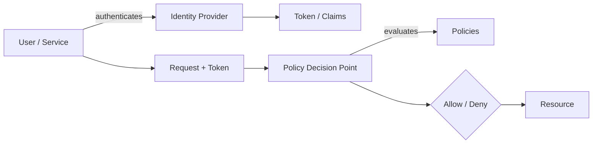

# IAM

> **Learning Path:** Cloud & Infrastructure Architecture
> **Section:** 4.1.11 — Cloud fundamentals

**The problem**

You have thousands of human users, service accounts, workloads, and API clients. They all need access to resources that are also multiplying: storage buckets, databases, models, queues, SaaS apps.

Manual access control breaks immediately. Who can do what, where, for how long, and can you prove it after an incident? Without a system, you get shared credentials, over-privileged accounts, and access that never gets revoked.

IAM exists to make authorization a first-class, auditable, programmatic concern instead of an ad-hoc ticket.

**Mental model**

Think of IAM as four linked questions:

1. **Who are you?** Identity. A user, a workload, a device.
2. **How do you prove it?** Authentication. Password, key, certificate, token.
3. **What are you allowed to do?** Authorization. Permissions mapped to a principal.
4. **Can we prove it later?** Audit. Every decision is logged.

Identity is not the same as access. Identity is stable. Access is contextual: time, location, data classification, role, environment.

**How it works**

The essential mechanism is **principal → policy → resource**.

A principal is an entity with an identity. A policy is a declarative rule that binds a principal to allowed actions on a resource, often with conditions. A policy engine evaluates requests against those rules.

Authentication creates a verifiable claim. Authorization is a policy evaluation, not code in each service. This separation lets you change who can do what without redeploying services.

In practice this means:
* Central identity source of truth, often an IdP with OIDC/SAML
* Short-lived credentials and tokens, not long-lived secrets
* Policies as code, versioned and reviewed
* Least privilege enforced by default, with explicit grants

**Architectural reasoning**

IAM helps when access needs to be:
* **Scalable:** thousands of principals, dynamic workloads
* **Consistent:** same rules across cloud, SaaS, on-prem
* **Auditable:** who did what, when, why
* **Revocable:** instant removal on offboarding or compromise

Alternatives are implicit: ACLs per resource, hardcoded credentials, manual role lists. They work for a small static system and collapse under growth, multi-tenancy, and compliance.

Design choice is how expressive policies need to be:
* **RBAC:** role = set of permissions. Simple, auditable, works for org structure.
* **ABAC:** attributes like department, data classification, environment, time. More flexible, harder to reason about.
* **ReBAC:** relationships, e.g., owner of a project. Good for multi-tenant apps.

You usually start RBAC and add ABAC conditions where context matters.

**Trade-offs and failure modes**

* **Policy sprawl vs granularity.** Too coarse = over-privilege. Too fine = unmaintainable. Central policy repos and automated testing help.
* **Centralization vs latency.** Central PDP is consistent but adds a call. Local enforcement with cached policies improves latency but risks drift.
* **Wildcard and privilege escalation.** `*` resources/actions, overly broad conditions, and permission boundaries that are too permissive are the most common breach vectors.
* **Stale identities.** Service accounts and human accounts linger after project end. Lifecycle automation and just-in-time access are required.
* **Token lifecycle.** Long-lived tokens increase blast radius. Short-lived tokens plus refresh flows and mTLS for services reduce it, at cost of complexity.

**Example**

An AI platform with human data scientists, automated training jobs, and customer data.

* Human users authenticate via IdP, get a role `data-scientist-prod` with read-only access to production data, only from corporate network, during business hours.
* Training jobs run as service principals with a role `trainer` granted temporary access to a specific dataset via a time-bound policy, scoped to that job ID.
* Model serving endpoints use a separate principal with only read permission to the model artifact store.

When a scientist leaves, disabling the IdP user instantly revokes all access. When a job finishes, its credentials expire automatically. Audit logs show exactly which principal accessed which data.

**Reasoning challenge**

You need data scientists to run ad-hoc queries on production customer data for model validation. Do you:
A. Give them long-lived database credentials with read access
B. Issue short-lived tokens via an IdP, scoped to a read-only role, with query logging and an approval step for production access

What fails first with A, and what architectural capability does B give you?

**Key takeaway**

* IAM is about mapping identity to authorized actions at scale, not managing users.
* Separate authentication from authorization; make policies declarative and auditable.
* Design for least privilege and short-lived credentials; access should be default-deny.
* Choose RBAC for clarity, add ABAC for context, and automate lifecycle to avoid privilege accumulation.
