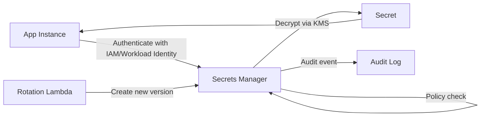

# Secrets management

> **Learning Path:** Cloud & Infrastructure Architecture
> **Section:** 4.1.12 — Cloud fundamentals

**Secrets management**

### 1. The problem

An app needs credentials to work: DB passwords, API keys, TLS certs, private keys. The problem isn't storing them, it's *where* they live and *how* they move.

Hardcoded → leaked in repos.
Env vars / config files → leaked in logs, images, backups, and shared across environments.
Manual rotation → outages when someone forgets a service.
No audit → you can't prove who read what.

As you move to cloud & containers, the problem gets worse: ephemeral instances spin up/down constantly, services are distributed, and secrets must be available instantly without being baked into artifacts.

You need a place for secrets that is separate from code, accessible only by identity, auditable, and rotatable without redeploys.

### 2. Mental model

Think of secrets as *live ammunition*, not configuration.

Configuration is static and declarative. Secrets are dynamic, high-risk data with a lifecycle: create → distribute → use → rotate → revoke → audit.

The core mental model: **Centralize storage, decentralize access via identity, never let secrets touch disk or code.**

### 3. How it works

A secrets manager is an encrypted store + access control layer + lifecycle engine.

Essential mechanism:
* **Store encrypted at rest** with a cloud KMS/HSM. The master key is not in the app.
* **Access via identity, not shared credentials.** App authenticates with IAM / workload identity / mTLS. No static API key to the vault.
* **Versioning and rotation.** New version is written, old version kept for rollback. Rotation can be automatic and emit events.
* **Short-lived access.** Retrieve → cache in memory for minutes, not forever. Some systems issue temporary tokens.

The app never holds a long-lived master credential to the store.

### 4. Architectural reasoning

When it helps:
* Multiple services share the same secret.
* Secrets change without code deploy.
* You need audit/compliance.
* You run in multi-env, multi-region, or ephemeral infra.

Alternatives and why they fail at scale:
* **Env vars / files** - simple, but secrets end up in process listings, container images, and git history. Rotation requires restart.
* **Config server** - solves distribution but not encryption, audit, or rotation.
* **Self-managed Vault** - powerful, but you own HA, upgrades, and key management.

Decision rule: Use a managed secrets service when you have >1 team, production workloads, or compliance needs. Use a local vault only if you need on-prem isolation or custom workflows you can't get from cloud.

### 5. Trade-offs and failure modes

* **Centralization vs latency.** Every secret read adds a network hop. Mitigate with in-process cache + TTL and local agent sidecar. Cache invalidation on rotation is the hard part.
* **Blast radius.** The secrets manager is a critical dependency. If it is down, new instances can't start. Design for read cache and graceful degradation.
* **Rotation risk.** Automatic rotation can break consumers if they don't handle version changes. Roll out with dual-write window and health checks.
* **Secret sprawl.** Teams create secrets manually with no naming convention. You get orphaned secrets and drift. Treat secrets as managed resources with IaC.

Failure mode to remember: leaking a secret is not the only risk. Logging the secret on retrieval, or granting `list secrets` broadly, is equally dangerous.

### 6. Example

AI inference service needs an API key for a vector DB and a DB password.

Bad: key in environment variable baked into Docker image. Image pushed to registry, key is forever in history.

Good: Service runs on EKS with IRSA. On startup it authenticates to Secrets Manager using its service account role, fetches `prod/vector-db-key` with version `latest`, caches 5 min. Rotation Lambda rotates the key in the DB, writes new version, emits event. Pods pick it up on next cache refresh. All reads are logged to CloudTrail.

No secret touches git, image, or disk.

### 7. Reasoning challenge

You have a multi-region SaaS with 200 microservices. Latency budget for cold start is <2s. Secrets Manager in Region A has 80ms p99 latency from Region B.

Do you replicate secrets cross-region, cache aggressively in each region, or accept the latency? What is the security trade-off of caching?

### 8. Key takeaway

* Secrets are dynamic data with lifecycle, not static config. Manage them separately from code.
* Access should be via identity and policy, not shared long-lived tokens.
* Centralize storage for audit and rotation, but distribute access via caching to avoid a single point of failure.
* Design rotation first. If you can't rotate safely, you will eventually leak.
