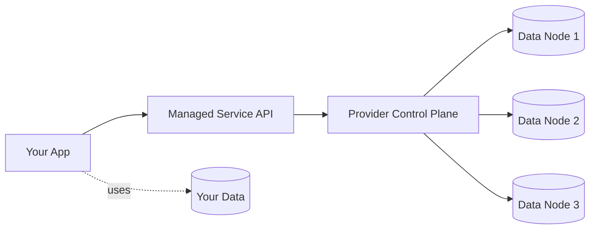

# Managed services

> **Learning Path:** Cloud & Infrastructure Architecture
> **Section:** 4.1.13 — Cloud fundamentals

**Managed services**

### The problem

You need a database, queue, object store, or ML inference endpoint. You can build it yourself on VMs: provision instances, install software, configure networking, patch OS, handle backups, scale replicas, monitor failures, rotate credentials.

That works once. At scale it becomes a permanent operational tax. Every service becomes a team that must keep it up, secure, and available. The cost is not just engineers — it's toil, pager load, and risk of outages from missed patches or bad upgrades.

The problem is not the service itself. It's the lifecycle ownership.

### Mental model

A managed service is you renting capability, not infrastructure.

You own: data, schema, application logic, access policies.
Provider owns: control plane, availability, patching, scaling mechanics, physical infra.

Analogy: you don't buy a fleet and hire mechanics. You buy a service with an SLA.

### How it works

The provider runs a control plane that manages a fleet of data plane nodes for you. You interact via a stable API.

You write to the service. The provider handles replication, failover, backups, version upgrades, and capacity. The boundary is explicit: you control what goes in, they control how it stays up.

### Architectural reasoning

Managed services exist to move the responsibility for undifferentiated heavy lifting to the provider.

When it helps:
* The service is commodity infrastructure, not core IP. Postgres, Kafka, Redis, S3, OpenSearch.
* You need high availability and compliance with minimal staff.
* You want elastic scaling without custom autoscaling logic.
* Time-to-value matters more than fine-grained control.

Alternatives:
* Self-managed on VMs/containers: full control, predictable cost at steady state, higher operational burden.
* SaaS: even higher abstraction, but less integration flexibility.
* Serverless functions: for compute, not durable state.

Choose managed when operational excellence for that component is not a competitive advantage.

### Trade-offs and failure modes

* **Control vs operability.** You lose knobs: custom kernel params, patch timing, exotic storage. You gain SLAs and automatic upgrades.
* **Vendor lock-in.** Data export and API compatibility become architectural concerns. Mitigate with abstraction at the app layer and regular export tests.
* **Cost model shift.** You pay for convenience and elasticity, not raw compute. Idle capacity can be expensive. Burst is cheap.
* **Abstraction leakage.** Provider limits, throttling, noisy neighbors, and regional quotas surface at scale. You still need observability into the service.
* **Failure mode changes.** You stop debugging OS crashes and start debugging IAM, quota, and control plane incidents. Outages become correlated across tenants.

### Example

Payments service needs a durable event log for reconciliation. Options:
* Self-managed Kafka on EC2: control over retention and partitioning, team must handle ZooKeeper/KRaft upgrades, disk failures, and rebalancing at 2am.
* Managed Kafka: you define topics, retention, and ACLs. Provider handles brokers, replication, and rolling upgrades.

Decision: choose managed. Event ordering and durability are required, but broker tuning is not differentiating. Team keeps focus on consumers and exactly-once processing, not broker ops. Accept lock-in by keeping producers/consumers to standard Kafka clients and testing cross-region restore.

### Reasoning challenge

You are designing a multi-tenant AI inference platform. Model weights are 50GB each, cold start latency must be <2s, and you need fine-grained GPU isolation per tenant with custom CUDA libraries.

Do you use a fully managed inference service, a managed Kubernetes with GPU node pool, or self-managed bare metal? What constraints drive the choice?

### Key takeaway

* Managed services trade operational ownership for abstraction and SLA.
* Use them for commodity components where reliability is bought, not built.
* The real decision is where you draw the control boundary: data and logic stay yours, lifecycle goes to provider.
* Plan for lock-in, cost at scale, and observability across the abstraction.
