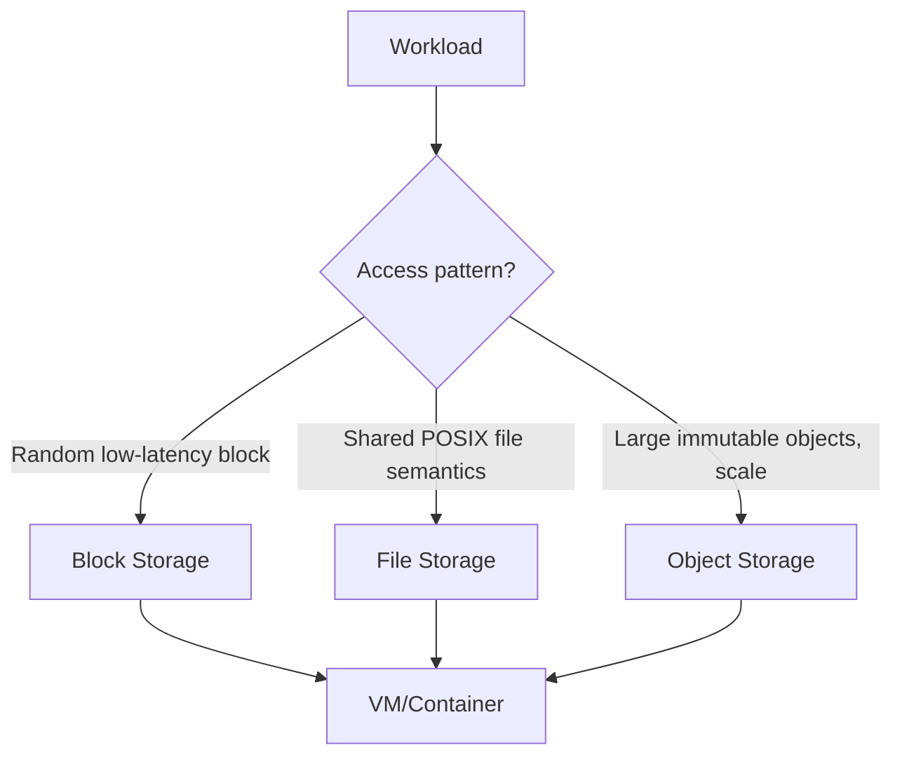

# Storage

> **Learning Path:** Cloud & Infrastructure Architecture
> **Section:** 4.1.2 — Cloud fundamentals

### The problem

You scale an application beyond one server. Local disk breaks immediately: data is lost on instance termination, you can't share files between instances, and you can't grow storage without growing the server.

You need persistence that survives process and host failure, and that can grow independently from compute. You also need a predictable access model: how fast must reads be, how consistent must they be, and who pays for moving data out.

Cloud storage is the answer to that decoupling.

### Mental model

Think of cloud storage as a durable service with an API, not a disk you attach.

Compute is ephemeral and elastic. Storage is durable and elastic. You rent capacity by the GB-month and operations by the request, and you access it over the network with defined consistency and latency guarantees.

That separation lets you scale read replicas, batch jobs, and frontends independently of where the data lives.

### How it works

The service abstracts physical disks into a logical namespace and handles replication, failure detection, and repair for you.

Data is typically replicated 3x across availability zones, or erasure-coded for durability at lower cost. The API gives you a contract: PUT returns success when the object is durably persisted, GET returns a version according to the consistency model.

Latency is higher than local NVMe, but durability and availability are built in.

### Architectural reasoning

Storage choice is driven by access pattern, not by how much data you have.

**Block storage** is a virtual disk presented to a single node. Random I/O, low latency, strong consistency. Use it for databases, OS volumes, anything that needs fs semantics and millisecond latency. Tied 1:1 to a compute instance.

**File storage** provides shared POSIX namespace across many nodes. Good for content repositories, home directories, media processing pipelines where multiple workers need the same file.

**Object storage** is flat namespace of immutable blobs addressed by key with HTTP API. Optimized for large scale, high throughput, eventual consistency reads, and cheap at rest. Ideal for data lakes, backups, images, logs, model artifacts. You cannot efficiently do random writes.

Decision rule: if you need low-latency random access by one node → block. If you need shared files → file. If you need cheap, durable, massively scalable storage for immutable data → object.

### Trade-offs and failure modes

**Durability vs latency and cost.** Higher durability means more copies and erasure coding, which increases cost and write latency. Object stores optimize for durability; block stores optimize for latency.

**Consistency vs availability.** Strongly consistent block storage limits availability during partitions. Object stores often favor availability and partition tolerance with eventual consistency on reads.

**Egress cost.** Storage is cheap; moving data out is expensive. Architect data locality: process near storage, avoid chatty cross-region access.

**Failure modes to design for:** hot partitions from uneven key distribution, API rate limits, eventual consistency causing stale reads after overwrite, and data loss from misconfigured lifecycle policies or accidental deletion. Object stores are immutable by design; mistakes in deletion are permanent without versioning.

### Example

AI training pipeline. Raw data lands in object storage as immutable Parquet files. Training jobs spin up spot instances, read data directly from object storage via high-throughput access points, write checkpoints back as objects. Model registry stores artifacts as objects with versioning.

Block storage is used only for the ephemeral scratch volume of the training node for fast shuffle. No data is kept on local disk after the job ends. Compute scales with the job, storage scales independently with the dataset.

### Reasoning challenge

You need to store product catalog images for an e-commerce site and a write-ahead log for order transactions.

Which storage types do you choose for each, and why? What changes if you later need to serve images from edge locations globally?

### Key takeaway

* Storage in cloud is a service contract for durability, availability, and access pattern, not just capacity.
* Decouple compute from storage to scale each independently and survive instance failure.
* Choose block for low-latency random access by one node, file for shared POSIX, object for massive immutable scale.
* Design for durability, consistency model, egress cost, and deletion safety from day one.
