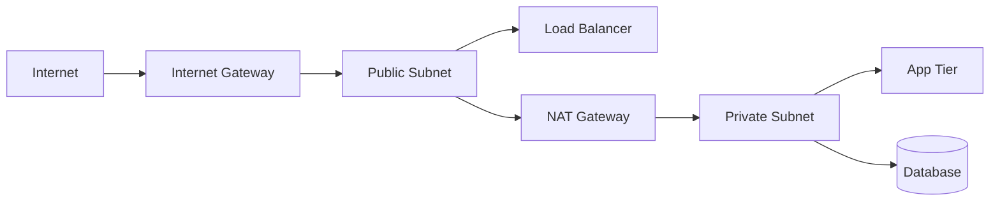

# Networking

> **Learning Path:** Cloud & Infrastructure Architecture
> **Section:** 4.1.3 — Cloud fundamentals

**Networking in Cloud Fundamentals**

### 1. The problem

In an on-prem data center you own the physical network. In cloud you rent compute in a multi-tenant environment where thousands of customers share the same physical switches and routers.

What problem appears when you need to run your services there?
* You need network isolation from other tenants and from the public internet.
* You need to control which services talk to each other and who can reach them.
* You need predictable routing, security boundaries, and scalability without rewiring hardware.

Physical networks don't scale with software deploys. You need a software-defined network that you can create, segment, and tear down in minutes.

### 2. Mental model

Think of a VPC as your private data center network, virtualized.

It is not one flat network. It is a set of isolated address spaces you own, with software-defined subnets, routing tables, and security controls. Everything inside is private by default. You explicitly choose what is reachable from the internet and how internal traffic flows.

### 3. How it works

The essential mechanism is layering isolation and routing:

* **VPC = virtual network boundary.** A private CIDR you control, isolated from other customers.
* **Subnets = placement zones.** Subnets live in Availability Zones. Public subnets have a route to an Internet Gateway. Private subnets do not.
* **Route tables = forwarding decisions.** Every subnet attaches to a route table that decides where packets go: to IGW, NAT Gateway, VPC peering, Transit Gateway, or on-prem via VPN/Direct Connect.
* **Security groups = stateful instance firewall.** Allow/deny based on source/destination ports, attached to ENIs. Works at the instance level.
* **Network ACLs = stateless subnet firewall.** Coarse perimeter filter.

Traffic flow is always: source -> security group -> network ACL -> route table -> gateway.

Public tier handles ingress. Private tier has no public IP and egresses via NAT.

### 4. Architectural reasoning

This model lets you make explicit architectural choices.

**Public vs Private subnets.** Put internet-facing components in public subnets and everything else private. The database never gets a public IP. It is only reachable from the app tier inside the VPC.

**Egress control.** If private workloads need internet for patches, use a NAT Gateway per AZ. It creates a bottleneck and cost, but it is a single chokepoint you can log and control. For zero egress, use a VPC Endpoint to reach SaaS or AWS services privately.

**Connectivity patterns.** 
* Hub-spoke with a central transit VPC for shared services like logging and security inspection.
* VPC Peering for simple 1:1 connections, but it creates a mesh problem.
* Transit Gateway for multi-VPC routing at scale.

You choose based onblast radius, latency, and operational overhead.

### 5. Trade-offs and failure modes

* **Flat vs segmented.** A single large VPC is simple but increases blast radius. Segmentation with multiple VPCs increases isolation but adds routing complexity and cost.
* **Security groups are stateful and instance scoped.** They are easy to reason about but can hide implicit allow rules when copied. Network ACLs are stateless and evaluated in order; misordering silently drops traffic.
* **NAT Gateway is a single point of failure and cost.** One per AZ for HA. Cross-AZ traffic incurs charges and latency.
* **Route table misconfiguration.** A private subnet with a default route to IGW is a public subnet in disguise. This is the most common security failure.
* **IP exhaustion.** CIDR planning is hard to change later. Choose large enough /16 or /20 per VPC and /24 per subnet.

### 6. Example

E-commerce checkout service:
* Public subnet: ALB + API instances. Security group allows 443 from internet, 1024-65535 to private app security group.
* Private subnet: App tier and Redis. No public IPs. Route table points 0.0.0.0/0 to NAT Gateway.
* Private subnet: RDS. Security group allows 5432 only from app security group. No internet route.
* VPC Endpoint for S3 and Secrets Manager so app can read configs without internet.

Result: Internet can reach ALB only. App can reach DB and AWS services privately. DB is never exposed.

### 7. Reasoning challenge

You need to connect an on-prem PostgreSQL database to a new cloud app, with low latency and no public exposure. Traffic must be auditable.

Do you use VPN over internet, Direct Connect, VPC peering, or a private link? What network controls do you place on the cloud side to ensure only the app tier can initiate the connection?

### 8. Key takeaway

* Networking in cloud is software-defined isolation, not cables. VPC + subnets + route tables are the primitives.
* Design for private-by-default. Public exposure is an explicit decision with a gateway.
* Security is layered: security groups for allowlisting, NACLs for subnet perimeter, routing for reachability.
* Plan CIDRs early, place NAT per AZ, and keep routing explicit and auditable.
