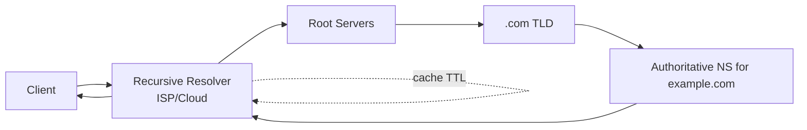

# DNS

> **Learning Path:** Cloud & Infrastructure Architecture
> **Section:** 4.1.4 — Cloud fundamentals

**DNS**

### 1. The problem

IP addresses are the actual location. Names are what humans use. In cloud and distributed systems, location changes constantly: autoscaling adds/removes instances, services move regions for failover, IPs are ephemeral.

If clients had to know IPs directly, every scale-out, redeploy, or failover would require updating every client. You need a layer that decouples *what* you want from *where* it is right now.

DNS is that indirection layer.

### 2. Mental model

Think of it as a globally distributed phonebook with a hierarchy, not a single database.

You ask a local operator: "Where is api.example.com?" The operator may already know, or asks up the chain. The authoritative owner of `example.com` is the only one who can say the current phone number, and it can change the number at any time.

The key insight: names are stable, IPs are not.

### 3. How it works

Resolution is a lookup chain with caching at every step.

* Hierarchical namespace: root → TLD → zone → record. Delegation via NS records.
* Two roles: Recursive resolvers do the walk for clients. Authoritative servers own a zone and are the source of truth.
* Records are data: A/AAAA for IPs, CNAME for alias, MX for mail, TXT for metadata. TTL controls cache lifetime.
* Resolution is eventually consistent. A change propagates as caches expire.

The resolver is the performance bottleneck you care about. Most lookups never leave your VPC because of OS, local DNS cache, and recursive cache.

### 4. Architectural reasoning

DNS enables architectural patterns that would be impossible otherwise.

* **Elasticity:** Service IP changes on scale. Clients keep using `api.example.com`.
* **Failover and health:** Return different IPs per region, or remove unhealthy IPs from the authoritative set.
* **Geo routing:** Return a different IP based on resolver location, e.g., `us-east` vs `eu-west`.
* **Decoupling:** Teams can move infrastructure without coordinating client changes.

Alternatives exist but are worse for most cases:
* Hardcoded IPs: zero flexibility, operational nightmare.
* Service mesh / consul discovery: great inside a VPC, but doesn't solve external ingress.
* Client-side config push: high coupling and latency.

Choose DNS when you need global, name-based location indirection with loose consistency.

### 5. Trade-offs and failure modes

* **TTL vs freshness:** Short TTL = fast failover, more queries and load. Long TTL = stable cache, slow reaction to outages. Architects tune TTL as a control knob, not a constant.
* **Cache poisoning and hijacking:** DNS is trusted. Validate responses, use DNSSEC where integrity matters. In private networks, use split-horizon DNS to avoid leaking internal names.
* **DDoS amplification:** Small queries can trigger large responses. Rate limit, use anycasted authoritative servers.
* **Resolver as SPOF:** If your recursive resolver is slow or down, everything looks broken. In cloud, use multiple resolvers and VPC DNS.
* **Negative caching:** NXDOMAIN gets cached. A typo can cause minutes of false negatives.

DNS is not real-time. Don't use it for sub-second health checks. It’s a routing hint with delay.

### 6. Example

Global SaaS API with active-active regions.

Authoritative zone for `api.example.com` returns multiple A records. A global anycast DNS provider with health checks removes unhealthy regions from responses. Clients resolve to the nearest healthy IP.

On a regional outage, the DNS provider stops advertising that region's IPs within the TTL window, typically 60s. Existing connections drain naturally; new connections go to healthy regions. No client redeploy needed.

The application also publishes `api.internal.example.com` via private Route53 view. Internal services resolve to private IPs, external users resolve to public IPs. Same name, different view.

### 7. Reasoning challenge

You run a latency-sensitive API. You want automatic failover between two regions with <30s reaction time, but you also want to avoid query storms and flapping during transient blips.

What TTL would you set for the A record, and what additional mechanism would you use to avoid returning unhealthy IPs? What happens if you set TTL to 5 seconds?

### 8. Key takeaway

* DNS is indirection between stable names and volatile IPs, enabling elasticity, failover, and geo routing.
* Resolution is hierarchical and cached; TTL is the consistency lever you control.
* Use DNS for coarse-grained location changes, not real-time health.
* Design for cache behavior, failure modes, and split-horizon visibility.
