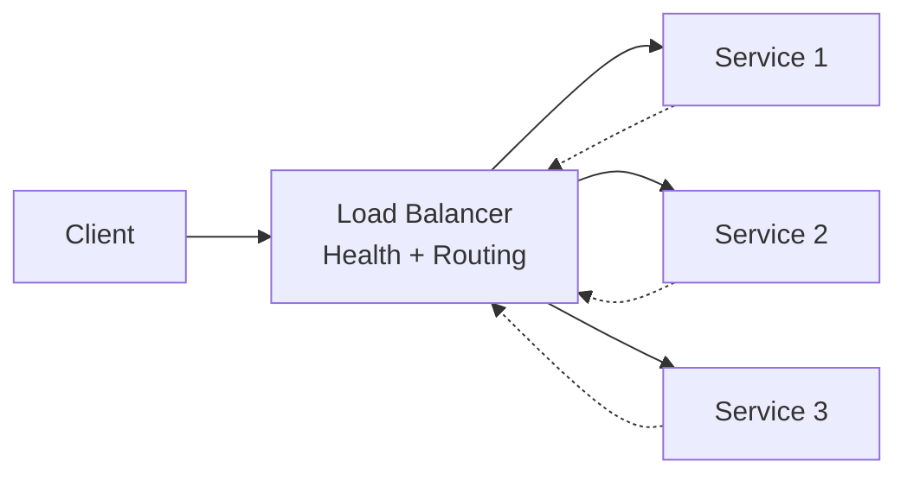

# Load balancing

> **Learning Path:** Cloud & Infrastructure Architecture
> **Section:** 4.1.5 — Cloud fundamentals

**Load balancing**

### 1. The problem

A single service instance has a finite capacity: CPU, memory, network, connections. Requests arrive in bursts and are unevenly distributed.

Without distribution you get three failures:
* **Saturation:** one instance queues or drops while others are idle
* **Blast radius:** one instance failure takes down all traffic
* **Scaling ceiling:** you cannot add capacity without downtime

You need a way to spread incoming work across multiple interchangeable instances, and to remove bad instances from the pool automatically.

### 2. Mental model

Think of a load balancer as a traffic cop in front of a pool of workers.

Clients talk to the cop, not the workers directly. The cop chooses a worker per request using a policy, watches health, and hides the pool behind one address.

The pool can grow, shrink, and replace members without clients knowing.

### 3. How it works

Essential mechanism, not features:

Requests in → Distributor → Healthy backend pool → Responses out

Core functions:
* **Accept and terminate traffic** at a stable endpoint. DNS or VIP stays constant while backends change.
* **Health checking.** Active probes remove unhealthy instances. Passive signals like 5xx/connection errors also work.
* **Distribution policy.** Round-robin spreads evenly. Least-connections favors idle workers. Hash-based routing gives stickiness for stateful sessions.
* **Layer choice.** L4 distributes TCP/UDP flows by IP/port, low latency. L7 distributes HTTP by path, headers, cookies, and can do routing rules.

State is minimal. The LB does not need to know business logic, only which backends are viable.

### 4. Architectural reasoning

When it helps:
* Horizontal scale out of stateless services
* Fault isolation: one instance dies, traffic shifts
* Rolling deploys: new version added to pool, drained gradually
* Traffic shaping: canary, blue/green, A/B

Alternatives:
* **DNS round robin** is cheap and client-side, but TTL caching makes failover slow and distribution is coarse.
* **Client-side load balancing** gives low latency and awareness, but requires clients to be smart and complicates health propagation.
* **No balancer** works only for single-instance, low variance workloads.

Choose a fronting LB when you need fast failover, central visibility, and independent control of routing from clients. Keep it out of the data path for ultra-low latency or when you already have a service mesh doing east-west distribution.

### 5. Trade-offs and failure modes

* **LB is a critical path component.** It must be highly available itself. Deploy active-active across AZs, use a managed service, or put it behind anycast.
* **Health check design is a trade-off.** Aggressive checks detect failure fast but can flap; slow checks keep bad instances serving traffic. Check what matters: TCP open vs HTTP 200 vs application probe.
* **Sticky sessions vs statelessness.** Sticky sessions simplify legacy apps but reduce distribution quality and hurt failover. Prefer making backends stateless and using external session store.
* **Uneven load.** Round-robin ignores request cost. A small request and a large report land on the same instance. Least-connections or latency-aware algorithms help, at the cost of complexity.
* **Thundering herd on recovery.** When a big instance returns, all LB connections may rush it. Use slow start / ramp-up.
* **Observability gap.** The LB sees latency and error rate; the app sees business metrics. Correlate both or you will mis-diagnose.

### 6. Example

E-commerce checkout during a flash sale.

Traffic spikes 10x in minutes. The checkout service is stateless and scales horizontally. An L7 load balancer fronts the pool, terminates TLS, routes `/checkout` to checkout instances, routes `/catalog` to read replicas.

Health checks hit `/healthz` every 5s. An instance that returns 5xx three times is removed in ~15s. New instances are added via autoscaling; the LB's slow start prevents them from being overwhelmed immediately.

Clients see one URL. The team deploys a new checkout version to 10% of instances using header-based routing, monitors error rate, then rolls out fully. No client changes, no downtime.

### 7. Reasoning challenge

You have a real-time bidding service with 2 ms p99 latency requirement. The service is stateless but maintains a small in-memory cache per instance for price data that is updated every second. You can add an L7 load balancer or move to client-side hashing.

What do you choose and what is the main risk to watch?

### 8. Key takeaway

* Load balancing exists to turn a pool of interchangeable instances into one reliable, scalable endpoint.
* The value is not distribution, it is failure isolation, elasticity, and independent lifecycle management.
* Design health checks and distribution policy around request cost and failure semantics, not just round-robin.
* Keep the balancer highly available, observable, and out of the business logic.
