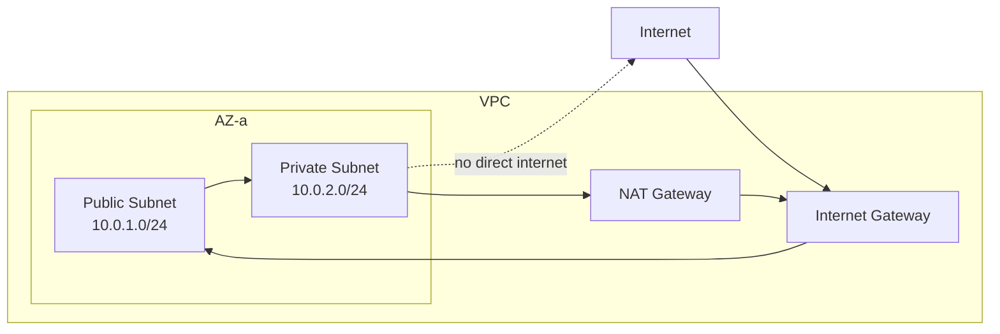

# Subnets

> **Learning Path:** Cloud & Infrastructure Architecture
> **Section:** 4.1.8 — Cloud fundamentals

**Subnets**

### 1. The problem

A flat network doesn't scale. Put 10,000 instances on one broadcast domain and you get ARP storms, a single blast radius for misconfiguration, and no way to express *this traffic should never reach that traffic*.

Cloud adds constraints: IP addresses are finite, workloads live across availability zones, and you need different security and routing rules for public-facing vs internal services.

You need a way to carve a big network into smaller, controllable neighborhoods with independent routing and security policies.

### 2. Mental model

A subnet is a neighborhood within a city.

The VPC is the city. A subnet is one neighborhood, in one district, with a specific address range. All houses in the neighborhood can talk to each other cheaply. To leave the neighborhood you go through a gate — a router — which decides where packets go next.

Crucially, neighborhoods are defined by CIDR, not by physical cables. In cloud, subnets map to AZs. You want at least one subnet per AZ for high availability.

### 3. How it works

A subnet = CIDR block + AZ + route table + network ACL.

* CIDR defines the address range, e.g. `10.0.1.0/24` = 256 IPs.
* Route table decides where traffic leaves the subnet. Default route `0.0.0/0` -> Internet Gateway for public subnets, -> NAT Gateway for private subnets.
* Network ACL is stateless subnet-level firewall. Security groups are stateful instance-level.

Traffic flow:

Public subnet hosts get public IPs and route `0.0.0/0` to IGW. Private subnet hosts have no public IPs and route `0.0.0/0` to NAT for egress only.

### 4. Architectural reasoning

Subnets enable three architectural decisions:

**Isolation by tier.** Put web in public subnets, app in private subnets, data in private subnets. You can then enforce: web can talk to app, app can talk to DB, DB cannot be reached from internet.

**Isolation by blast radius.** A misconfigured NACL or routing loop in one subnet doesn't take down the whole VPC. You can test new workloads in a dedicated subnet.

**AZ-level resilience.** Subnets are AZ-bound. Spreading services across 3 subnets in 3 AZs lets you survive an AZ failure without re-IP.

Alternatives: flat /16 with security groups only. Works for small scale but you lose routing control, you can't enforce egress via NAT per tier, and you can't place workloads physically close to specific AZ resources.

Choose subnets when you need layered security, controlled egress, and AZ distribution. Don't create subnets for aesthetics; create them for a distinct routing or security policy.

### 5. Trade-offs and failure modes

* **Complexity vs safety.** More subnets = more route tables, NACLs, and CIDR planning. Over-segmentation makes troubleshooting harder.
* **IP waste.** CIDR blocks can't overlap. Pick sizes with growth in mind. ` /24` for small services, `/20` for large.
* **Routing mistakes.** Overlapping CIDRs across VPC peering, or a missing route to NAT, causes silent blackholes. Private subnets with `0.0.0/0` to IGW = accidental internet exposure.
* **Cross-AZ cost/latency.** Traffic between subnets in different AZs is slower and costs more. Keep tightly coupled services in the same AZ subnet when latency matters, and accept AZ risk.
* **Security group alone is insufficient.** Security groups are instance-level and stateful. NACLs are subnet-level and stateless. You need both for defense in depth.

### 6. Example

E-commerce checkout.

VPC `10.0.0.0/16`.

* `10.0.1.0/24` public subnet AZ-a, `10.0.2.0/24` public subnet AZ-b. ALBs + bastion.
* `10.0.10.0/24` private app subnet AZ-a, `10.0.11.0/24` private app subnet AZ-b. App servers.
* `10.0.20.0/24` private data subnet AZ-a, `10.0.21.0/24` private data subnet AZ-b. RDS.

Route tables: public -> IGW. private -> NAT per AZ. NACL allows 443 in to public, 8080 app->app within private CIDR only, DB port only from app CIDR.

Result: DB is never internet reachable, app egress is audited via NAT, and AZ failure doesn't kill checkout.

### 7. Reasoning challenge

You have a single VPC with one /24 subnet in one AZ containing web, app, and DB. Traffic is growing and you need a second AZ for HA.

Do you:
A. Add a second subnet in the second AZ with the same CIDR range, or
B. Create a new /24 with a different CIDR in the second AZ and update route tables?

What breaks if you pick A? What is the minimum change to get HA without re-IP?

### 8. Key takeaway

* Subnets exist to give you controlled routing and security boundaries inside a VPC, not just IP organization.
* Design subnets around failure domains and security tiers, not around services.
* Always plan CIDR for growth and AZ distribution from day one; subnet changes are painful in production.
* Public vs private is a routing decision first, security decision second.
