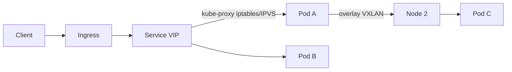

# Container networking

> **Learning Path:** Cloud & Infrastructure Architecture
> **Section:** 4.2.2 — Containers

**Container networking**

### 1. The problem

You want containers to be lightweight, ephemeral, and isolated — but also to talk to each other reliably, across hosts, as they are created and destroyed.

A container is just a process in its own network namespace. By default it has no IP, no routing, no way to reach another container unless you break isolation. The moment you scale to multiple hosts, the problem gets worse: how do you give each pod a stable address when the underlying host IP changes, how do you route traffic without NAT explosion, and how do you control who can talk to whom?

The need is not “more networking”. It is predictable connectivity + isolation + mobility with minimal overhead.

### 2. Mental model

Think of containers as tenants in an apartment building.

Each tenant gets its own private room with a door. The building has a shared lobby and a mail system. The landlord decides: do you give each tenant a public street address, or an internal apartment number that is translated by the building?

Host network = tenant removes the door. Bridge = internal apartment number behind one building IP. Overlay = a virtual street that spans multiple buildings. Service mesh = a concierge that inspects and routes every piece of mail.

### 3. How it works

Linux gives each container a network namespace: its own interfaces, routing table, iptables rules. The runtime connects that namespace to the host via a veth pair.

```
container ns --veth-- bridge --host net
```

On a single node, a bridge like `cni0` provides a private subnet. Containers get IPs from that subnet and communicate via the bridge. The kube-proxy / CNI plugin programs iptables or IPVS to map Service IPs to real pod IPs.

Across nodes, you need an overlay. The CNI plugin creates a virtual tunnel — typically VXLAN or Geneve — so pods on different hosts appear to be on the same L3 network. Each node encapsulates packets destined for remote pods and decapsulates them locally.

Service abstraction sits on top: a stable ClusterIP/DNS name is decoupled from ephemeral pod IPs. DNS + kube-proxy give you load balancing and service discovery without clients knowing pod lifecycles.



### 4. Architectural reasoning

**When it helps:** microservices, batch jobs, AI training workers that need fast peer-to-peer, and any workload where pods are created/destroyed frequently.

**What it solves:** 
* Decoupling identity from location. Pods can move, restart, scale, and clients keep using `service.default.svc.cluster.local`.
* Isolation without VMs. Network policies can restrict east-west traffic.
* Multi-host reachability without manual port mapping.

**Alternatives and why you might choose them:**
* Host network: lowest latency, no encapsulation. Use for CNI plugins, network appliances, or latency-sensitive daemons. Trade: loses isolation, port conflicts, breaks NetworkPolicy.
* Bridge + NAT only: simple for single-node dev. Fails at scale across nodes.
* Overlay vs underlay: overlay is portable across any cloud; underlay requires routable pod CIDR on the physical network. Underlay wins on performance and observability, overlay wins on portability.

Decision driver: portability vs performance vs operational complexity.

### 5. Trade-offs and failure modes

* **Performance vs isolation.** Each hop — bridge, overlay encapsulation, iptables — adds latency and CPU. VXLAN adds ~50-70 bytes overhead and MTU issues. Misconfigured MTU causes silent fragmentation.
* **IP management.** Large clusters exhaust IPv4. /24 per node is common. Plan CIDR early or move to IPv6.
* **Observability.** Packets are NATed and tunneled. Packet capture requires `tcpdump` inside pod namespace and understanding of overlay IDs. Network policies are only as good as their rules; a missing default-deny opens east-west blast radius.
* **Failure modes:** CNI plugin crash leaves pods in `NetworkUnready`. Node failure partitions overlay. DNS caching causes stale endpoints. Conntrack table exhaustion under high connection churn.

### 6. Example

An e-commerce checkout service on Kubernetes. API pods in namespace `checkout` need to reach Postgres in `data`, Redis in `cache`, and emit events to Kafka.

You create Services for each, DNS names `postgres.data.svc`, `redis.cache.svc`. NetworkPolicy allows `checkout` -> `data:5432` only, denies all other ingress to `data`. Pods get IPs from 10.244.0.0/16 via Calico CNI. Traffic between nodes travels over VXLAN, but Services stay stable. If a node dies, pods reschedule, endpoints update, and clients reconnect via the Service VIP without code changes.

You chose overlay for portability across AWS and on-prem, accepted ~2-3% CPU overhead for encapsulation, and kept host network for the ingress controller where latency matters.

### 7. Reasoning challenge

You are designing a multi-tenant AI inference platform. Each tenant gets isolated GPU pods. Tenants must not sniff each other’s traffic. Inference pods need <5ms p99 latency to a shared model cache service, and the platform will run on both cloud VMs and bare metal.

Would you use a flat overlay network with NetworkPolicy, or a flat underlay with per-tenant VLANs/VXLAN segmentation? What breaks if you pick host network for the inference pods to reduce latency?

### 8. Key takeaway

* Container networking is about giving ephemeral processes a stable identity and controlled reachability, not just IPs.
* Bridge solves single-node connectivity; overlay solves multi-host; service abstraction solves lifecycle churn.
* Choose host network only when you can afford to lose isolation; choose underlay when you own the physical network and need performance.
* Design for MTU, IP exhaustion, conntrack limits, and observability from day one — they are the real production failures.

You should be able to reason: *What isolation do I need? How much latency can I tolerate? Where do I run, and how will pods move?* The network model follows from those answers.
