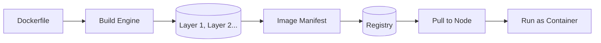

# Images

> **Learning Path:** Cloud & Infrastructure Architecture
> **Section:** 4.2.3 — Containers

### The problem

You ship working code. It runs on your laptop. It fails in staging. It fails differently in production.

The root cause is not the code, it's the environment. Library versions, OS packages, environment variables, file paths, and undocumented manual steps diverge across machines.

With VMs you get isolation but heavy weight and slow boot. With scripts you get fragility. You need a portable, repeatable, self-contained unit of deployment that includes application + runtime + dependencies, and that behaves identically wherever it runs.

### Mental model

A container image is an immutable artifact that captures an application and its complete execution context.

Think of it as a frozen filesystem snapshot with metadata: what process to run as entrypoint, what ports to expose, what limits to expect. The image is not the running container. The image is the blueprint; a container is a running instance of that blueprint.

Images are layered. Each instruction in a build creates a read-only layer. Layers are cached and reused. This makes builds fast and images composable.

### How it works

You describe the desired filesystem and process in a Dockerfile. Build produces an OCI-compliant image made of layers + manifest.

At runtime the runtime mounts a thin writable layer on top of the read-only image layers. The process sees a consistent filesystem. When the container stops, the writable layer is discarded unless you commit it.

Registries provide versioned storage and distribution. Tags point to immutable digests. `myapp:v1.2.3` is a human label; `sha256:abc...` is the real identity.

### Architectural reasoning

Images solve reproducibility and portability. Build once, run anywhere that supports the runtime.

When it helps:
* Microservices that must deploy identically across dev, test, and prod
* Ephemeral workloads where startup time matters
* Teams that need to decouple build and release

Alternatives:
* VM images: more isolation, heavier, slower, larger
* Source + package manager: flexible, non-repeatable, environment drift
* Serverless artifacts: great for functions, less control over OS/runtime

Choose images when you need consistency, fast startup, and density. Don't choose them if you need full kernel isolation, persistent mutable state, or hardware access that containers abstract poorly.

### Trade-offs and failure modes

* **Immutability vs size.** Layers improve cacheability but bloat images if you copy too much. Multi-stage builds are essential to keep production images small.
* **Security surface.** Every layer is attack surface. Base image vulnerabilities, leaked secrets in history, and `latest` tag drift are common failures. Scan images, pin digests, use minimal base images.
* **Build reproducibility.** Non-deterministic builds break trust. Pin versions, avoid `latest` in Dockerfile, lock dependency files.
* **Supply chain.** Pulling from public registries is a trust decision. Sign images, use private registry with admission policies, and verify digests.
* **Operability.** Image != running system. Logging, metrics, and config must be externalized. Baking config into images creates sprawl.

Failure modes you will see: image pull failures under load, registry outage blocking deploys, layer cache invalidation causing slow CI, and silent drift when teams use `latest`.

### Example

Enterprise payment service.

Build pipeline creates `payment-api:1.4.7` via multi-stage build:
Stage 1 uses `node:20` to install deps and run tests.
Stage 2 uses `gcr.io/distroless/nodejs20` with only the compiled app and static assets.

Image is pushed to private registry with digest `sha256:9f3c...`. Kubernetes deployment references the digest, not tag. Admission controller rejects images without signed SBOM. Rollout uses image pull policy `IfNotPresent` with node image cache warming.

Result: identical behavior from CI to prod, 80 MB image vs 1.2 GB dev image, and traceable provenance.

### Reasoning challenge

Your team ships a data processing job that needs Python 3.11, 8 GB RAM, and a 50 GB reference dataset.

Option A: bake the dataset into the image.
Option B: mount the dataset from persistent volume at runtime and keep image tiny.

What are the trade-offs for startup time, image size, update cadence, and multi-region replication? Which would you choose and why?

### Key takeaway

* Images provide immutable, portable deployment units that eliminate environment drift.
* Layering enables cache efficiency and composition, but requires discipline to keep images small and secure.
* Pin digests, scan base images, and avoid `latest` to preserve reproducibility and supply chain integrity.
* Use multi-stage builds to separate build-time tooling from runtime.
* An image is a build artifact, not a configuration store. Keep config external and runtime ephemeral.
