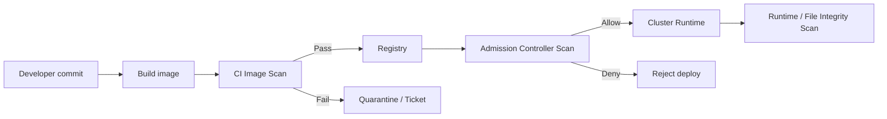

# Security scanning

> **Learning Path:** Cloud & Infrastructure Architecture
> **Section:** 4.2.5 — Containers

**Security scanning — Containers**

### 1. The problem

Containers are fast to build and cheap to deploy, which means vulnerable code spreads fast too.

A single base image like `python:3.11` contains OS packages, system libraries, application dependencies, and your code. One layer change can introduce a CVE. One compromised upstream library can become a supply chain attack. One developer pulling a public image can pull a backdoored image.

The problem is not finding vulnerabilities. The problem is *controlling propagation*: you want a bad artifact to die in CI, not in production. You also want to know what is actually running, not just what was built.

### 2. Mental model

Think of scanning as a policy enforcement point on an artifact lifecycle, not a test suite.

Build → Image → Registry → Admission → Runtime

Scanning answers: *Should this artifact be allowed to exist in this environment?* It produces a signal: risk, provenance, compliance. That signal drives a decision: allow, quarantine, or block.

### 3. How it works

Effective container security is layered, not a single scan.

* **Image scan, shift-left.** Scan the built image in CI before push. Uses the image manifest + layers to check OS packages, language libraries, and known vulnerabilities against a vulnerability DB. Produces SBOM for provenance.
* **Registry gate.** Registry webhook triggers rescan on push and on new CVE disclosures. Prevents a previously clean image from becoming non-compliant later.
* **Admission control, shift-right.** Kubernetes validating webhook scans image at deploy time against policy: no critical CVEs, approved base images, signed image, SBOM present. This is the last gate before workload runs.
* **Runtime scan.** Checks running containers for anomalous behavior, secrets in env, drift from image, or live exploitation. Image scan can't see runtime config.

### 4. Architectural reasoning

When it helps: any multi-team environment with shared registries and production SLAs.

What it solves: reduces blast radius of vulnerable dependencies, satisfies compliance, and gives auditors evidence of control.

Alternatives and why scanning wins over alternatives:
* **Manual review** doesn't scale with hundreds of images per day.
* **Runtime only** is too late; you already shipped risk.
* **Build-time only** misses images promoted later and new CVEs.

Decision pattern: scan early for speed and feedback, enforce late for safety.

Choose image scanning in CI for developer feedback. Choose admission scanning for enforcement. Choose runtime scanning for what you actually run vs what you think you run.

### 5. Trade-offs and failure modes

* **Speed vs depth.** Deep scans with dependency graph resolution are slow. Shallow scans are fast but miss transitive issues. Architects tune scan depth per stage: fast in CI, deep in nightly.
* **Break builds vs noise.** Blocking on every HIGH CVE kills velocity. Most teams use risk-based policy: block Critical, allow High with exception and SLA, ignore Low. Without triage, scanning becomes ignored.
* **Scan time vs freshness.** Vulnerability DBs lag. A clean scan today can be vulnerable tomorrow. Registry re-scan on new CVEs is required.
* **Image vs runtime.** Image scanning misses secrets baked in at build time, misconfigurations in Helm charts, and runtime process injection. You need both.
* **False sense of security.** Scanning finds known CVEs, not logic bugs, misconfigurations, or compromised build pipelines. Scanning is necessary, not sufficient.

Common failure: scanning only on push, then allowing any image to be deployed if it was once clean. You need continuous evaluation.

### 6. Example

A payments team builds 200 microservices. Policy: images must be built from approved base images, signed with Cosign, and have no Critical CVEs at deploy time.

CI runs Trivy on build, fails PR on Critical, creates ticket for High. Registry auto-scans on push and on new CVE feed, tags images as `compliant`/`non-compliant`. Admission webhook denies non-compliant images in prod namespace, allows in dev with warning. Runtime agent flags a container running with privileged mode despite image being clean.

Result: vulnerable base image is caught in CI, not in prod, and a developer can't bypass policy by pushing directly to registry.

### 7. Reasoning challenge

You have a legacy payment service image with a Critical CVE in OpenSSL with no patch available for 90 days. Business requires the service to stay up. Scan policy currently blocks Critical CVEs at admission.

Do you: relax the policy for this image, allow it with runtime monitoring and network isolation, or force a rewrite now? What compensating controls would you need, and how do you prevent this exception from becoming permanent?

### 8. Key takeaway

* Security scanning in containers is about controlling artifact propagation, not finding bugs.
* Scan early for feedback, enforce late for safety: CI → Registry → Admission → Runtime.
* Policy must be risk-based and actionable; otherwise developers bypass it.
* An image scan is a point-in-time check; continuous re-scan and runtime visibility are required for real protection.
