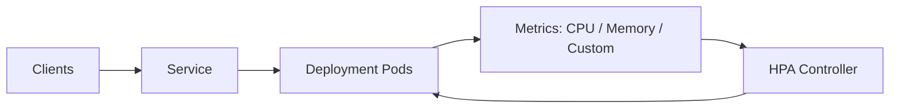

# HPA

> **Learning Path:** Cloud & Infrastructure Architecture
> **Section:** 4.3.10 — Kubernetes

**HPA — Horizontal Pod Autoscaler**

### The problem

You have a Kubernetes Deployment serving traffic. Load spikes at 9am, drops at night, and has random bursts. 

Constraints:
* Pods are cheap to create but not free — each takes time to start, image pull, warm up.
* You can't manually edit replicas fast enough.
* You can't just over-provision 24/7 — cost.

You need replicas to track demand automatically, without human intervention, and without manual scaling policies.

That's the problem HPA solves: **keep pod count proportional to load, within bounds, with minimal latency.**

### Mental model

HPA is a feedback controller, not a scheduler.

Think thermostat: it measures temperature, compares to target, turns heater on/off. HPA measures load, compares to target, adds/removes pods.

It does **not** create nodes. It only changes replica count of a Deployment/StatefulSet. It assumes the cluster can fit those pods.

### How it works

Essentially three loops:

1. **Metrics source.** HPA reads metrics every ~15s. Default is resource utilization from Metrics Server. Production uses custom metrics via Prometheus Adapter, and external metrics via KEDA.
2. **Target calculation.** HPA computes desired replicas: `desired = ceil[current * current_metric / target_metric]`. With behavior policies it can smooth scale-up/down.
3. **Actuation.** HPA updates the Deployment's `.spec.replicas`. The Deployment controller creates/deletes pods. Scale up is fast; scale down is delayed by stabilization windows.

HPA never scales below `minReplicas` or above `maxReplicas`. It also respects pod readiness — new pods must be ready before they receive traffic.

### Architectural reasoning

**When it helps**
* Stateless request-driven workloads with variable, predictable latency to warm up.
* Workloads where cost and latency trade-off is acceptable to react in ~30-60s.
* Services where scaling dimension is *concurrency per pod*, not node capacity.

**Alternatives and why not**
* **Vertical Pod Autoscaler:** changes CPU/memory requests per pod. Good for steady-state right-sizing, bad for burst. Cannot handle sudden load.
* **Cluster Autoscaler:** scales nodes, not pods. HPA creates pods that may be unschedulable without it.
* **Manual HPA / KEDA:** KEDA scales on event sources like queue length. Use it when load is event-driven, not CPU-driven.

HPA is appropriate when you want reactive, metric-driven horizontal scaling of a stateless workload inside an already-capable cluster.

### Trade-offs and failure modes

* **Metric lag and thrashing.** CPU is a lagging indicator. A spike is seen 15-30s later. Aggressive scale-up can overshoot; scale-down stabilization windows cause over-provisioning.
* **Cold start cost.** New pods need image pull, init, warm-up. If p99 latency matters, HPA alone is insufficient — you need predictive scaling or a minimum buffer.
* **Wrong metric.** Scaling on CPU for a queue worker is useless. You need queue length, RPS, or request latency as custom metric. Bad metric = bad scaling.
* **Stateful workloads.** HPA can scale StatefulSets but many stateful apps can't tolerate arbitrary replica changes. Also shared state, sticky sessions break.
* **Scale down risk.** HPA scales down ready pods. If terminationGracePeriod is too short, in-flight requests drop. If pods hold local state, data loss.
* **Node capacity.** HPA can request 100 replicas on a 10-replica cluster. Without Cluster Autoscaler + proper resource requests, you get Pending pods.

### Example

AI inference API behind an ingress. Traffic is bursty: batch jobs at night, live users by day.

Architecture: Deployment with HPA on `http_requests_per_second` from Prometheus, target 100 RPS/pod, min 3, max 50, scale up stabilization 30s, scale down 5min.

Result: Nighttime holds 3 warm pods for latency. Daytime ramps to 30 pods. Cluster Autoscaler adds nodes as needed. Cost is ~40% lower than static 50 pods, p99 stays under SLO because min buffer absorbs first burst.

If the model needs 60s to load weights, HPA would still scale late. Architect adds a pre-warmed pool via `minReplicas` and readiness gate, or switches to KEDA scaling on queue depth.

### Reasoning challenge

You have a Kafka consumer Deployment. Each pod processes partitions, warm-up takes 90s to rebalance. Traffic is spiky and you care about processing lag, not CPU.

Do you use HPA on CPU? If not, what metric and what scaling behavior would you choose, and what minimum replicas would you keep to avoid rebalancing storms?

### Key takeaway

* HPA is a reactive feedback loop for replica count, not a capacity planner.
* It needs a good, leading metric. CPU works for simple web tiers; custom/external metrics are needed for queues, latency, business signals.
* Scale up is limited by pod startup time; scale down is limited by stabilization windows and graceful termination.
* Always pair HPA with Cluster Autoscaler and proper readiness/liveness probes, and define min/max replicas based on SLO and cost.
* Use HPA for stateless, horizontally scalable workloads. For stateful, long-warmup, or event-driven workloads, consider KEDA, VPA, or predictive scaling.
