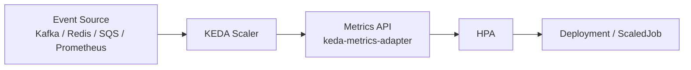

# KEDA

> **Learning Path:** Cloud & Infrastructure Architecture
> **Section:** 4.3.11 — Kubernetes

**KEDA: Event-driven autoscaling for Kubernetes**

### 1. The problem

Kubernetes Horizontal Pod Autoscaler scales on CPU/memory or custom metrics. It polls every 15-30s and never scales to zero.

That creates a mismatch for event-driven workloads:
* Work arrives in bursts from Kafka, RabbitMQ, SQS, Redis Streams, etc.
* You need replicas = 0 when idle to save cost, and replicas > 0 instantly when events queue.
* CPU is near zero even when the queue is backing up. HPA is blind.

Result: you either over-provision 24/7 or accept high latency and queue buildup.

### 2. Mental model

KEDA is a translator between an event source and Kubernetes scaling.

It sits outside your app. It asks the event source: *how many items are waiting?* It converts that into a desired replica count and drives the Deployment/Jobs via the Metrics API.

Think: HPA is reactive to resource usage. KEDA is reactive to *work waiting to be done*.

### 3. How it works

KEDA runs as an operator in the cluster. You declare a `ScaledObject` pointing at a Deployment or ScaledJob and one or more triggers.

Essentially:
`Event Source → Scaler polls / receives → Desired Replicas → HPA → Pods`



The scaler implements the protocol for that source, e.g. `queueLength` for RabbitMQ, `lag` for Kafka, `length` for Azure Service Bus. It computes `desiredReplicas = ceil(metric / targetPerReplica)` with min/max bounds, and writes it back as a custom metric.

ScaledJob adds a different pattern: create a batch of Jobs on demand and scale to zero when idle, instead of long-running pods.

### 4. Architectural reasoning

When it helps:
* Work is queue-driven and bursty with idle periods.
* Scale-to-zero is a cost requirement.
* You need faster reaction than HPA + custom metrics can give, or you need a metric HPA can't expose.

Alternatives:
* **Over-provision + HPA on CPU:** Simple, wasteful, can't scale to zero.
* **Knative / KNative Serving:** Great for request-driven scale-to-zero with HTTP, but heavier and less natural for queue workers.
* **Custom operator:** Full control, high maintenance cost.

Choose KEDA when you want Kubernetes-native scaling for external event sources without rewriting your worker to be HTTP-serving.

### 5. Trade-offs and failure modes

* **Cold start latency.** Scale-to-zero means first event pays pod start time. For user-facing latency you may need a minReplicas > 0 or a warm pool.
* **Metric lag and oscillation.** Polling intervals and cooldowns cause overshoot/undershoot. Too aggressive scale-down drops in-flight work.
* **Thundering herd.** A large backlog can spawn maxReplicas instantly, overwhelming downstream systems. Use `triggers → scalingModifiers` and rate limiting.
* **Operational coupling.** You now depend on KEDA operator health and the event source being observable. If the scaler fails, scaling stalls silently.
* **Not for request latency.** KEDA scales on queue depth, not request latency. For HTTP you still need HPA/VPA or Knative.

Failure mode to watch: scale-down while messages are being processed. KEDA only sees queue length, not in-flight work. Use `activationDeadlineSeconds` and ensure workers ack late, or set stabilization windows.

### 6. Example

Image processing microservice. Workers read from Redis Stream. Traffic is near zero overnight, spikes at 9am.

With KEDA:
```
ScaledObject for deployment/image-worker
trigger: redis stream length > 0
minReplicas: 0, maxReplicas: 50
target: 10 messages per pod
```
At night: 0 pods, $0. At 9am queue grows to 400 messages → KEDA creates ~40 pods within seconds. When queue drains, pods terminate.

No change to worker code. No persistent over-provision.

### 7. Reasoning challenge

You have a payment webhook processor reading from SQS. Messages must be processed within 5 seconds of arrival. Cold start is ~8 seconds. Queue can receive 1000 messages in a burst.

Do you enable scale-to-zero? What minReplicas and cooldowns would you pick, and what risk are you accepting?

### 8. Key takeaway

* KEDA solves event-driven scaling to zero, not CPU scaling.
* It bridges external event sources to Kubernetes via the Metrics API.
* Use it for bursty, queue-backed workloads where idle cost matters.
* Watch cold start latency, scaling oscillation, and in-flight work during scale-down.
