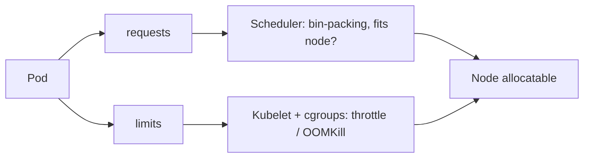

# Resource limits

> **Learning Path:** Cloud & Infrastructure Architecture
> **Section:** 4.3.12 — Kubernetes

**Resource limits in Kubernetes**

### 1. The problem

A Kubernetes node is shared. Without boundaries, one pod can consume all CPU and memory, starving co-located pods and causing the node to become unhealthy. The scheduler also needs a predictable signal to place pods.

You need two different guarantees:
* **Can this pod be placed?** → needs a reservation
* **Can this pod be contained if it misbehaves?** → needs a ceiling

### 2. Mental model

Think of a restaurant reservation.

* **requests** = reservation. The restaurant holds that table for you. It's used for planning.
* **limits** = max party size / time limit. You can be asked to leave if you exceed it.

In Kubernetes, requests drive scheduling and node capacity planning. Limits drive runtime enforcement via cgroups. They are independent.

Quality of Service classes follow directly:
* **Guaranteed**: requests == limits for all containers → most priority on eviction
* **Burstable**: requests < limits → normal
* **BestEffort**: no requests/limits → evicted first

### 3. How it works

`requests` are a promise to the scheduler. The scheduler sums requests on a node and only places a pod if `sum(requests) <= allocatable`. Requests also determine the pod's share during contention.

`limits` are enforced at runtime by kubelet via cgroups:
* CPU limit → throttling via CFS quota. The pod gets its request worth of guaranteed CPU, but is throttled when it tries to use more than the limit.
* Memory limit → hard cap. Exceeding it triggers OOMKill of the container.



Implementation is just a spec:

```yaml
resources:
  requests:
    cpu: "250m"
    memory: "256Mi"
  limits:
    cpu: "500m"
    memory: "512Mi"
```

### 4. Architectural reasoning

Use requests to make scheduling honest. If you omit requests, the scheduler assumes zero and will over-pack a node, leading to runtime contention and latency spikes.

Use limits to protect the node and neighbors. A runaway pod without a memory limit can trigger the kernel OOM killer on the whole node, evicting unrelated workloads.

When to be strict:
* Multi-tenant clusters, shared services, production SLOs. Set limits close to expected peak and requests close to steady-state.
* Latency-sensitive services. CPU throttling is invisible until it causes tail latency.

When to be loose:
* Batch / dev workloads where you want high utilization and can tolerate preemption.
* Memory-intensive workloads with bursty allocation where setting limits too low causes premature OOMKill.

Alternatives: no limits = maximum utilization, maximum blast radius. ResourceQuota and LimitRange at namespace level enforce policy, but they don't replace per-pod limits.

### 5. Trade-offs and failure modes

* **Utilization vs stability.** Tight limits improve isolation but waste capacity if set too high. Loose limits improve bin-packing but allow noisy neighbors.
* **CPU throttling vs latency.** CPU limits cause throttling, not hard stop. A pod can still burst to its limit, but sustained overuse adds latency. Many teams set CPU requests = limits for latency-critical services to avoid throttling.
* **Memory OOMKill is brutal.** Memory is not compressible. Exceeding memory limit = immediate kill. Setting memory limits too low causes flapping; too high allows a pod to consume node memory and trigger node-level eviction.
* **Eviction under pressure.** When node memory is pressured, Kubernetes evicts pods by QoS priority. BestEffort first, then Burstable, then Guaranteed. No limits = BestEffort = first to die.

Common failure: setting requests = 0 and limits high. Scheduler packs aggressively, runtime contention appears as mysterious latency. Another failure: requests high, limits low. Pod is scheduled with large reservation but throttled immediately.

### 6. Example

An AI inference service co-located with nightly training jobs.

Inference needs p99 < 200ms. Set:
`requests cpu 500m memory 1Gi`, `limits cpu 500m memory 1Gi` → Guaranteed. No throttling, high eviction priority.

Training job is batch, can be preempted. Set:
`requests cpu 1 cpu memory 4Gi`, `limits cpu 4 cpu memory 8Gi` → Burstable. Scheduler reserves 1 CPU, job can burst to 4 when node is idle, but won't starve inference because inference has Guaranteed QoS.

Result: predictable latency for the service, higher node utilization for batch.

### 7. Reasoning challenge

You have a node with 16 CPU, 64Gi memory. Two services:
A is a payment API, must stay up, steady 2 CPU, spikes to 3 CPU during peak.
B is a data exporter, runs hourly, needs 8 CPU for 10 minutes.

How do you set requests and limits for A and B to keep A reliable while maximizing utilization? What QoS classes do you get?

### 8. Key takeaway

* Requests are for scheduling and fairness, limits are for runtime containment.
* CPU limits throttle, memory limits kill. Design accordingly.
* Guaranteed QoS gives eviction priority and no throttling; BestEffort is a liability in production.
* Resource limits enable safe overcommit: reserve conservatively, cap aggressively.

I understand why this exists, how it works, when I would choose it, and what could go wrong.
