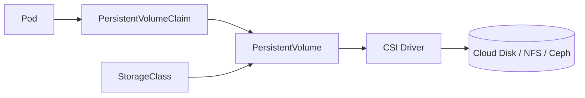

# Persistent volumes

> **Learning Path:** Cloud & Infrastructure Architecture
> **Section:** 4.3.14 — Kubernetes

**Persistent Volumes in Kubernetes**

### 1. The problem

Pods are ephemeral. A Pod can be rescheduled to another node, evicted, or deleted at any time. Anything written to the container filesystem is lost when the Pod dies.

That is fine for stateless workloads. It is fatal for stateful workloads: databases, queues, model training data, media processing, logs that must survive restarts.

Constraint: Kubernetes wants to schedule Pods freely across a node pool. Storage must be decoupled from the node and from the Pod lifecycle.

You need durable storage that outlives Pods, but you also don't want to manage disks manually per Pod.

### 2. Mental model

Think of storage as a cluster resource, like CPU and memory.

* **PersistentVolume, PV** = actual storage provisioned in the cluster, managed by the cluster admin or cloud. It has capacity, access mode, and a reclaim policy.
* **PersistentVolumeClaim, PVC** = a Pod's request for storage. It's like a reservation: "I need 100Gi, ReadWriteOnce".
* **StorageClass** = policy for how PVs are created. Dynamic provisioning turns a PVC into a real volume automatically.

The Pod never talks to the cloud disk directly. It binds to a PVC by name, and Kubernetes binds that PVC to a PV.

Binding is decoupled: you can create a PVC today, bind it later, and reattach it to a new Pod tomorrow.

### 3. How it works

A PVC is created in a namespace. The controller finds a PV that matches requests and binds it. With dynamic provisioning, no PV exists yet: the StorageClass's provisioner creates a PV on demand from the PVC spec.

The Pod mounts the PVC as a volume. When the Pod is deleted, the PVC and PV usually stay. The data persists.

Lifecycle is explicit: PV is cluster-scoped, PVC is namespace-scoped. This separation lets you move storage between Pods without moving data.

### 4. Architectural reasoning

Persistent volumes solve: **how to give stateful workloads durable storage while keeping Pods portable.**

When it helps:
* StatefulSets, databases, persistent queues
* AI/ML artifacts: training datasets, model checkpoints that must survive pod restarts and be shared read-only
* Any workload where recreating data is expensive

Alternatives and why PV wins:
* `emptyDir`: lives as long as Pod, lost on eviction. Good for scratch space.
* `hostPath`: tied to a node, breaks scheduling.
* Manual disks: operational burden, no portability.

You choose PV when data durability and Pod mobility both matter.

Decision factors: access mode, performance, and operator control.

* **ReadWriteOnce** for single-writer workloads like Postgres
* **ReadWriteMany** for shared data like NFS, required for some web content
* Static provisioning for compliance/audit where you pre-create volumes
* Dynamic provisioning for elasticity

### 5. Trade-offs and failure modes

* **Network vs local:** Network-attached storage is portable but adds latency. Local SSDs are fast but pin Pods to a node via node affinity. Choose performance or mobility, not both.
* **Multi-attach:** Most block storage cannot be mounted on two nodes at once. StatefulSets handle this with Pod identity and ordered deployment.
* **Reclaim policy:** `Retain` keeps data after PVC deletion, `Delete` removes it. Wrong choice = accidental data loss or orphaned volumes costing money.
* **Failure modes architects care about:** PVC stuck Pending due to no matching PV or StorageClass misconfiguration; volume expansion not supported by driver; CSI driver bug causing mount failures; Pod stuck Terminating because volume unmount hangs; snapshot/restore inconsistency for databases.

Operability cost is real. You now own backup, restore, encryption, and capacity planning for storage, not just compute.

### 6. Example

AI training service. Training Jobs launch Pods that need a 2TB dataset and must write checkpoints.

Solution: one StorageClass with RWX NFS for the dataset, mounted read-only by all training Pods. A separate PVC per Job with RWO block storage for checkpoints, mounted via PVC so checkpoints survive Pod crashes and can be inspected later.

Pods can be rescheduled across nodes without losing checkpoints, and the dataset is decoupled from the compute nodes.

### 7. Reasoning challenge

You have a latency-sensitive feature store that must serve <5ms reads. Team proposes a PVC backed by cloud managed SSD. Pods are running in a single zone.

What do you question before approving? Consider data path, scheduling constraints, and failure impact.

### 8. Key takeaway

* Pods are ephemeral, storage must be independent.
* PV = physical storage, PVC = logical claim, StorageClass = provisioning policy.
* Use PVs when data must outlive Pods and scheduling freedom matters.
* Trade mobility vs performance: network storage is portable, local storage is fast.
* Design for failure: reclaim policy, access modes, CSI reliability, and backups are architectural decisions, not afterthoughts.
