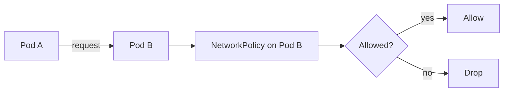

# Network policies

> **Learning Path:** Cloud & Infrastructure Architecture
> **Section:** 4.3.15 — Kubernetes

**Network policies**

### 1. The problem

Kubernetes gives you a flat network. By default every pod can reach every other pod in the cluster via IP, and Services give a stable name. That's great for developer velocity, terrible for security and blast radius.

What appears when you run multiple workloads in one cluster:
* A compromised frontend pod can scan and attack the database pod
* A new microservice can accidentally call a legacy internal service
* You cannot enforce least-privilege between teams sharing a namespace
* Compliance requires network segmentation you cannot prove

The cluster needs a way to say *who can talk to whom, on which ports*, without moving workloads to different clusters.

### 2. Mental model

Think of a NetworkPolicy as a firewall rule attached to a set of pods.

You select pods by labels, then define allowed ingress and egress. Everything not explicitly allowed is either allowed or denied depending on your default stance.

It's not a service mesh. No encryption, no mTLS, no observability. It's just allow/deny at L3-L4.

### 3. How it works

A NetworkPolicy is a Kubernetes object. It only takes effect if your CNI implements it, e.g. Calico, Cilium, Weave.

Core pieces:
* **Pod selector** - which pods this policy applies to
* **Ingress / Egress rules** - who is allowed in/out
* **From / To** - selected by namespace and pod labels, or IP block
* **Ports** - TCP/UDP port filter

Crucially, a NetworkPolicy is additive and only applies if at least one policy selects the pod. If no policy selects a pod, traffic is unrestricted. Default allow.

The typical pattern is a default deny then explicit allow:



Implementation is CNI specific: Calico uses iptables/eBPF, Cilium uses eBPF dataplane. You declare intent in Kubernetes; CNI enforces it.

### 4. Architectural reasoning

Use NetworkPolicy when you need pod-level segmentation inside a cluster and you want it declarative and portable.

It solves:
* **Zero trust inside the cluster** - limit lateral movement
* **Blast radius control** - a compromised tier cannot reach tiers it doesn't need
* **Compliance evidence** - "payments namespace can only egress to fraud and postgres"

Alternatives:
* **No policy** - fastest, worst security
* **Separate clusters / namespaces** - strong isolation, high cost and ops overhead
* **Service mesh** - gives L7 policy, mTLS, observability. Overkill if you just need network segmentation
* **Network firewalls / cloud security groups** - protect the edge, not east-west pod traffic

Choose NetworkPolicy when the decision is about *which pods can connect*, not about *what they say*.

### 5. Trade-offs and failure modes

* **Default allow is dangerous.** Most teams think policies are on by default. They aren't. You must create a deny-all policy first, then allow. Forgetting this is the #1 failure mode.
* **CNI dependency.** If your CNI doesn't support policies, you have no enforcement. Changing CNI later can silently change behavior.
* **No visibility by default.** A dropped packet looks like a timeout. You need CNI flow logs or Cilium Hubble to debug.
* **Label churn.** Policies select on labels. Renaming labels breaks policies silently. Operate policies like code.
* **Egress is harder.** Ingress is intuitive. Egress often requires allowing DNS, kube-proxy IP ranges, and external services. Over-restricting egress breaks pods in non-obvious ways.
* **No identity.** NetworkPolicy is IP based. If two pods share an IP via sidecar or IP masquerading, rules get messy. Service mesh solves this with identity.

### 6. Example

Payments service in namespace `payments`. It should only talk to `fraud-api:443` and `postgres:5432` inside `payments`, and receive traffic only from `api-gateway` in namespace `edge`.

Default deny ingress/egress first:
```yaml
apiVersion: networking.k8s.io/v1
kind: NetworkPolicy
metadata: {name: default-deny}
spec:
  podSelector: {}
  policyTypes: [Ingress, Egress]
```

Then allow:
* Ingress from `edge` namespace pods with label `app=api-gateway` to port 8080
* Egress to pods with label `app=fraud-api` port 443, and `app=postgres` port 5432, both in same namespace
* Allow DNS egress to kube-dns

Now a compromised payments pod cannot reach the internal admin tools in another namespace, and an attacker who reaches it cannot scan the cluster.

### 7. Reasoning challenge

You have a multi-tenant cluster. Team A and Team B share a namespace for cost reasons, but must not be able to talk to each other's pods. You can use labels `team=A` and `team=B`.

Do you:
A. Create one NetworkPolicy per team that denies traffic from the other team
B. Create a default deny policy and two allow policies that only permit intra-team traffic
C. Rely on namespace NetworkPolicies and put teams in separate namespaces

What breaks with your choice, and what is the operational cost?

### 8. Key takeaway

* Kubernetes has no network isolation by default. NetworkPolicy adds declarative allow/deny at pod granularity.
* Always start with default deny, then explicit allow. Default allow defeats the purpose.
* NetworkPolicy is segmentation, not a service mesh. Use it for blast radius and compliance, not for authz or observability.
* Enforcement depends on CNI. Design, test, and monitor policies like infrastructure code.
