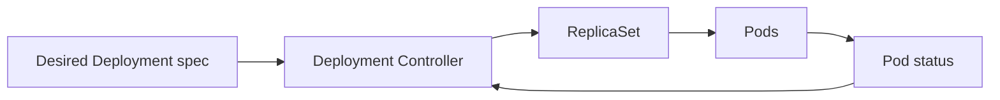

# Deployments

> **Learning Path:** Cloud & Infrastructure Architecture
> **Section:** 4.3.2 — Kubernetes

**Deployments in Kubernetes**

### The problem

You need a stateless service to run continuously. Pods crash, nodes fail, traffic spikes. You also need to ship new code without downtime and be able to roll back if it breaks.

Manual pod management fails because:
* Pods are ephemeral. Re-create them manually every time one dies.
* Scaling is manual and error-prone.
* Updates require killing pods and starting new ones, causing downtime or mixed versions.
* You want a single source of truth for "how many replicas should be running with this exact configuration".

The constraint is Kubernetes is declarative and controller-based. You don't orchestrate pods, you declare desired state and let controllers reconcile.

### Mental model

A Deployment is a declarative controller for stateless pods.

You declare: `I want 3 replicas of this pod template running, with this update strategy`. The Deployment controller continuously makes reality match that declaration.

Think of it as: Desired State → Controller → ReplicaSet → Pods.

It owns the lifecycle: creation, scaling, rolling updates, rollback.

### How it works

The Deployment controller reconciles every few seconds.



Essentially:
* Deployment owns one or more ReplicaSets.
* Each ReplicaSet owns pods matching a selector and template.
* On change to the pod template, Deployment creates a new ReplicaSet with the new template and gradually shifts traffic from old to new via the update strategy.

Default strategy is RollingUpdate: maxSurge = 25%, maxUnavailable = 25%. New pods start, pass readiness probes, then old pods terminate. This gives zero-downtime upgrades if readiness is correct.

You get built-in primitives: `kubectl rollout status`, `kubectl rollout undo`, `kubectl rollout history`.

### Architectural reasoning

When it helps:
* Stateless, horizontally scalable services: APIs, web frontends, workers.
* You need safe, automated canary/rolling upgrades and rollback.
* You want declarative scaling and self-healing.

Alternatives:
* **Raw Pod**: You control everything. No self-healing, no updates. Only for one-off jobs.
* **ReplicaSet**: Ensures N copies of a pod template. No rollout logic.
* **StatefulSet**: For stateful workloads needing stable identity, ordered deployment, persistent storage. Not for stateless web services.
* **DaemonSet**: One pod per node. For node-level agents, not services.

Why Deployment over ReplicaSet? The rollout controller abstracts the complex dance of creating new pods while draining old ones. It also gives you revision history and pause/resume.

### Trade-offs and failure modes

* **Stateless assumption.** Deployment assumes pods are interchangeable. If you need sticky sessions or ordered state, use StatefulSet.
* **Readiness vs Liveness.** RollingUpdate depends on readiness probes. A bad probe makes rollout hang or cause 502s. Liveness kills pods, readiness removes them from Service.
* **Image pull and resource limits.** A new ReplicaSet can stall if images are large, registry is slow, or nodes lack resources. RollingUpdate will appear stuck.
* **Shared mutable state.** If your app writes to local disk or depends on pod identity, rolling updates corrupt state.
* **Database migrations.** Deployment will roll out new code while old pods still serve traffic. You need migration ordering, feature flags, or a separate migration Job. Deployment does not solve data compatibility.
* **Drift.** Directly editing ReplicaSets or Pods bypasses Deployment and causes reconciliation loops.

### Example

Enterprise payment API, stateless Go service.

You declare:

```yaml
apiVersion: apps/v1
kind: Deployment
metadata:
  name: payment-api
spec:
  replicas: 6
  strategy:
    rollingUpdate:
      maxSurge: 2
      maxUnavailable: 0
  selector:
    matchLabels: {app: payment-api}
  template:
    metadata:
      labels: {app: payment-api}
    spec:
      containers:
      - name: api
        image: registry/payment-api:v1.4.2
        readinessProbe:
          httpGet: {path: /ready, port: 8080}
        resources:
          requests: {cpu: 200m, memory: 256Mi}
```

HPA scales replicas based on CPU. When v1.4.3 is released, you change image. Deployment creates new ReplicaSet, brings up 2 new pods, waits for readiness, then terminates old pods one by one. `maxUnavailable: 0` guarantees no capacity loss during rollout.

### Reasoning challenge

You have a Deployment running a pricing service that connects to Redis. A new release changes the Redis client library and requires a new connection pool size. You deploy and see rolling update stuck at 50% with pods CrashLoopBackOff.

What do you check first, and would you use `kubectl rollout undo` immediately?

*Hint: The problem is likely not the Deployment controller, it's a runtime assumption about the environment.*

### Key takeaway

* Deployment is a declarative controller for stateless pods, not a runtime.
* It solves reproducible scaling and safe rolling updates, not application correctness.
* Design for readiness probes, idempotent startup, and statelessness. Deployment amplifies bad assumptions.
* Rolling updates give zero-downtime deploys only if your app signals readiness correctly and your data model tolerates mixed versions.
