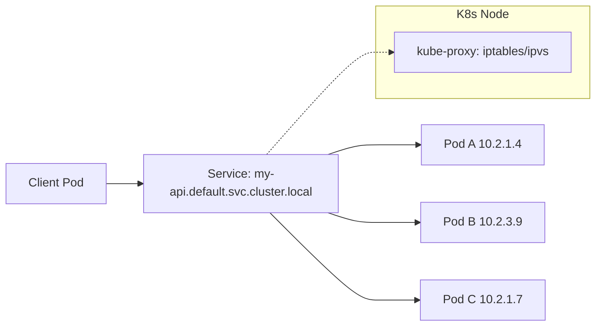

# Services

> **Learning Path:** Cloud & Infrastructure Architecture
> **Section:** 4.3.3 — Kubernetes

### The problem

Pods are ephemeral. They get created, killed, rescheduled on different nodes, and get new IPs each time. Clients that talk to them cannot hard-code IP:port.

You need a stable network identity for a *logical* group of pods, with built-in load balancing, and automatic membership updates as pods come and go.

That is the problem Services solve.

### Mental model

A Service is a stable DNS name + virtual IP that always resolves to the current set of pods matching a selector.

Think of it as a phone number for a team, not for an individual. The team members change, the phone number does not. Kube-proxy ensures calls get routed to an available member.

No client needs to know pod IPs. The Service abstracts pod churn.

### How it works

A Service object has a selector, e.g. `app: api`. The control plane continuously watches pods and builds Endpoints for that Service: the current IPs and ports.

kube-proxy on each node programs local networking rules so that traffic to the Service's virtual IP is load-balanced to the Endpoints.

DNS is provided by CoreDNS: `my-api.default.svc.cluster.local` resolves to the Service's ClusterIP.

Key types are really just exposure modes:

* **ClusterIP** - internal only, default. Stable IP reachable inside cluster.
* **NodePort** - opens a static port on every node, external access via node IP.
* **LoadBalancer** - provisions a cloud LB in front of the Service.
* **Headless** - no virtual IP, DNS returns all pod IPs directly.

### Architectural reasoning

When does it help?

* You have a set of interchangeable pods that implement the same API. Service gives them a single address.
* You want loose coupling. Producers don't need to discover consumers; consumers call a name.
* You want automatic load balancing and failover as pods scale.

Alternatives and why Service wins for the base case:

* Client-side discovery + polling: works but pushes complexity to every client and adds latency.
* Static IPs / manual routing: breaks with autoscaling and node failures.
* Service mesh: gives retries, mTLS, observability. That's valuable, but it builds *on top of* Services, not replaces them.

Choose Service when you need stable identity + simple load balancing. Choose headless when you need direct pod identity, e.g. for StatefulSet with stable network names per replica.

### Trade-offs and failure modes

* **kube-proxy scale.** iptables mode is fast but rule updates are O(n). Large clusters with many Services can cause latency spikes on node updates. ipvs mode scales better.
* **Endpoints staleness.** During rolling updates, Endpoints can briefly point to terminating pods unless you use readiness gates and proper terminationGracePeriod.
* **Session affinity is weak.** Kubernetes' affinity is cookie-based and not durable across nodes. Don't assume sticky sessions.
* **Headless misuse.** Headless gives you DNS A records per pod. Good for clients that need to pick a specific replica. Bad if you actually want load balancing; you now have to implement it yourself.
* **External exposure cost.** LoadBalancer creates a cloud LB per Service. NodePort is cheap but exposes a port on every node and requires firewall rules.
* **Network policy interaction.** Service allows traffic, NetworkPolicy restricts it. Forgetting policies is a common security gap.

### Example

E-commerce checkout flow:

`checkout-frontend` pods call `payment-api` and `inventory-api`.

Both APIs are deployed as Deployments with 3-10 replicas autoscaled on CPU.

Services `payment-api` and `inventory-api` are ClusterIP. Frontend uses DNS names, not pod IPs.

When HPA scales payment-api from 3 to 8 pods, kube-proxy updates iptables on all nodes within seconds. Frontend continues calling `payment-api:8080` with zero config change.

For a Kafka cluster using StatefulSet, you use a headless Service `kafka-headless`. DNS returns `kafka-0.kafka-headless, kafka-1...` so brokers can address each other by stable identity. Load balancing is not desired; you need direct pod-to-pod.

### Reasoning challenge

You have a gRPC service that is stateful per connection and must not be rebalanced mid-request. You also need to scale horizontally. Do you use a ClusterIP Service with session affinity, a headless Service with client-side load balancing, or put a Service Mesh in front?

Consider failure modes of kube-proxy affinity and the cost of client complexity.

### Key takeaway

* Services exist to give pods stable identity despite churn.
* Service = selector + virtual IP + DNS + kube-proxy load balancing.
* Use ClusterIP for internal load-balanced APIs, headless for stable per-pod identity, LoadBalancer/NodePort only for external access.
* Trade-off is simplicity vs control: Service is cheap and universal; service mesh adds resilience at cost of complexity.
