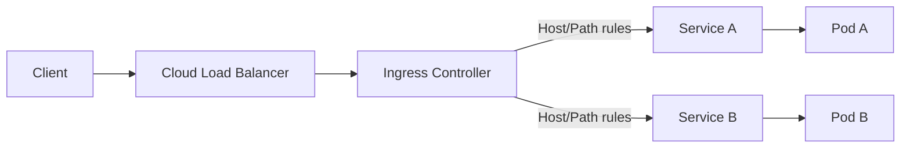

# Ingress

> **Learning Path:** Cloud & Infrastructure Architecture
> **Section:** 4.3.4 — Kubernetes

### 1. The problem

You have a set of pods running microservices in Kubernetes. Pods are ephemeral, IPs change on restart, and Services only give you a stable cluster-internal IP.

External clients need to reach them. You also need:
* Host-based routing: `api.example.com` vs `app.example.com`
* Path-based routing: `/v1` to service A, `/v2` to service B
* TLS termination at the edge
* One external IP for many services, not one LB per service

NodePort works but exposes a port per service and no hostname routing. A LoadBalancer Service works but costs one cloud load balancer per service and still no Layer 7 routing.

You need a single, cluster-wide HTTP/HTTPS front door that can route by host/path and terminate TLS.

### 2. Mental model

Think of Ingress as the front door and reception desk for your cluster.

The Ingress resource is declarative routing rules: *if host=X and path=Y then send to service Z*. The Ingress Controller is the actual reverse proxy that implements those rules. It watches Ingress resources and programs itself, typically sitting behind a single external LoadBalancer.

### 3. How it works

You declare Ingress:

* `spec.rules.host` and `paths` define routing
* `tls.secretName` references a TLS cert
* Backend points to a Kubernetes Service, not directly to pods

The controller runs as a DaemonSet or Deployment in the cluster. It has two jobs:
1. Watch Ingress resources and Service/Endpoint changes
2. Program a data-plane proxy - nginx, Envoy, etc. - with the current rules

Traffic flow: Internet -> Cloud LB -> Ingress Controller Pod -> kube-proxy / iptables -> Service -> Pod.

No pods are directly exposed. The controller is the only thing that needs a public IP.

### 4. Architectural reasoning

Ingress solves the *many services, one edge* problem.

When it helps:
* You need hostname and path routing to multiple services
* You want TLS termination in one place with cert management
* You want to avoid paying for N cloud load balancers
* You want to keep services private and only expose via rules

Alternatives:
* **LoadBalancer Service**: Simple, direct, L4 only. Good for one critical service that needs its own LB and health checks. Expensive at scale.
* **NodePort / hostNetwork**: Anti-pattern for production. Breaks abstraction, security risk.
* **Service Mesh Gateway**: Istio/Gateway API for mTLS, fine-grained authz, traffic splitting. Overkill if you only need external HTTP routing.

Decision rule: Use Ingress for north-south HTTP/HTTPS routing to many internal services. Use LoadBalancer Service for a single service that needs dedicated L4 LB behavior. Use Gateway API now for new clusters; Ingress is the legacy API.

### 5. Trade-offs and failure modes

* **Controller is a critical path.** If the controller crashes or is mis-configured, all external traffic fails. Run at least 2 replicas across zones.
* **Single point of TLS management.** Cert rotation, renewal, and secret distribution must be automated with cert-manager. A missing cert = 502s.
* **Layer 7 only.** Ingress does HTTP/HTTPS. TCP/UDP needs a different controller or Service.
* **Observability gap.** You must log at the controller and correlate with backend services. 404s are often wrong Ingress rules, not service down.
* **Complexity leakage.** Path rewriting, header manipulation, and rate limiting push you toward an advanced controller like NGINX or Envoy.

Common failures: controller not picking up new Ingress due to webhook issues; hostnames not matching; TLS SNI mismatch; backend service selector typo leading to 503.

### 6. Example

AI platform with two models behind one domain.

`api.example.com/models/chat` -> `chat-service` 
`api.example.com/models/embed` -> `embed-service`

One Ingress resource with TLS for `api.example.com` terminates TLS, routes by path, and adds `X-Forwarded-Proto`. Both backend services stay ClusterIP, no public IPs. Scaling chat and embed independently does not change external routing.

Cost: 1 cloud LB + 1 Ingress Controller vs 2 LBs.

### 7. Reasoning challenge

You have a multi-region Kubernetes deployment. Users in US-East hit a regional ingress, users in EU hit EU ingress. You need session affinity for a stateful inference service, but you also want zero-downtime deploys with canary.

Do you put the canary logic in the Ingress controller, in the service mesh, or in the application? What breaks if you change Ingress classes per region?

### 8. Key takeaway

* Ingress exists to provide a single, declarative HTTP/HTTPS entry point for many internal services.
* Ingress = routing rules resource + controller that implements them. Rules without a controller do nothing.
* Prefer one Ingress per cluster for external traffic; use LoadBalancer Service only when you need a dedicated L4 front door.
* The real architectural cost is operational: controller availability, TLS lifecycle, and observability at the edge.
