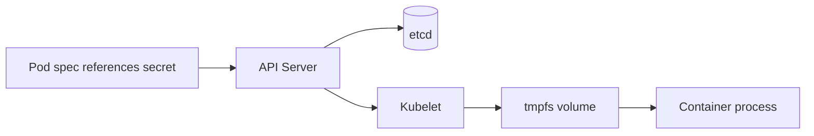

# Secrets

> **Learning Path:** Cloud & Infrastructure Architecture
> **Section:** 4.3.6 — Kubernetes

**Secrets in Kubernetes**

### 1. The problem

A pod needs credentials to do its job: DB password, TLS cert, API key for a model provider, cloud IAM token. 

You cannot bake them into an image. Images are immutable, shared, and scanned into registries.
You cannot commit them to git. Repos are readable by many.
You cannot put them in plain env vars in a manifest. Manifests live in git and CI logs.

You need a way to distribute sensitive data to specific pods, per namespace, with lifecycle tied to the pod, without exposing it to the whole cluster or developers.

That is the problem Secrets solve: *distribution of sensitive data to workloads*, not secure storage.

### 2. Mental model

A Kubernetes Secret is a named blob stored in the API server, base64-encoded, distributed to nodes on demand.

Think of it as: `Secret object -> etcd -> kubelet -> volume mount / env var inside pod`.

It is not a vault. By default it is not encrypted at rest, not versioned, and not audited for access beyond RBAC. It is just a safer transport mechanism than manifests.

ConfigMap = non-sensitive config. Secret = sensitive config. Both share the same distribution mechanics.

### 3. How it works

You create a Secret object. The API server stores it in etcd.

A Pod spec references it:

* as an env var via `envFrom.secretRef`
* as a read-only volume mounted at `/etc/secrets`

Kubelet watches the Secret, renders tmpfs files on the node, and mounts them into the container. Updates to the Secret are eventually reflected in the mount, and env vars are immutable for the pod lifetime.

The secret never passes through git or CI artifacts, only through the control plane.

### 4. Architectural reasoning

When native Secrets help:
* Small number of static credentials, one cluster, short-lived dev/test.
* You need tight coupling to pod lifecycle: secret deleted => pod can't restart.
* You want declarative distribution without external dependencies.

Alternatives and when to prefer them:
* **External Secrets Operator + Vault/AWS Secrets Manager/GCP Secret Manager**: Secrets live in a real vault with encryption, audit, rotation, versioning. Kubernetes only caches them. Choose this for production, compliance, or multi-cluster.
* **Sealed Secrets**: Encrypt secrets with a cluster public key so they can be committed to git safely. Good for GitOps with no external vault.
* **Workload Identity / IRSA**: No secret at all. Let the pod assume an IAM role. Prefer this for cloud services.

Decision rule: Use native Secrets for distribution mechanics only. Use an external system for security guarantees.

### 5. Trade-offs and failure modes

* **Security is an illusion by default.** Secrets are base64 in etcd. If etcd backups are unencrypted, you leak everything. Enable etcd encryption at rest and RBAC.
* **Rotation is painful.** Updating a Secret does not restart pods by default. Env vars are frozen at pod start. Volume mounts update, but many apps never reload. You need a rotation strategy: restart pods, or use a sidecar reloader.
* **Leakage surface.** Secrets appear in `kubectl describe`, events, CI logs, and container image layers if injected at build. Disable secret logging and never `echo $SECRET`.
* **RBAC sprawl.** Anyone who can `get secrets` in a namespace can read them. Least-privilege and namespaces are mandatory.
* **No versioning or audit.** Native Secrets give you last-write-wins. You cannot answer "who read this key last week?".

### 6. Example

Payments service needs `DB_PASSWORD` and `STRIPE_SECRET_KEY`.

Bad: env vars in deployment yaml checked into git.
Good: Create `stripe-secret` in namespace `payments-prod`, mount as volume.

The app reads files at startup. Deployment references the secret name, not the value. CI never sees the value. Rotation means updating the Secret in Vault, letting External Secrets Operator sync it, then rolling the Deployment to pick up new pods.

### 7. Reasoning challenge

You run a multi-tenant cluster with dev, staging, prod namespaces. A database password must rotate every 30 days with zero downtime. Do you use native Kubernetes Secrets, External Secrets Operator, or workload identity?

What breaks if you choose native Secrets with in-place updates and no pod restarts?

### 8. Key takeaway

* Secrets in Kubernetes are about *distribution*, not secure storage. They solve the problem of getting sensitive data to pods without git/CI exposure.
* Native Secrets are simple and fast, but lack encryption, audit, and safe rotation. For production, pair them with a real vault and treat Kubernetes as a cache.
* Prefer no secret at all via workload identity when the downstream service supports it.
* Always assume etcd and API server logs can leak. Design rotation and RBAC as first-class concerns, not afterthoughts.
