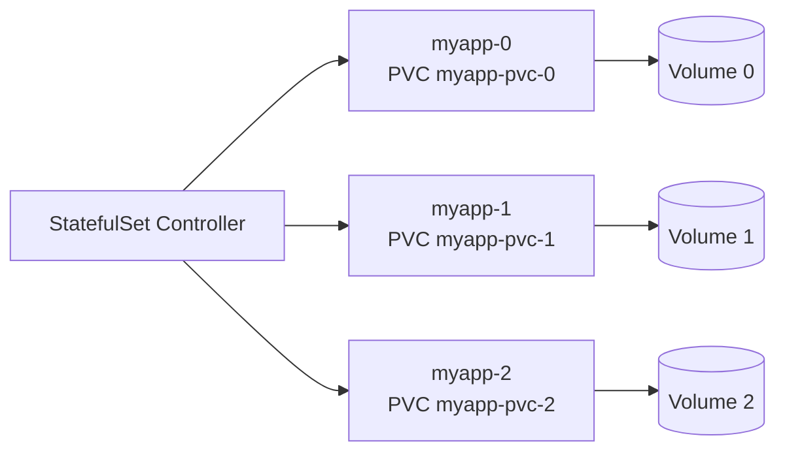

# StatefulSets

> **Learning Path:** Cloud & Infrastructure Architecture
> **Section:** 4.3.7 — Kubernetes

**StatefulSets**

### The problem

Kubernetes treats Pods as cattle: ephemeral, interchangeable, replaceable anywhere. That works for stateless services.

It breaks for stateful services where identity matters:
* A database replica needs a stable network name so other replicas can find it consistently
* Local persistent storage must follow the Pod, not be lost on eviction
* Startup order matters — you can't start replica-2 before replica-1 exists
* Rolling upgrades need to be ordered, not parallel

With a Deployment, `myapp-7f4b9d` becomes `myapp-9c2a1` after a rollout. The Pod name, IP and volume are all new. For ZooKeeper, Kafka, Elasticsearch, PostgreSQL, that is a failure.

### Mental model

Think apartments vs hotel rooms.

A Deployment is a hotel: guests check in to any room, rooms are numbered randomly, luggage is stored in a shared locker.

A StatefulSet is an apartment building: `myapp-0`, `myapp-1`, `myapp-2` are permanent addresses. Each unit has its own private storage that moves with the tenant. Evictions are handled by moving the tenant back into the same apartment number, with the same storage.

Identity is stable: pod name, hostname, network identity, and storage are all tied to the ordinal.

### How it works

The StatefulSet controller manages an ordered, persistent set of Pods.

* **Stable identity.** Pods are named `statefulset-name-0`, `-1`, `-2`. Names never change.
* **Stable storage.** A PVC template creates one PersistentVolumeClaim per replica, e.g. `myapp-data-myapp-0`. The claim is bound to that ordinal and reattached when the Pod is recreated.
* **Ordered operations.** Scale up creates pods sequentially 0..N-1. Scale down deletes in reverse N-1..0. Rolling updates proceed in the same order.
* **Network identity.** Headless Service gives each Pod a stable DNS entry `myapp-0.myapp`.

The controller enforces the guarantees; the application still owns consensus, replication and data integrity.

### Architectural reasoning

Use a StatefulSet when you need **identity + persistent local storage + ordered lifecycle**.

When it helps:
* Distributed databases and queues that elect leaders by name, e.g. Kafka brokers, ZooKeeper ensemble, etcd
* Shared-nothing stateful services where each replica owns a partition
* Applications that require stable DNS for peer discovery

Alternatives:
* **Deployment + external managed storage** for stateless apps that can externalize state
* **Operator** on top of StatefulSet for higher-level lifecycle, backups, failover
* **Static pods** for very specialized control plane components

You choose StatefulSet not because you like Kubernetes primitives, but because the system you are running requires stable identity and storage affinity to be correct.

### Trade-offs and failure modes

* **Node affinity and scheduling friction.** Pods prefer to stay with their volume. If the volume lives on a specific storage class or node, rescheduling is constrained. This hurts availability during node failures.
* **Scaling is slow and ordered.** You cannot burst scale. Each Pod must start successfully before the next ordinal is created.
* **Upgrade complexity.** Ordered rolling updates are safer but slower. A bug in ordinal 0 can block the whole set.
* **Storage is the bottleneck.** StatefulSets do not make storage durable; they only attach it predictably. You still need replication, snapshots, and a disaster recovery plan.
* **Not for ephemeral state.** Using StatefulSet for a cache that can be rebuilt is over-engineering and adds operational cost.

### Example

Kafka brokers.

Each broker must have a stable broker.id and persistent log directory. Brokers discover each other by hostname. If broker-1 loses its Pod and gets a new IP and empty disk, the cluster loses partition leadership and data.

With a StatefulSet `kafka` with 3 replicas and a PVC template:
* `kafka-0` always gets `kafka-data-kafka-0`
* DNS `kafka-0.kafka` is stable for leader election
* Rolling upgrade updates `kafka-2`, then `kafka-1`, then `kafka-0`
* Scale up adds `kafka-3` with its own volume, no existing data is touched

This gives the cluster the identity guarantees it needs without custom scripts.

### Reasoning challenge

You are designing an AI inference service that loads a 200GB model from network storage into local NVMe on first start for low-latency serving. The model files are read-only and shared, but each replica wants a local copy for speed. Replicas are identical and can be replaced anywhere.

Would you use a StatefulSet, a Deployment with a ReadOnlyMany PVC, or a DaemonSet? What changes if the model weights are fine-tuned per replica and must persist across restarts?

### Key takeaway

* StatefulSets exist because some distributed systems require stable identity, storage, and ordering, not just replicas.
* They give you predictable pod names, per-replica PVCs, and ordered create/delete/upgrade.
* Choose them for stateful, identity-driven workloads like databases and queues; avoid them for stateless or easily rebuilt state.
* The trade is operability and scheduling flexibility for correctness guarantees the application requires.
