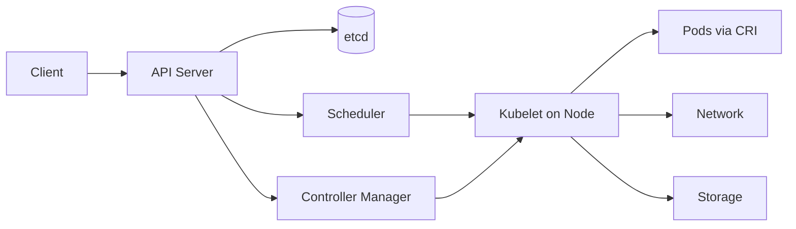

# Kubernetes architecture

> **Learning Path:** Cloud & Infrastructure Architecture
> **Section:** 4.4.1 — Platform engineering

**Kubernetes architecture**

### 1. The problem

You are running dozens to hundreds of containerized services. Each service needs CPU/memory, restarts on failure, scales with load, and moves between machines for upgrades or node failure. 

The problem is not running one container. It is keeping a desired state consistent across a fleet of machines, with machines failing, workloads changing, and teams needing a stable API to deploy without SSH-ing into hosts.

Manual orchestration creates toil: imperative scaling, snowflake nodes, inconsistent networking/storage, and no declarative rollback.

### 2. Mental model

Kubernetes is a distributed control loop. You declare *what* you want. The control plane continuously reconciles reality to that declaration.

Think of it as:
* **API Server = source of truth.** All state lives as objects in etcd.
* **Controllers = specialized loops.** Each watches API objects and makes the world match.
* **Nodes = workers.** Kubelet on each node pulls desired state and runs containers.

It is not a scheduler first, it is a reconciliation engine with scheduling as one loop.

### 3. How it works

Declarative API → etcd → control loops → nodes.

Essential pieces:
* **API Server + etcd:** All objects are stored in etcd. API server is the only write path. Controllers read via watches.
* **Scheduler:** Binds unscheduled Pods to nodes based on predicates and priorities. One-shot decision, not continuous.
* **Controller Manager:** A set of loops. ReplicaSet controller ensures pod count, Deployment controller manages rolling updates, Endpoint controller syncs Services to kube-proxy.
* **Kubelet:** Agent on each node. Watches assigned Pods, ensures containers are running via CRI, reports status back.
* **kube-proxy + CNI + CSI:** Provide network and storage abstractions to make nodes look homogeneous.

The loop: you POST a Deployment → API Server writes etcd → Deployment controller creates ReplicaSet → ReplicaSet controller creates Pods → Scheduler places them → Kubelet runs them. If a node dies, the controller loop notices missing Pods and recreates them.

### 4. Architectural reasoning

When it helps:
* You need portability of workloads across clouds/on-prem with the same manifest.
* You need self-healing, rolling updates, and declarative scaling without custom operators per service.
* You want a platform layer where teams deploy via GitOps, not via infra tickets.

Alternatives:
* **ECS/Fargate:** Managed container runtime with less control, good for AWS-native microservices.
* **Nomad:** Simpler scheduler, easier ops, less ecosystem.
* **VMs + config management:** Fine for static, low-churn workloads. Fails at rapid scale and fast rollback.

Choose Kubernetes when the organization is willing to pay operational complexity for a standard control plane and ecosystem. Don't choose it for a handful of long-running services.

### 5. Trade-offs and failure modes

* **Complexity vs portability.** You get a portable API, but you now own control plane HA, etcd backups, and version upgrades. Managed services reduce this, but you still own networking and storage plugins.
* **etcd is a SPOF.** Corrupt or split-brain etcd loses cluster state. Size and write latency grow with object churn. Architects must size etcd, monitor disk latency, and test backups/restores.
* **Abstractions leak.** CNI performance, CSI latency, and kube-proxy iptables vs IPVS choices directly affect tail latency. The network is not magic.
* **Control plane blast radius.** A bad mutating webhook or controller can stall all API writes. Rate limits and priority classes matter at scale.
* **Operational cost.** You trade manual toil for platform engineering toil: upgrades, security patching, multi-tenancy isolation, cost attribution.

### 6. Example

Platform team runs a single managed EKS cluster with namespaces per business unit. Developers submit Helm charts to Git. ArgoCD reconciles Git → cluster. Deployments use HPA for CPU and custom metrics for queue depth. Node pools separate spot and on-demand, GPU workloads get a taint-toleration pool. Network policies enforce zero-trust between services. This moves the team problem from "how to run containers" to "how to define SLOs and costs per namespace."

### 7. Reasoning challenge

You need to run a latency-sensitive, single-tenant fraud scoring service that requires dedicated GPUs and <10ms p99 to a local NVMe dataset. The dataset cannot move off-node.

Do you put this on a shared Kubernetes cluster with a GPU node pool, or run it outside Kubernetes? What isolation, scheduling, and observability controls would change your decision?

### 8. Key takeaway

* Kubernetes is a declarative reconciliation system, not just a container scheduler.
* The API Server + etcd is the source of truth; controllers are the brains, kubelet is the muscle.
* It solves multi-tenant, dynamic workload orchestration at scale, at the cost of operational complexity and leaky abstractions.
* Design for failure of etcd, control plane upgrades, and network/storage plugin behavior before you assume it just works.
