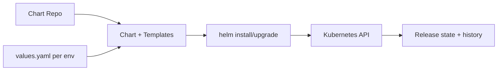

# Helm

> **Learning Path:** Cloud & Infrastructure Architecture
> **Section:** 4.4.2 — Platform engineering

**1. The problem**

Kubernetes is declarative and powerful, but deploying real applications is painful at scale. A single service is not one manifest, it's Deployment, Service, Ingress, ConfigMap, HPA, ServiceAccount, RBAC, maybe Jobs. Multiply by environments dev/staging/prod, by teams, by versions.

Constraints appear:
* Repetition across environments with only a few differences
* Manual edits cause drift
* No standard way to version, share, or roll back an entire application
* Upgrades are risky and not repeatable

You need packaging, parameterization, and a managed release lifecycle on top of raw manifests.

**2. Mental model**

Helm is a package manager + templating engine + release manager for Kubernetes.

Think of it as `apt` for K8s, where a **Chart** is a package. The chart contains templates with placeholders. A `values.yaml` file supplies the concrete parameters for a specific environment. Helm renders the templates, talks to the Kubernetes API, and records the release so it can upgrade or roll back.



**3. How it works**

Essential mechanism only:
* **Chart** = versioned package with templates, values schema, and metadata
* **Values** = parameter layer that makes one chart reusable across clusters
* **Release** = Helm tracks what was rendered and applied, giving `helm history`, `helm rollback`, and upgrade safety

The core loop is: render -> diff -> apply -> record. Helm does not replace Kubernetes, it makes repeated, parameterized application of manifests reliable.

**4. Architectural reasoning**

When it helps:
* Many services deployed to multiple clusters/environments with small config deltas
* Platform teams need to distribute standard patterns as consumable packages
* You need versioned upgrades and rollbacks without hand-editing manifests

Alternatives:
* Raw manifests + `kubectl apply`: simple, transparent, unmanageable at scale
* Kustomize: excellent for patch-based config layering, weak on packaging and release history
* Operators / GitOps controllers: better for complex lifecycle, higher complexity

Choose Helm when you need package distribution and parameterized templating more than fine-grained patching. It enables the architectural decision to treat applications as versioned, reusable artifacts rather than one-off YAML sets.

**5. Trade-offs and failure modes**

* **Abstraction leak.** Templates hide complexity until they don't. Values sprawl creates "values hell" where you maintain 50 nearly identical files.
* **Secret handling.** Helm stores rendered secrets in release secrets in etcd. It is not a secret manager. Misuse leads to secrets in chart repos.
* **Upgrade coupling.** A bad template change can render invalid manifests for all environments. Helm will happily apply them.
* **Chart sprawl.** Teams fork charts instead of composing, creating divergence.

Common failure: an upgrade renders a new Deployment with an incompatible change, pods fail, and Helm marks the release as failed. Rollback works only if the previous release was recorded correctly and resources are compatible.

**6. Example**

Payment service platform. One chart `payments` contains Deployment, Service, Ingress, HPA templates.

```
values-dev.yaml   image.tag=1.2.3-dev, replicas=1, resources.small
values-prod.yaml  image.tag=1.2.3, replicas=6, resources.large
```

CI builds the image, updates the chart version in a private Helm repo, and CD runs:
`helm upgrade payments ./payments -f values-prod.yaml --atomic --timeout 5m`

Platform team ships the chart; product teams only change values. Rollback is `helm rollback payments 3`.

**7. Reasoning challenge**

Your platform has 200 microservices. 80% are stateless and fit a standard chart. 20% need custom init jobs and canary rollouts. Do you:

a) Force all services into one opinionated Helm chart with many conditional flags, or
b) Provide a base chart and let teams compose with Kustomize/Helm post-renderer, or
c) Keep Helm for packaging but move rollout logic to Argo Rollouts + GitOps?

What constraint drives your choice?

**8. Key takeaway**

* Helm solves packaging and parameterization at scale, not Kubernetes complexity itself
* A chart is an interface between platform and product teams
* Values are configuration; charts are contracts. Keep them small and versioned
* Helm gives you upgrades and rollbacks, it does not give you safety. Validation, tests, and atomic upgrades are your responsibility
