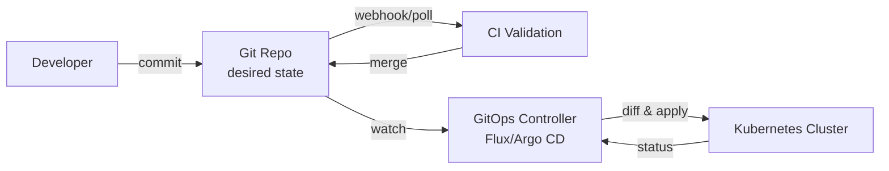

# GitOps

> **Learning Path:** Cloud & Infrastructure Architecture
> **Section:** 4.4.3 — Platform engineering

### 1. The problem

You have a production Kubernetes cluster. Developers push app changes via CI. Ops push infra changes via kubectl or scripts. Someone fixes a bug in staging at 2am with `kubectl edit`. No PR, no review.

A week later production drifts from staging. You can't reproduce an incident because you don't know the true state. Rollbacks are manual and scary. Audit asks "who changed the ingress?" and you have no answer.

The constraints are:
* Desired state is scattered across laptops, runbooks, and manual edits
* Changes are imperative and not reproducible
* Audit, review, and rollback require human memory

You need a single source of truth for infrastructure that is versioned, reviewed, and auditable, and automatically enforced.

### 2. Mental model

GitOps = Git is the control plane, the cluster is the data plane.

You declare the desired state in Git. A reconciler continuously compares the live cluster to Git and converges them. Git becomes the API for infrastructure.

Analogy: Git is the blueprint, the controller is the building inspector who walks the site every few seconds and builds/fixes anything that doesn't match the blueprint.

### 3. How it works

The essential loop is declarative + reconciliation.



1. Desired state lives as manifests, Helm charts, Kustomize overlays in Git
2. PRs enforce review, policy, tests
3. On merge to main, the controller detects drift and applies the diff
4. The controller also reports drift back to Git via status

No one touches the cluster directly. Changes are pull-based, not push-based.

### 4. Architectural reasoning

**When it helps**
* Multi-environment promotion via branches/tags
* Teams need self-service with guardrails
* Auditability and compliance are non-negotiable
* You want automated rollback by reverting a commit

**What it solves**
* Drift detection and auto-remediation
* Reproducible history: `git log` = audit log
* Decouples change authorization from execution

**Alternatives**
* Imperative automation: Ansible/Terraform applied manually. Fast to start, hard to audit, drift is silent.
* Push-based CI: CI runs `kubectl apply` on merge. No continuous reconciliation, drift can reappear.
* Fully managed control plane: e.g., Terraform Cloud. Good, but couples you to a vendor workflow.

Choose GitOps when the system benefits more from declarative convergence and audit than from immediate imperative control.

### 5. Trade-offs and failure modes

* **Git as bottleneck.** Merge conflicts on shared manifests are real. You need good ownership boundaries and templating.
* **Secrets.** Git is not a vault. You must integrate external secret stores or sealed secrets, and the controller needs access. Leaking a secret into Git is permanent.
* **Blast radius.** A bad commit is auto-applied. You need progressive delivery, canary, and approval gates on protected branches. Argo CD ApplicationSets + Flux Image Automation help.
* **Latency.** Reconciliation is eventually consistent. Not ideal for emergency break-glass changes. Keep a documented break-glass path that still records to Git.
* **Observability burden.** You now have two states to debug: Git and cluster. Controllers must surface sync status clearly.

### 6. Example

Enterprise platform team manages 30 namespaces across dev/stage/prod.

Repo structure:
```
apps/
  payments/
    base/
    overlays/dev,stage,prod
infra/
  ingress/
  monitoring/
```

Developers open PRs to change their app's Deployment. CI runs `kubeval` + policy checks. Merge to main auto-syncs dev. Merge to `release/stage` branch auto-syncs stage via Flux Kustomization.

A production incident shows HPA is missing. `git log` shows it was removed in a PR 3 days ago with no review. Revert commit, controller reconciles in ~30s. Audit trail is complete.

### 7. Reasoning challenge

Your team wants GitOps for Kubernetes, but the SRE team also manages cloud networking via Terraform. The networking changes need to be applied before the app manifests are valid.

Do you put Terraform state in the same GitOps repo and have one controller manage both, or keep two separate GitOps loops with an ordering dependency? What breaks if you choose wrong?

### 8. Key takeaway

* Git is the single source of truth for desired state, not a deployment artifact.
* Reconciliation, not imperative push, is the core mechanism that prevents drift.
* GitOps trades immediate manual control for auditability, repeatability, and automated convergence.
* Design for secrets, blast radius, and merge ownership from day one, or GitOps becomes a liability.
