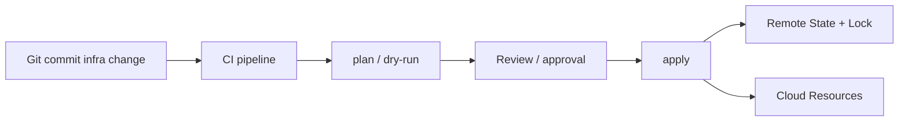

# Infrastructure as Code

> **Learning Path:** Cloud & Infrastructure Architecture
> **Section:** 4.4.5 — Platform engineering

**Infrastructure as Code**

### 1. The problem

Provisioning infrastructure by hand creates invisible debt. An engineer clicks through a console, runs ad-hoc scripts, or SSHs into a box to fix it. The result is snowflakes: production can't be reproduced from staging, onboarding takes days, and no one knows the true state.

The pain compounds at scale: manual changes aren't reviewed, can't be rolled back, and drift silently accumulates. An outage fix made at 2am lives only in someone's terminal history. Auditors ask "who changed this?" and you can't answer.

Constraints that force a change: repeatability across environments, auditability for compliance, speed for self-service, and safety for production.

### 2. Mental model

Treat infrastructure as a software artifact: versioned, reviewed, tested, and deployed from a single source of truth.

IaC is not about using Terraform instead of CloudFormation. It is the principle that desired infrastructure state is described declaratively and applied deterministically by automation. The infrastructure becomes the build output of a repo.

### 3. How it works

The essential mechanism is desired state + diff + apply.

You declare what should exist. The tool maintains state and computes a plan: what must be created, changed, or destroyed to converge reality to declaration.

Imperative scripts say "run these commands in order". Declarative IaC says "this is the target state". The tool owns ordering, idempotency, and reconciliation.

State is the critical piece: it records the last known reality so the tool can diff. Remote, locked state enables collaboration.

### 4. Architectural reasoning

When it helps:
* Multiple environments that must stay consistent
* Teams needing self-service without granting broad console access
* Compliance and audit requirements
* Frequent, safe changes

What it solves: drift, manual error, tribal knowledge, slow onboarding.

Alternatives:
* Click-ops: fast for one-off, unreviewable at scale
* Shell scripts/Ansible ad-hoc: repeatable but fragile, no plan, state scattered
* Fully managed platforms: great, but hides control when you need it

Choose IaC when infrastructure change frequency and blast radius justify the upfront cost of modeling. Don't IaC a one-time lab.

### 5. Trade-offs and failure modes

State is a single point of failure and a security boundary. Corrupt or leaked state can destroy resources or expose credentials. Locking prevents concurrent applies but can stall pipelines.

Abstraction leaks. High-level modules are convenient until you need an escape hatch for a provider quirk. The learning curve is real: you trade operational intuition for declarative modeling.

Drift still happens. Manual console edits bypass the repo, creating divergence the next apply will attempt to "fix". You need drift detection and guardrails.

Secret handling is a design problem, not a feature. Storing secrets in state or repo is a breach. Use external secret stores and inject at apply time.

### 6. Example

A payments platform with 3 environments and 12 engineers. Previously, a platform engineer provisioned VPCs, clusters, and databases by hand. On-call incidents required that engineer.

With IaC, the repo defines modules for `network`, `eks`, `rds`. Engineers open PRs to change instance size or add a node pool. CI runs `plan`, posts the diff to the PR, requires approval for prod. State lives in S3 with DynamoDB locking. Changes are auditable, reversible, and reproducible.

The platform team moves from ticket-driven provisioning to product: self-service with guardrails.

### 7. Reasoning challenge

You inherit a 10-year-old on-prem data center with hundreds of manually configured VMs and no documentation. A greenfield cloud workload is starting next quarter.

Do you IaC the legacy estate, IaC only the new cloud, or try a hybrid? What constraints drive your decision and what failure modes do you accept?

### 8. Key takeaway

* IaC exists to make infrastructure reproducible, reviewable, and auditable, not to automate clicks.
* Desired state + version control + automated plan/apply replaces tribal knowledge with a code review process.
* State management, drift control, and secrets are architectural concerns, not implementation details.
* Use IaC where change frequency and team scale make manual error costlier than modeling cost.
