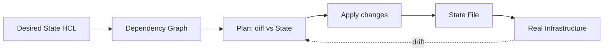

# Terraform

> **Learning Path:** Cloud & Infrastructure Architecture
> **Section:** 4.4.6 — Platform engineering

**Terraform**

### 1. The problem

You are shipping services to dev, staging, and prod. Each environment needs VPCs, clusters, buckets, IAM roles, and autoscaling rules. Engineers provision some via console clicks, some via scripts, some via CloudFormation.

The result: you can't reproduce an environment, you can't review infrastructure changes, and prod drifts from code. A manual fix in prod never makes it back to dev. Rollbacks are scary, and onboarding a new engineer means tribal knowledge.

The core constraint is **coordination over time**: infrastructure must be created once, changed safely, and stay consistent across people, environments, and months.

### 2. Mental model

Terraform is a declarative state reconciler for cloud resources.

You describe the *desired* infrastructure in code. Terraform keeps a record of the *actual* infrastructure in a state file, computes the diff, and makes the minimum changes to converge.

Think of it as Git for infrastructure: config = source, state = index, plan = diff, apply = commit.



### 3. How it works

Three pieces matter architecturally:

* **Declarative config in HCL.** You declare resources, not steps. Provider plugins map resources to cloud APIs.
* **State.** Terraform stores the real IDs, attributes, and dependencies. The state is the source of truth for what *is*, not what *should be*.
* **Plan/Apply loop.** `plan` is a dry-run diff against state and cloud. `apply` executes the graph in dependency order with locking.

This gives you reviewable changes, reproducible environments, and an explicit dependency graph.

### 4. Architectural reasoning

When it helps:

* Multiple environments from one codebase with variables/workspaces
* Team review of infrastructure via PRs
* Need to destroy/recreate environments reliably
* Platform teams exposing self-service infra via modules

Alternatives:

* **CloudFormation / CDK / ARM**: native, tightly coupled to one cloud, less portable
* **Pulumi**: general-purpose languages, better for complex logic, worse for pure declarative review
* **Manual + scripts**: fast initially, fails at scale and auditability

Choose Terraform when you need portable, declarative IaC with strong review gates and module reuse across clouds. Choose an alternative when you need deep native integration or want imperative programming for complex provisioning logic.

### 5. Trade-offs and failure modes

* **State is a liability.** A single state file is a shared mutable resource. Lose it or corrupt it and you lose mapping to real resources. Mitigate with remote state + locking in S3/DynamoDB, and treat state like a database.
* **Drift.** Reality can change outside Terraform: console edits, manual fixes. `terraform plan` detects drift, but you must decide policy: auto-remediate or alert.
* **Provider quality.** Terraform is only as good as providers. Lagging APIs, partial updates, and eventual consistency cause flaky applies.
* **Secrets.** State contains sensitive attributes. Encrypt state at rest, never commit it, and use secret stores, not plain variables.
* **Complexity escape hatch.** `for_each`, `count`, and dynamic blocks help, but over-engineered modules become hard to reason about.

### 6. Example

Platform team provides a `module "app_platform"` that creates a VPC, EKS cluster, IRSA roles, and a managed DB.

App teams call it with variables:

```hcl
module "payments" {
  source   = "git::..."
  env      = "staging"
  replicas = 3
}
```

Changing `replicas` opens a PR, CI runs `terraform plan`, reviewers see a diff of only autoscaling changes, and `apply` promotes to staging then prod via workspaces. No console access needed.

### 7. Reasoning challenge

You have a production database that was manually patched by an on-call engineer to increase IOPS. Terraform now shows drift. Do you:

A) Import the new value into state and move on
B) Revert the cloud to match Terraform and re-apply the change via code
C) Update Terraform config to match reality and apply

What are the operational risks of each? When would you choose one over the other?

### 8. Key takeaway

* Terraform solves repeatability and coordination, not speed of first provision.
* State management is the central architectural concern, not syntax.
* Plan/Apply gives safe change review; drift detection tells you where process broke.
* Modules enable platform abstraction, but state sharing and locking remain the failure domain.
