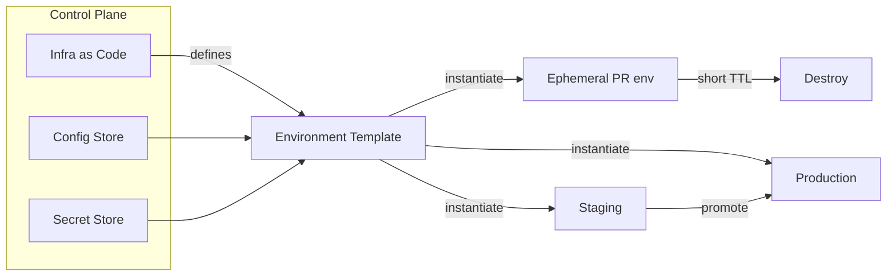

# Environment management

> **Learning Path:** Cloud & Infrastructure Architecture
> **Section:** 4.4.7 — Platform engineering

**Environment management**

### The problem

You ship code, but the code never runs in a vacuum. It runs with data, configuration, secrets, resource limits, and network policies. When you have one developer laptop, that's manageable. With 50 engineers, multiple services, and AI workloads that need training vs inference, the variability explodes.

The problem is not "how to create dev and prod". The problem is: **how to guarantee that behavior is explained by code changes, not by invisible differences between places where code runs.**

Without deliberate management you get drift, surprises, and risk. A bug appears only in staging because the connection string is wrong. A model trains on a different feature set than the one serving. A secret is copied manually and leaks. Cost spikes because preview environments are never torn down. Deployments are slow because promoting requires manual checklist.

Environment management exists to make the environment a controlled variable.

### Mental model

Think of an environment as a product for developers and operators. It is not a server. It is a reproducible, isolated execution context with a lifecycle, a contract, and a cost.

The core mental model: **same code, different context**. The context is defined declaratively and versioned alongside code. Environments are created, configured, observed, and destroyed by policy, not by ad-hoc clicks.

### How it works

Platform engineering treats environments as first-class resources.

* **Definition as code.** Infrastructure, config, secrets references, and runtime parameters are described in a single source of truth. Terraform/Pulumi for infra, config stores for app config, secret stores for secrets.
* **Isolation boundaries.** Logical isolation via namespaces, logical networks, and resource quotas. Physical isolation via accounts or clusters when needed for security or compliance.
* **Lifecycle automation.** Provision on demand, promote via pipelines, destroy automatically for ephemeral environments. Promotion is a change of context, not a rebuild.
* **Observability and parity.** Each environment emits the same telemetry schema, with environment as a dimension. Parity is not identical hardware, it is identical behavior contracts.

### Architectural reasoning

When does it help? When the cost of an environment incident exceeds the cost of building the platform to manage environments.

Choose isolation level by risk and data sensitivity. Shared dev clusters are cheap and fast, but you risk noisy neighbors and data leakage. Full account-per-environment isolation is expensive and slow, but gives strong blast radius containment for production-like data.

Choose ephemeral vs permanent. Ephemeral preview environments per PR give fast feedback and confidence for changes, especially for AI apps where you want to test a model variant against a real dataset. Permanent integration and staging environments give stable baselines for QA and compliance.

Standardize templates. Platform provides golden environment templates with guardrails: default resource quotas, required observability, security baselines. Teams can parameterize within guardrails, not reinvent.

For AI systems this matters more. Training, validation, and serving have different compute, data access, and latency requirements. Environment management ensures the same model artifact is evaluated on the same feature store snapshot in staging before promotion, and that production serving uses locked secrets and model versions.

### Trade-offs and failure modes

* **Isolation vs cost.** More isolation = more safety and reproducibility, more cloud spend and operational overhead. The architect’s job is to find the minimum isolation that meets risk.
* **Fidelity vs speed.** High-fidelity prod clones are accurate but expensive and slow to create. Low-fidelity mocks are fast but hide integration bugs. Use tiered fidelity: ephemeral = low, staging = high, prod = real.
* **Standardization vs flexibility.** Too rigid and teams work around the platform. Too flexible and you lose the benefits of reproducibility. Provide opinionated defaults with escape hatches.

Common failures:
* **Environment parity illusion.** Config looks similar but secrets, feature flags, or data are different. Fix with config-as-code and automated drift detection.
* **Snowflake environments.** Manual tweaks accumulate. Fix with immutable templates and automated reconciliation.
* **Secret sprawl.** Secrets copied between environments. Fix with a central secret store with environment-scoped access and audit.
* **Orphaned environments.** Preview environments left running. Fix with TTLs and cost attribution per team.

### Example

An enterprise platform with 12 microservices and an LLM-based recommendation service.

Platform provides `env create --type preview --ttl 24h` which spins up a namespace with the service mesh, a read-only feature store replica, and a stubbed LLM endpoint. The preview environment inherits config from the template but overrides the model endpoint via config store. PR merges trigger automatic promotion to shared staging, which mirrors production data anonymized and runs integration tests against real model version. Production promotion is manual, gated by model evaluation metrics and config diff approval.

When a data science team ships a new model, they test in a training environment with GPU quota and isolated data lake access. Only after validation metrics pass does the model artifact move to staging for serving tests, then prod. No manual copying of weights or secrets.

### Reasoning challenge

You have limited budget and a team of 30 engineers working on a fintech API with PCI data. A proposal is to give every engineer a personal full copy of production for local testing. What do you push back on, and what minimal environment design would you propose instead to keep safety and speed?

### Key takeaway

* Environments are products, not servers. Manage them with lifecycle, templates, and automation.
* Reproducibility beats identical hardware. Version the context alongside code.
* Choose isolation by risk, not by habit. Match fidelity to the testing need.
* Make environment creation self-service and destroyable. If it’s hard to create, teams will avoid it; if it’s hard to destroy, you will overpay.

You should be able to reason about any environment decision by asking: what variability are we controlling, what risk are we accepting, and what does it cost to change it later.
