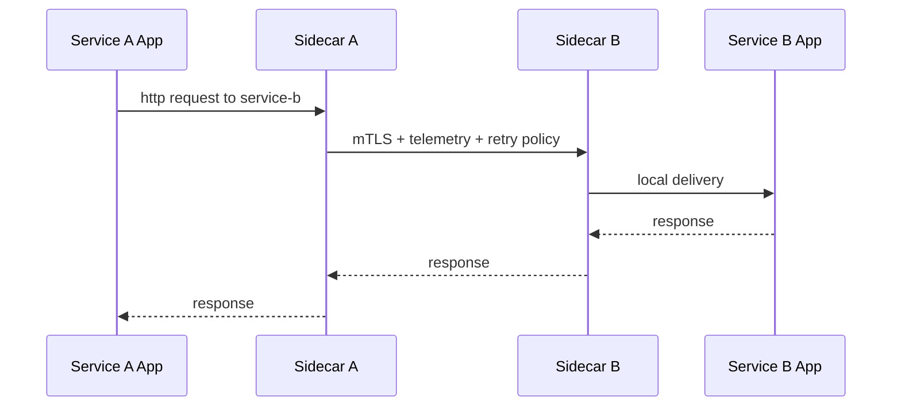

# Service mesh

> **Learning Path:** Cloud & Infrastructure Architecture
> **Section:** 4.4.8 — Platform engineering

**Service mesh**

### The problem

You have 50-200 microservices. Each talks to several others. The application code is now clean, but the *network* is a mess.

You need consistent mTLS, retries with backoff, timeouts, rate limiting, traffic mirroring for testing, and observability for every call. Doing that inside each service means every team re-implements it differently, and changes require app deploys.

The constraint: you cannot keep pushing networking, security and reliability concerns into business logic, and you cannot ask 20 teams to implement them consistently.

### Mental model

A service mesh is a dedicated networking layer for service-to-service communication.

Think of it as an invisible, automatic sidecar for every service. The service speaks plain HTTP/gRPC to localhost. The sidecar handles the real network: encryption, routing, retries, metrics. A control plane configures all sidecars centrally.

It solves east-west traffic, not north-south. API Gateway handles ingress. Service mesh handles inside the cluster.

### How it works

Two parts:

* **Data plane:** a lightweight proxy deployed as a sidecar next to each pod/container. All inter-service traffic is forced through it via iptables/IPVS redirection.
* **Control plane:** configures proxies with service discovery, routing rules, mTLS certificates, telemetry collection.

Request flow:

The app is unaware. The mesh is the network.

### Architectural reasoning

When it helps:
* Large number of services with complex communication patterns
* Need uniform security policy, e.g. mTLS everywhere without code changes
* Platform team wants centralized observability, traffic management, and policy enforcement

Alternatives:
* **Library/SDK in app:** gives control, but couples networking to app code and creates fragmentation across languages/teams.
* **API Gateway only:** good for north-south, does not help service-to-service.
* **Service mesh:** decouples networking from app. Teams ship business logic, platform owns reliability and security.

You choose it when organizational scale makes consistency more valuable than minimal latency and operational simplicity.

### Trade-offs and failure modes

* **Latency and resource cost:** every request passes through an extra hop. Sidecar adds CPU/memory per pod and ~1-3ms latency.
* **Operational complexity:** you now run a distributed system to run your distributed system. Control plane is critical infrastructure. Upgrades, config drift, and certificate rotation become platform responsibilities.
* **Blast radius:** misconfigured routing or policy can black-hole traffic across the whole mesh. A bad rollout to the control plane propagates instantly.
* **Observability overload:** you get rich telemetry by default, but you must store and make sense of it. Without good filtering, cost explodes.
* **Not for small systems:** for <10 services with simple needs, a mesh is over-engineering.

Common failure: treating the mesh as magic. Teams disable retries at app level but rely on mesh retries, creating duplicate requests during partial failures. You must decide where resilience lives.

### Example

Enterprise payments platform with services: api-gateway, payments, fraud-check, ledger, notifications. Each team uses different languages.

Platform mandates mTLS and audit logging. With a mesh, payments can call fraud-check over plaintext to localhost, sidecars upgrade to mTLS automatically, emit per-request traces with consistent tags, and enforce a 2s timeout + 2 retries with jitter. Canary release of fraud-check v2 is done by shifting 5% of traffic at the mesh level, no code change.

### Reasoning challenge

You run a low-latency trading matching engine. p99 latency budget is 5ms. Platform wants to roll out mesh-wide mTLS and default retries for all services.

Do you include the matching engine in the mesh? What would you require to make the decision?

### Key takeaway

* Service mesh solves east-west communication policy at scale, not individual service networking.
* It decouples reliability, security and observability from application code via sidecars controlled centrally.
* Choose it when organizational consistency and platform control outweigh added latency and operational complexity.
* The mesh is critical infrastructure: failures and misconfigurations propagate fast.
