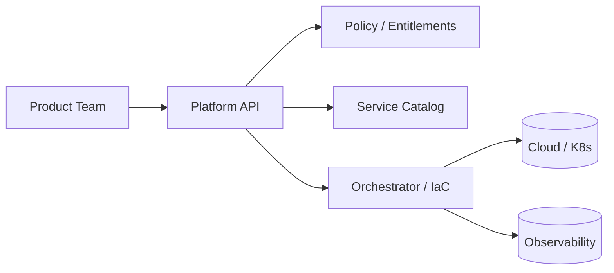

# Platform APIs

> **Learning Path:** Cloud & Infrastructure Architecture
> **Section:** 4.4.9 — Platform engineering

**Platform APIs**

### 1. The problem

Give 50 engineering teams direct access to AWS/GCP and Kubernetes and you get 50 different ways to do the same thing. Teams reinvent auth, observability, networking, and security. Prod incidents happen because of undocumented manual steps. Security and FinOps lose visibility. The platform team becomes a ticket queue.

Platform engineering exists to solve this: accelerate delivery while enforcing guardrails. Raw cloud APIs are too low-level and ungoverned. Platform APIs are the product surface that makes infrastructure safe to self-serve.

### 2. Mental model

Think of the platform as an internal product. Product teams are customers.

A Platform API is the contract between platform and product teams. It hides the complexity of the control plane and exposes only the capabilities teams need: provision a workload, request a database, promote to prod.

It is not a wrapper around `kubectl`. It is a domain-specific abstraction with opinions: standard observability, cost tags, security baseline, deployment pipeline.

### 3. How it works

The platform API accepts declarative intent, not imperative steps.

Developer requests: `POST /workloads` with name, tier, region.
Platform API validates against policy, maps intent to concrete resources, and orchestrates provisioners.



The API is the single source of truth for what can be built. Versioned, documented, and tested like any public API.

### 4. Architectural reasoning

When it helps:
* Many teams need the same capabilities repeatedly
* Compliance and cost control must be enforced centrally
* You want product teams to move without platform team involvement

What it solves: coupling to underlying infrastructure. Teams can migrate from EKS to GKE, change CI/CD backend, or enforce new security policies without changing product code.

Alternatives:
* **Shared libraries / golden paths**: Lower abstraction, teams still manage infra. More flexibility, less governance.
* **Direct cloud access**: Maximum flexibility, zero standardization. Doesn't scale.
* **Service mesh / internal platform as UI only**: Click-ops creates drift.

Choose Platform APIs when standardization has business value and you can accept some loss of low-level control.

### 5. Trade-offs and failure modes

* **Abstraction leakage**: Teams hit the limits of the API and demand escape hatches. If you block them completely, they'll work around you.
* **Platform bottleneck**: A slow or buggy platform API becomes the critical path for all teams. You need SLOs for your own platform.
* **Versioning and migration**: Changing the API breaks dozens of teams. Treat it like a public product with deprecation cycles.
* **Over-standardization**: Too narrow an API forces teams to build shadow infrastructure. The API must evolve with real use cases.

Failure mode: the API becomes a thin pass-through to cloud APIs with no policy enforcement. Then you have added latency with no benefit.

### 6. Example

A fintech platform team offers `create-service`.

Request:
```json
{
  "name": "payments-api",
  "tier": "critical",
  "region": "eu-west-1"
}
```

Platform API provisions: namespace with network policies, service mesh config, managed Postgres with encryption enabled, CI/CD pipeline with mandatory security scans, dashboards and alerts, cost tags.

Product team never touches Terraform. When SOC2 requires a new audit log, the platform team updates the API implementation once. All services inherit it.

### 7. Reasoning challenge

Your platform API provides `deploy` and `scale`. A high-throughput team wants a custom network policy with specific CIDR allow-lists that the API does not support. Do you:

A) Add a one-off escape hatch to let them apply raw manifests
B) Extend the API with a `network_policy` field for everyone
C) Reject the request and tell them to use the standard policy

What do you optimize for, and what risk do you accept?

### 8. Key takeaway

* Platform APIs are product APIs for internal infrastructure. They encode policy, not just provisioning.
* They exist to decouple product teams from infrastructure complexity and enforce non-functional requirements by default.
* Design for intent, not implementation. Validate, audit, and version the API like an external product.
* The real trade-off is standardization vs flexibility. A leaky or too rigid abstraction will be bypassed.
