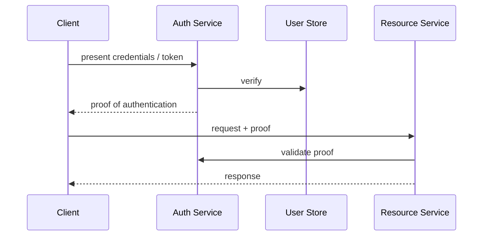

# Authentication

> **Learning Path:** Security Architecture
> **Section:** 5.1.1 — Application security

**Authentication**

### 1. The problem

You have a distributed system with many entry points: web, mobile, API clients, services. Each request arrives with no intrinsic identity. You need to answer: *Can I trust this request is from who it claims to be?*

Without a consistent answer, you cannot enforce authorization, audit actions, or bill correctly. The problem gets harder with scale: stateful sessions don't work across regions, mobile apps can't share cookies reliably, and internal services need to call each other without user passwords.

### 2. Mental model

Authentication is proving possession of a secret, not proving who you are in real life.

Think of it as a check-in desk. The client presents a credential. The verifier checks it against a trusted source of truth. If valid, the verifier issues a short-lived proof of that check. The rest of the system trusts the proof, not the original credential.

### 3. How it works

The core flow is always the same:

Two patterns for the proof:

* **Stateful session.** Server stores session ID -> user mapping. Cookie proves identity. Cheap to revoke, costly to scale.
* **Stateless token.** Server signs a token with user claims, e.g. JWT. Resource service verifies signature locally. Scales horizontally, revocation is hard.

Credentials are never stored raw. Passwords are hashed with Argon2/bcrypt + salt. Long-term secrets are rotated. Short-lived access tokens are issued, refresh tokens are stored securely and rotated.

### 4. Architectural reasoning

When to centralize vs distribute?

Centralized auth service gives one source of truth for identity, MFA, risk, and audit. It's the right default for products with multiple clients and teams. Services become *resource servers* that only validate tokens.

Decentralized per-service auth is only viable for isolated internal systems. It duplicates policy and creates identity sprawl.

Key decisions:

* **Session vs token.** Use sessions for server-rendered web where you control cookies and want instant revocation. Use signed tokens for APIs, mobile, and microservices where stateless validation and cross-service calls matter.
* **Direct auth vs delegated.** For first-party apps, direct login to your auth service is fine. For third-party access, use OAuth2/OIDC so you never share user passwords. The auth server issues access tokens to clients, not user secrets.
* **Where validation happens.** Validate at the edge - API gateway or sidecar - not in every business service. This keeps services focused on domain logic and reduces token validation latency.

### 5. Trade-offs and failure modes

* **Revocation vs scalability.** Stateless tokens scale but can't be revoked instantly. Mitigate with short TTLs + refresh token rotation + revocation list checked only for high-risk actions.
* **Token size and leakage.** JWTs grow with claims. Keep them minimal. Treat access tokens like passwords: short-lived, sent over TLS, never in URLs. Refresh tokens are high value, store httpOnly secure cookies or secure storage.
* **Central auth is a critical dependency.** If it is down, no one logs in. Design for high availability, read replicas for user data, and local validation of signed tokens so resource services stay up during auth outages.
* **Clock skew and signing key rotation.** Stateless validation depends on correct time and key management. Rotate signing keys with overlap, not cutover.

Common failures: storing sessions in local memory, accepting tokens without signature verification, using weak password hashing, allowing refresh token reuse, and trusting client-provided user IDs.

### 6. Example

SaaS product with web, iOS/Android, and partner APIs.

Central Auth Service issues OIDC tokens. Web uses session cookie backed by a central store for instant logout. Mobile uses refresh token rotation in secure storage + 15 min access tokens. Partner APIs use client credentials grant with scoped access tokens.

All resource services validate JWT signature locally using JWKS cached at the edge. Authorization service checks entitlements from token claims + DB for fine-grained permissions. Audit log is written by auth service on login events and by resource services on sensitive actions.

### 7. Reasoning challenge

You have internal microservices that need to call each other on behalf of a logged-in user, plus background jobs with no user context. Do you propagate the user's access token to internal calls, or mint a separate service token? What breaks if the user's token is leaked internally, and how does your choice affect revocation?

### 8. Key takeaway

* Authentication is proving possession of a secret via a trusted verifier; authorization is what you can do after.
* Centralize identity, distribute validation. Auth service is source of truth, resource services verify locally.
* Prefer short-lived stateless proofs for scale, with secure long-lived refresh mechanisms and explicit revocation strategy.
* Design auth for failure: high availability, key rotation, clock tolerance, and never trust client-supplied identity.
