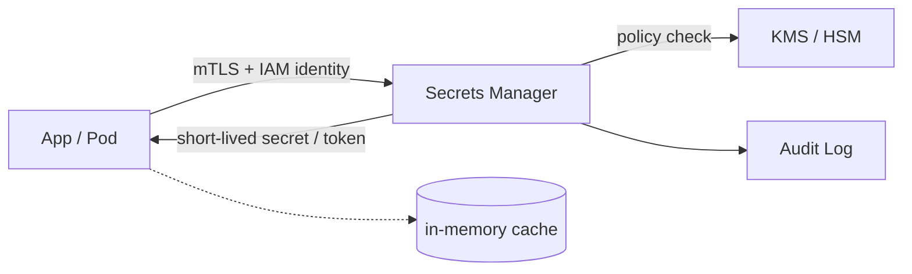

# Secrets

> **Learning Path:** Security Architecture
> **Section:** 5.1.10 — Application security

## The problem

You ship code. That code needs credentials to talk to a database, a queue, a payment gateway, a model API. Hardcode it and it leaks in git. Put it in environment variables and it leaks in logs, dumps, and container images. Put it in a config file and every developer has a copy.

Now multiply by 200 microservices, 12 environments, and rotation every 90 days. The problem is not hiding a string. The problem is **controlling access to a capability over time** while keeping it out of code, out of logs, and revocable without a redeploy.

Constraints architects face:
* **Confidentiality**: only the right workload should ever see the secret
* **Lifecycle**: secrets must be rotated, revoked, audited
* **Availability**: apps must start even if the secret store is slow
* **Least privilege and blast radius**: a leak in one service should not compromise all services

## Mental model

A secret is not data. It is a short-lived capability token. Think of it like a hotel key card: it grants access to a specific room for a limited time, it can be invalidated centrally, and the card itself is useless without the lock system that issued it.

The job of secrets management is to be the issuer and revoker, not a vault of permanent passwords.

## How it works

Centralize issuance and never let long-lived credentials touch disk or code.

App authenticates with its identity, not a shared password. The manager checks policy, returns a secret, ideally short-lived and scoped to that workload. The app caches it in memory only, never writes it to disk. Rotation happens server-side; the next fetch returns a new value.

Dynamic secrets go further: instead of storing a static DB password, the manager creates a credential on demand with a TTL and destroys it automatically.

## Architectural reasoning

When it helps:
* Multiple services share the same third-party API key or database
* You need auditability of who accessed what and when
* You must rotate without redeploying
* You run in cloud / Kubernetes where workload identity exists

Alternatives and why you pick one:
* **Env vars / files**: simple, zero latency. Terrible for rotation and audit. Only acceptable for local dev.
* **Cloud Secret Manager / Vault**: centralized control, audit, rotation, IAM integration. Adds a network call and a new dependency.
* **HSM / KMS**: for root keys and signing, not for everyday app secrets. More cost, more latency.

Decision driver: if you cannot revoke a credential in <5 minutes without a deployment, you do not have secrets management, you have secrets storage.

## Trade-offs and failure modes

* **Secret zero**: how does the app authenticate to the secret manager? Solve with workload identity, instance profiles, or SPIFFE. If you bootstrap with a static token, you moved the problem.
* **Availability vs centralization**: a single secret store is a critical path. Cache in memory with a safe TTL, and design for graceful degradation. Don’t fetch a secret on every request.
* **Blast radius**: one compromised service should not imply all secrets. Use per-service identities and per-secret IAM policies, not one master key.
* **Logging leakage**: apps routinely log env vars and config. Secrets management does not protect you from your own logging. Strip secrets from logs at the collector level.
* **Rotation thundering herd**: rotating a DB password can cause simultaneous reconnect storms. Use dual-write windows and staggered rollout.

## Example

An e-commerce platform with 40 services, 3 regions, and a payment provider key. Each service needs DB access and the payment key.

Instead of 40 copies of the key in repos, each service gets an IAM role. On startup it authenticates to Secrets Manager with that role, fetches `payment/api-key` and `db/password`, caches them 5 minutes in memory. The manager rotates the DB password weekly via automation, issues new credentials, and revokes old ones. Audit logs show exactly which service fetched which secret and when. No secret ever appears in CI logs or container images.

For an AI system, the same pattern applies to model provider keys, feature store credentials, and internal tools. Per-tenant OpenAI keys are stored once, accessed only by the tenant-isolated worker with a policy that restricts the key to that tenant’s identity.

## Reasoning challenge

You are designing a multi-tenant AI agent platform. Each tenant supplies their own OpenAI API key. You have 1,000 tenants, 3 regions, and strict latency SLOs for agent inference.

Where do you store the keys, how do you retrieve them per request, and what is your rotation and revocation story? What breaks if the secret store is unavailable in one region?

## Key takeaway

* Secrets are capabilities with a lifecycle, not static strings to hide.
* Centralize issuance, authentication, audit and rotation; keep secrets in memory only, never in code or logs.
* Use workload identity to solve secret zero, not another long-lived secret.
* Design for availability: cache short-lived, tolerate store latency, limit blast radius with per-service policies.
* If you cannot rotate and revoke without a redeploy, you are managing risk, not secrets.
