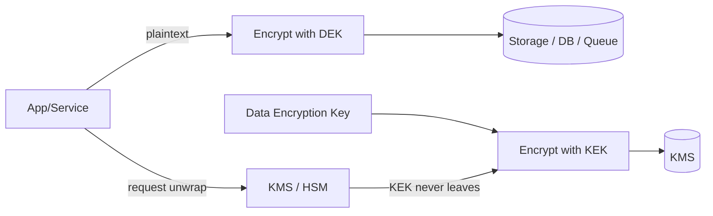

# Encryption

> **Learning Path:** Security Architecture
> **Section:** 5.1.11 — Application security

**Encryption**

### 1. The problem

Access control is not enough. If a database is exfiltrated, backups are copied, logs are leaked, or a developer laptop is stolen, permissions no longer protect you. You need data that is *unreadable* without a secret, even to an attacker who owns the storage.

The problem gets worse in application security: data moves between services, is written to logs, cached, sent over networks, and stored by third parties. You need confidentiality with *compartmentalization* — compromise of one component should not reveal everything.

### 2. Mental model

Encryption is a lockbox with a key policy.

* Plaintext = the contents.
* Ciphertext = locked box.
* Key = the only thing that makes the box openable.

Security does not come from obscurity of the algorithm. It comes from the fact that the key is *not* with the data. The architectural question is always: **who holds the key, how is it distributed, and what happens when it is lost or rotated?**

### 3. How it works

Two primitives, one pattern.

**Symmetric:** Same key encrypts and decrypts. Fast, ideal for bulk data. Problem: key distribution. If you need to share data with many services, you now have many copies of the key.

**Asymmetric:** Public key encrypts, private key decrypts. Solves distribution. Slow for bulk data. Used for key exchange and signing.

In practice you use both. Hybrid / envelope encryption:

Data is encrypted with a short-lived Data Encryption Key. The DEK is encrypted with a master Key Encryption Key held in a KMS/HSM. Services never see the KEK. This gives you bulk performance + centralized key control + auditability.

Key lifecycle matters more than algorithm choice: generation, storage, rotation, revocation, access policy, and destruction.

### 4. Architectural reasoning

When it helps:
* Data at rest must remain confidential after a breach: PII, PHI, payment data, secrets.
* Data in transit across trust boundaries: service-to-service, client-to-API.
* Compliance mandates: GDPR, PCI-DSS, HIPAA require encryption + key management.
* AI systems: training data, prompts with PII, model weights as intellectual property.

What it solves: confidentiality independent of perimeter security.

Alternatives and why you might not encrypt:
* Tokenization / pseudonymization for non-sensitive reference data. Cheaper, reversible only by a mapping service.
* Access control + network isolation if data is low sensitivity and breach impact is acceptable.
* Application-level encryption vs transparent disk encryption. Disk encryption protects the host; application encryption protects data even when copied out of the host.

Decision rule: Encrypt where the data's value persists beyond the lifetime of a single request and where you cannot guarantee the storage medium stays trusted.

### 5. Trade-offs and failure modes

**Key management is the system.** A perfect cipher with a leaked key is zero security.

* Key sprawl and rotation cost. Rotating a master key can mean re-wrapping thousands of DEKs. Plan rotation windows and automate.
* Performance. Symmetric encryption is cheap, but per-record key unwrap adds latency. Batch and cache unwrapped DEKs with short TTLs, never in plaintext logs.
* Availability vs confidentiality. Lose the key, lose the data. HSMs and KMS provide durability but add a critical dependency. You need key escrow and disaster recovery tested.
* Crypto misuse. Encrypting the same plaintext with same key/nonce, using weak modes, logging plaintext, or storing keys next to data are common failures. Use vetted libraries, authenticated encryption like AES-GCM, and avoid rolling your own.
* Compliance illusion. Encrypting data then logging the plaintext in application logs or error messages defeats the purpose. Define data classification and enforce it at the schema level.

### 6. Example

Payment microservice storing card numbers.

* Application encrypts PAN with a per-tenant DEK using AES-GCM.
* DEK is stored encrypted by KMS, with IAM policy: only the payment service role can `Decrypt`, only in production VPC.
* Rotation: new DEK generated monthly, old DEK kept for decryption only. Re-encryption happens lazily on read/write.
* Audit: every unwrap is logged to SIEM. No plaintext PAN ever hits logs, caches, or message queues.

If the DB is dumped, ciphertext is worthless without KMS access. If a developer account is compromised, IAM denies key access from untrusted IPs. If the service is compromised, attacker gets at most data encrypted with current DEK, and can be cut off by revoking the role.

### 7. Reasoning challenge

You are designing an AI platform that ingests customer support transcripts for fine-tuning and also stores API keys for third-party integrations.

Where do you encrypt, with what granularity, and who manages keys? What do you *not* encrypt?

Think about data lifetime, who needs to read it, regulatory scope, and operational cost of rotation.

### 8. Key takeaway

* Encryption protects confidentiality after access control fails; design for breach, not just prevention.
* Prefer envelope encryption with a KMS/HSM: fast data keys + centralized master key control + audit.
* The hard problem is key lifecycle, not cipher choice. Rotation, access policy, and availability are architectural decisions.
* Never store keys with data, never log plaintext, and use authenticated encryption from vetted libraries.
