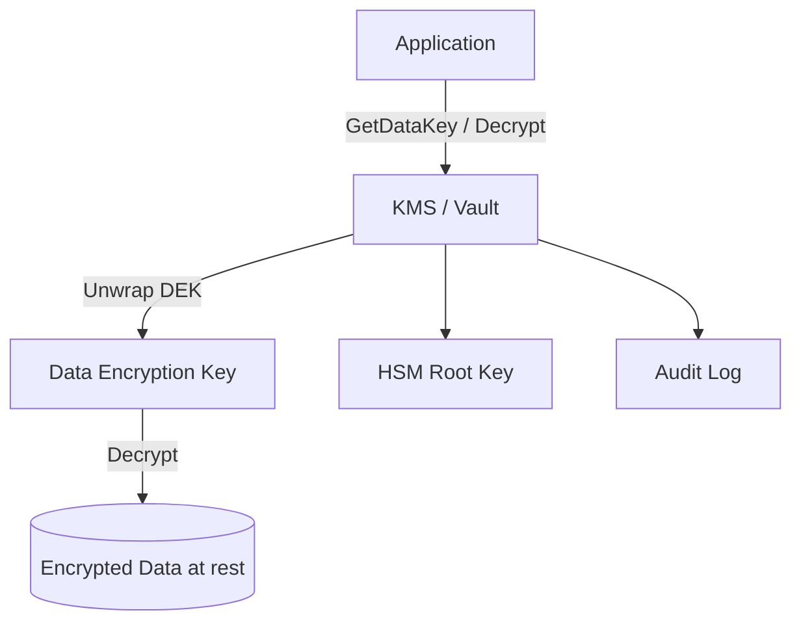

# Key management

> **Learning Path:** Security Architecture
> **Section:** 5.1.12 — Application security

**Key management — Security Architecture 5.1.12**

### 1. The problem

Applications need secrets: database encryption keys, signing keys, API keys for LLM providers, model weights protection. The problem is not generating a key, it's living with it.

If a key is in code, env vars, or config repos it leaks. If it lives in the app, rotation means redeploying everything. If it's lost, data is unrecoverable. If it's shared, one breach compromises everything.

You need: confidentiality, controlled use, auditability, rotation without downtime, and separation between who writes code and who can access the key.

### 2. Mental model

Think of keys as radioactive material. You don't store them next to the reactor. You keep a small, hardened vault with strict access, and hand out short-lived, scoped tokens.

Key management is a control plane for cryptographic material: generate, store, distribute, rotate, revoke, audit. The app never holds long-term secrets; it borrows capability from the vault.

### 3. How it works

The essential pattern is hierarchy + envelope encryption.

* Master Key, stored in HSM/KMS, never leaves. Root of trust.
* Data Encryption Keys, per data set / tenant, encrypt actual data.
* Data is encrypted with DEK, DEK is encrypted with Master Key.

App flow:

Rotation becomes cheap: rotate DEKs, re-wrap with new master. Access is policy enforced at KMS, not in app code. All use is logged.

### 4. Architectural reasoning

Use a KMS/Vault when:
* Keys protect production data or third-party credentials
* You need audit, rotation, and least-privilege access
* Multiple services share keys

Don't build your own: generating secure random, protecting at rest, FIPS compliance, and audit trails are hard.

Alternatives:
* Hardcoded/env vars: fast, terrible. Acceptable only for local dev.
* Secrets manager / Vault: good for API tokens, short-lived secrets, dynamic credentials.
* Cloud KMS + HSM: good for encryption keys, compliance, key custody guarantees.
* Bring your own HSM: needed for regulated workloads, key attestation, or zero-cloud-trust.

Decision hinges on custody and blast radius. Who holds the root key? Cloud provider vs you. What happens if the vault is down? Design for availability.

### 5. Trade-offs and failure modes

* Centralization vs latency. KMS call per decrypt adds latency and a runtime dependency. Mitigate with in-memory cache of DEKs with TTL and envelope encryption.
* Cost vs control. KMS is cheap per op until scale. HSM is expensive but provides tamper evidence and legal non-repudiation.
* Blast radius. One master key = all data. Use per-tenant or per-service DEKs and limit IAM to narrow scopes.
* Rotation failure. If rotation is manual, it won't happen. Automate rotation and test restore from backup keys.
* Key leakage via logs. Apps log request payloads and accidentally log secrets. Enforce redaction and never return plaintext master keys to app.

Common failure: app retrieves master key at startup and caches forever. Now a compromise of the app = compromise of all data. Correct pattern: app holds only a short-lived session token, KMS enforces per-request authZ.

### 6. Example

SaaS with multi-tenant Postgres and OpenAI API keys.

Each tenant gets a DEK. Tenant data is encrypted with DEK, DEK wrapped with tenant-scoped master key in KMS. App never sees plaintext DEK for > seconds.

LLM provider keys are stored in Vault with dynamic leases. Worker service requests a key, gets a 15-minute lease, usage is logged per tenant. When an employee leaves, revoke IAM, no key hunting.

Rotation: KMS auto-rotates master key annually. On read, if DEK is wrapped with old master, unwrap then re-wrap transparently. Zero downtime.

### 7. Reasoning challenge

You are architecting an AI pipeline that ingests customer documents, encrypts them, and calls three external model providers. You can store provider API keys in Vault or in the app's config with rotation via CI/CD.

What is the failure mode if you choose config, and what non-functional requirement forces you to use a secrets manager with per-service IAM and audit logging?

### 8. Key takeaway

* Keys are a control problem, not a storage problem. Separate generation/storage from use.
* Use hierarchical keys and envelope encryption to make rotation cheap and blast radius small.
* Centralize in KMS/Vault for audit, policy, and rotation. Accept latency and availability as design constraints.
* Never let the application own long-lived secrets. It should request capability, not custody.

You should be able to reason: where does the root of trust live, who can unwrap a key, how do you rotate without downtime, and what breaks if the vault is unavailable.
