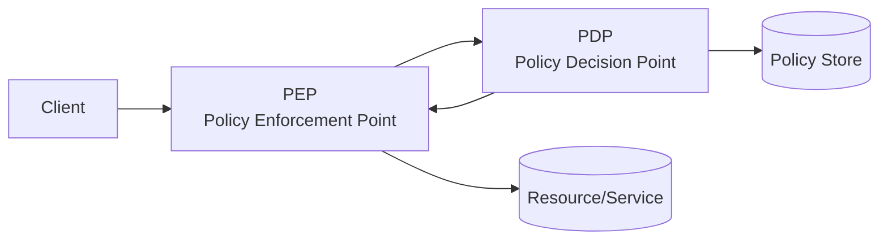

# Authorization

> **Learning Path:** Security Architecture
> **Section:** 5.1.2 — Application security

### The problem

Authentication answers *who you are*. Authorization answers *what you are allowed to do with it*.

Once you have a valid user, every service still needs to decide: can this principal perform this action on this resource, right now? 

In monoliths that check is a quick `if user.isAdmin` scattered in code. At scale it breaks:
* Policy is duplicated across services and drifts
* Changes require code deploys
* Auditing who was allowed to do what is impossible
* Least privilege can't be enforced consistently across microservices, APIs, data stores and AI tools

You need a way to make access decisions centrally, consistently, and auditable without coupling every service to every policy.

### Mental model

Authorization is a policy evaluation: **can Principal P do Action A on Resource R in Context C?**

Think of it as a decision function, not a flag.

`Decision = Policy(P, A, R, C)`

Where context includes tenant, time, location, data classification, ownership graph, etc. The mental model is not "roles" - roles are just one way to encode policy.

### How it works

Enforcement is split into two parts:

* **PEP** intercepts the request at the service edge, API gateway, or SDK client. It assembles the request attributes: who, what, where, when.
* **PDP** evaluates policy against those attributes and returns Allow/Deny + obligations.
* Policy is stored separately and versioned.

This separation lets services stay dumb: they ask, they don't decide. Auditing becomes a log of decision inputs and outputs.

### Architectural reasoning

**When it helps**
* Multiple services share the same resources
* Permissions need to be dynamic per user, per object, per context
* You need auditability and revocation without redeploy
* AI agents/tools need per-user guardrails

**Options**
* **RBAC** - Role → Permissions. Simple, fast, explodes with fine-grained data.
* **ABAC** - Attribute based. `user.department == resource.ownerDepartment && time in businessHours`. Expressive, flexible.
* **ReBAC** - Relationship based. "Can edit if member of team that owns doc". Good for graphs.

Most real systems are hybrid: coarse RBAC for service access, ABAC/ReBAC for data access.

Choose central PDP when consistency and audit matter more than a few ms latency. Push decisions to the edge with cached policies when latency is critical.

### Trade-offs and failure modes

* **Centralization vs latency.** A remote PDP adds round-trip. Cache decisions with short TTL, or push compiled policies to PEPs. Stale cache = security risk.
* **Coarse vs fine-grained.** Fine-grained is correct but creates policy explosion and slower evaluation. Define a boundary: who can access the service vs who can access a specific row.
* **Policy complexity.** Complex ABAC is powerful and unreadable. Test policies, version them, and have a simulation mode.
* **Failure modes.** Confused deputy when a service uses its own credentials instead of the user's. TOCTOU where permission is checked then resource changes. Missing context leading to over-permission. Deny-by-default must be enforced, not opt-in.

### Example

Multi-tenant SaaS docs platform.

Request: `User U42` wants to `UPDATE` `Doc D99` at 22:00 from new IP.

PEP extracts: principal=`u42`, action=`update`, resource=`doc:d99`, tenant=`acme`, owner=`u10`, user role=`editor`, ip reputation=`low`.

Policy: 
`Allow if tenant matches AND owner == user OR user has role editor in tenant AND time in business hours AND ip reputation good`

PDP denies. Service never sees the decision logic, just gets Deny. The decision is logged for audit and the UI can explain why.

For an AI assistant in the same tenant, the same PDP gates tool calls: can this user invoke `delete_project`? It prevents privilege escalation via the model.

### Reasoning challenge

You are designing an AI coding assistant that runs in a corporate repo. Each user should only be able to read files in repos they have access to, and can only run `create PR` in repos where they are maintainer. The assistant also calls an internal search API.

Where do you enforce authorization: in the assistant orchestrator, in each tool, or both? What attributes do you need in the decision, and what fails if you cache the decision for 5 minutes?

### Key takeaway

* Authorization is policy evaluation over principal-action-resource-context, not a role check.
* Separate enforcement from decision making. PEP asks, PDP decides.
* Design for auditability and revocation first; performance second via caching.
* Start coarse with RBAC, add ABAC/ReBAC only where data-level control is required, and always default deny.
