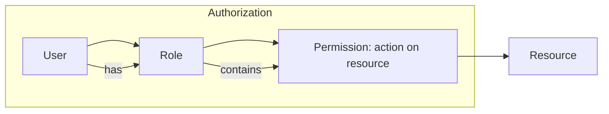

# RBAC

> **Learning Path:** Security Architecture
> **Section:** 5.1.3 — Application security

**The problem**

You ship an application with 10 users. Access control is easy: hard-code checks or an allow-list per user.

At 10,000 users across multiple teams, products, and environments, that breaks down.

* Who can approve a refund? Who can read PII? Who can deploy to prod?
* Permissions change frequently. Users change roles.
* You need auditability: *who did what, under what authority*.
* You need least privilege without creating a maintenance nightmare.

Direct user-to-permission mapping doesn't scale. You need an abstraction layer between identity and authorization.

**Mental model**

RBAC = Roles as bundles of permission.

Instead of granting permissions to individuals, you grant permissions to a role, and assign users to roles. Authorization becomes: *Does this user have a role that includes this permission on this resource?*

Think of it as an organizational chart mapped to software. A role captures a job function, not a person.

**How it works**

Three core entities:

* **User** - identity, authenticated principal
* **Role** - named job function, e.g., `billing_admin`, `support_readonly`
* **Permission** - tuple of `action + resource`, e.g., `delete:invoice`, `read:customer_pii`

Evaluation at request time: `user -> roles -> permissions -> allow/deny`.

Implementation is usually a policy store with two relations: `user_role` and `role_permission`. Enforcement happens in middleware / API gateway / service layer. The check is constant-time if roles and permissions are cached per session.

**Architectural reasoning**

RBAC solves the management problem, not the expression problem.

Use it when:
* Access is organized around stable job functions
* The number of roles is << number of users
* Audit requirements are "who in this role performed this action"

Alternatives:
* **ACL - Access Control List**: permission per user per resource. Precise, explodes with scale. Good for document-level sharing.
* **ABAC - Attribute Based Access Control**: decision based on attributes of user, resource, environment, e.g., `user.department == resource.owner_department AND time < 18:00`. Expressive and dynamic.
* **ReBAC - Relationship Based**: permissions derived from graph relationships, e.g., manager of user.

Decision: RBAC first for coarse-grained control. Add ABAC for context-dependent exceptions. Don't start with ABAC; you will over-engineer policy.

**Trade-offs and failure modes**

* **Role explosion.** Too many fine-grained roles = ACL in disguise. Keep roles coarse, permissions fine-grained. Aim for <50 roles per domain.
* **Static.** RBAC is role-centric, not context-centric. It cannot express "doctor can access patient record only if treating that patient". That's ABAC.
* **Hierarchical complexity.** Role inheritance simplifies but makes audits hard. A change at top cascades.
* **Stale assignments.** Users accumulate roles. No automatic revocation on role change. Requires lifecycle processes.
* **Performance.** Permission checks per request can be costly. Mitigate with short-lived access tokens containing role claims, and central policy decision point.

Failure mode to watch: granting `admin` to reduce tickets. RBAC encourages least privilege only if you enforce role reviews and deny-by-default.

**Example**

SaaS billing platform, multi-tenant.

Roles: `tenant_admin`, `finance_user`, `support_agent`, `auditor`.

Permissions: `read:invoice`, `write:invoice`, `refund:invoice`, `read:pii`, `export:report`.

A support agent can read invoices but not refund. A finance user can refund but only for their tenant. Enforcement is done in API gateway: token contains roles, policy engine checks `role_permission` + tenant scoping.

When a new compliance rule requires "no PII access outside business hours", RBAC alone can't enforce it. You add an ABAC guard on top: `role allows read:pii AND time in business_hours`.

**Reasoning challenge**

You are designing access for a hospital system. Roles exist: Doctor, Nurse, Admin.

A doctor should only view patient records they are assigned to, and only during their shift. A nurse can view vitals for assigned patients 24/7.

Do you model this with RBAC alone? If not, what minimal extension do you add, and where does it live in the architecture?

**Key takeaway**

* RBAC solves *management scale* by abstracting permissions behind stable roles, not by making policies more expressive.
* Choose RBAC for job-function authorization, ACL for resource-specific, ABAC for context-dependent.
* Role explosion and permission creep are the primary operational failures; design for review cycles and deny-by-default.
* In practice, RBAC + ABAC layered is the production pattern: RBAC for coarse gate, ABAC for fine-grained context.
