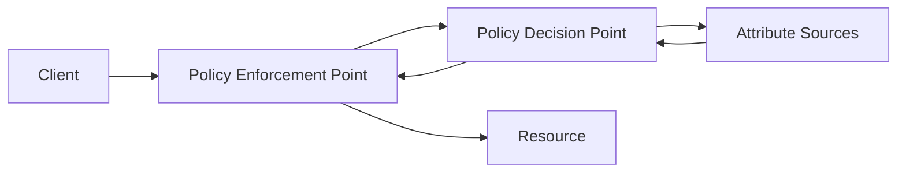

# ABAC

> **Learning Path:** Security Architecture
> **Section:** 5.1.4 — Application security

### 1. The problem

RBAC works until it doesn't. You create roles like `Doctor`, `Nurse`, `BillingAdmin`. Then you need rules like:
* Doctors can only see patients on their own ward
* On-call doctors can access after hours from hospital network only
* A doctor can see a record only if the patient consented for that specialty

With RBAC you end up creating roles for every combination: `CardiologyDoctorDayShift`, `CardiologyDoctorNightShift`, `CardiologyDoctorRemote`. Role explosion is unmaintainable and lags behind reality.

The constraint is: authorization must be decided from *attributes*, not just identity + static role. Attributes change: user role, department, clearance, location, time, device posture. Resource attributes change: owner, sensitivity, data residency, patient consent. Environment attributes change: IP, time of day, risk score.

You need a model where policy is decoupled from identity management.

### 2. Mental model

ABAC = Access = f(User attributes, Resource attributes, Action, Environment attributes)

Think of it as a policy filter, not a role list. You don't ask "Is this user in role X?". You ask "Given who they are, what they're accessing, what they're doing, and where/when, does a policy allow it?"

It's attribute-driven, not role-driven.

### 3. How it works

The architecture separates decision from enforcement:

* **PEP** intercepts the request in API gateway, service mesh, or app layer.
* **PDP** evaluates policy against attributes fetched in real time.
* **Attribute sources** provide current attributes: IdP for user, resource DB for object metadata, context service for IP/time/device.

Policy example in concept: `allow if user.department == resource.department AND user.clearance >= resource.classification AND time.hour in 08..18 AND device.trusted == true`

Standards like XACML formalize this. In practice OPA/Rego, Cedar, or custom engines implement it.

### 4. Architectural reasoning

**When it helps**
* Fine-grained, context-aware access: healthcare, finance, multi-tenant SaaS
* Dynamic attributes matter: consent, location, risk score
* Policies must be centrally audited and changed without code deploys
* You need same policy enforced across services, APIs, and data plane

**Alternatives**
* **RBAC**: good for coarse, stable roles. Fails on context.
* **ReBAC / Relationship-Based**: good for graph relationships like "manager of". Still limited vs arbitrary attributes.
* **MAC**: mandatory, central policy. Too rigid for most apps.

Choose ABAC when policy complexity is high dimensional, not just role count.

### 5. Trade-offs and failure modes

* **Complexity and governance.** Policies are powerful and easy to make wrong. You need version control, testing, and audit for policies as code. A bad policy is a silent security hole.
* **Attribute freshness and trust.** Decision is only as good as attributes. Stale consent flag or spoofed location = wrong decision. Attribute sources become critical dependencies.
* **Performance.** PDP evaluation per request adds latency. You mitigate with caching, pre-computation, and pushing simple checks to PEP.
* **Observability.** Debugging "why was this denied?" requires replaying attributes + policy version at request time. Log all four inputs.

Failure mode: policy explosion in another form. Teams write thousands of ad-hoc rules with no abstraction. Treat policies like code: DRY, review, test.

### 6. Example

Healthcare records API.

Attributes:
* User: `role=doctor`, `department=cardiology`, `on_call=true`
* Resource: `type=record`, `patient_id=123`, `sensitivity=high`, `owner_department=cardiology`
* Action: `read`
* Environment: `time=02:15`, `ip_in_hospital=true`, `device_managed=true`

Policy: allow read if user.role in [doctor,nurse] AND user.department == resource.owner_department AND (time in business hours OR user.on_call) AND ip_in_hospital.

No new role needed when on-call changes. Policy adapts instantly.

### 7. Reasoning challenge

You are designing access for an AI agent platform. Agents can call internal tools on behalf of users. Should an agent be allowed to read a user's private emails and summarize them for a request to "draft a reply"?

What attributes would you need to evaluate, and why is RBAC insufficient here? What failure mode worries you most?

### 8. Key takeaway

* ABAC exists to solve fine-grained, context-dependent authorization where RBAC creates role explosion.
* Decision = policy over attributes of user, resource, action, environment, not membership in a role.
* Separate PEP, PDP, and attribute sources to keep policy centralized and auditable.
* Trade flexibility for complexity: you gain expressiveness, you lose simplicity. Governance, performance, and attribute trust become architectural concerns.
