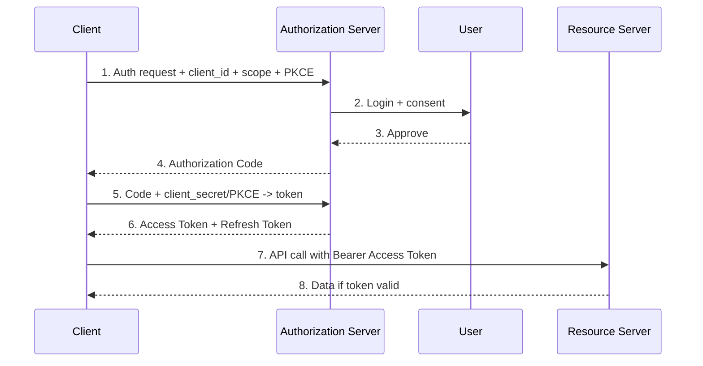

# OAuth2

> **Learning Path:** Security Architecture
> **Section:** 5.1.5 — Application security

**OAuth2**

### 1. The problem

You have a user, a resource server with user data, and a third-party client that needs to act on behalf of that user. The client must not get the user's password, and the user must be able to grant limited access and revoke it later.

Constraints emerge immediately:
* Credentials must stay with the user and the authorization server.
* Access must be scoped and time-limited.
* The client may be untrusted or public, e.g. a mobile app or SPA.
* The resource server must be able to verify a request without contacting the client.

This is delegation, not authentication. OAuth2 solves delegation at scale.

### 2. Mental model

Think valet key. You don't hand the valet your house key. You hand a limited key that opens the car door and starts the engine, expires after a few hours, and can be revoked.

OAuth2 is a brokered delegation protocol:
* **User** owns the data
* **Authorization Server** issues limited tokens after user consent
* **Client** presents tokens to prove delegated permission
* **Resource Server** trusts tokens from the authorization server

No password sharing. No long-lived secrets in the client.

### 3. How it works

Core roles: User, Client, Authorization Server, Resource Server.

Essential flow for a confidential or public client:

Mental shortcuts:
* **Authorization Code + PKCE** is the default secure flow. Code is short-lived and exchanged server-side.
* **Access Token** is bearer: whoever holds it is trusted. Short lived, 5-60 min.
* **Refresh Token** is long lived, stored securely, used to mint new access tokens.
* **Scope** limits what the token can do: `read:profile` vs `write:billing`.

That's it. The rest is profiles and extensions.

### 4. Architectural reasoning

When it helps:
* Third-party apps need user data from your API.
* You need fine-grained consent and revocation.
* You want to decouple identity from authorization.

Alternatives:
* **API key**: simple, but no user context, no revocation granularity, leaks easily.
* **SAML / OIDC**: identity-focused, good for SSO between organizations. OIDC builds on OAuth2 for identity.
* **mTLS / service tokens**: machine-to-machine, no user delegation.

Choose OAuth2 when the problem is *user-delegated access to resources*. Choose API keys for internal service-to-service where trust is static. Choose OIDC when you also need identity assertions.

### 5. Trade-offs and failure modes

* **Complexity vs security.** Authorization code + PKCE + refresh rotation is hard to implement correctly. Skipping PKCE on public clients is the most common vulnerability.
* **Token theft is fatal.** Access tokens are bearer. Mitigate with short TTL, HTTPS only, sender-constrained tokens, and refresh token rotation.
* **Confused deputy.** A token issued for Resource A can be replayed to Resource B if audiences are not validated. Always verify `aud`, `iss`, `exp`.
* **Redirect URI misconfiguration.** Open redirect enables code interception. Exact-match redirect URIs + PKCE required.
* **Scope creep.** Over-permissive scopes turn a read app into a write app. Default to minimal scope and make users re-consent for elevation.
* **Refresh token storage.** In SPAs/mobile, refresh tokens must live in secure storage, not localStorage. Consider backend-for-frontend pattern.

### 6. Example

Enterprise SaaS billing platform. Your app needs to pull invoices from Stripe on behalf of customers.

You register as an OAuth2 client with Stripe. User logs in to your app, you redirect to Stripe Authorization Server, user consents to `read:billing`. Stripe returns code, you exchange for access + refresh token.

Your backend stores refresh token encrypted. Access token is used for API calls, refreshed automatically. User can revoke in Stripe dashboard, token stops working immediately. You never see the user's Stripe password, and you can limit access to read only.

### 7. Reasoning challenge

You are designing an internal SPA dashboard that calls your own API. The SPA is public, no backend. Should you use Authorization Code + PKCE with refresh tokens stored in the browser, or move tokens behind a Backend-for-Frontend?

What breaks if you store refresh tokens in localStorage? What changes if you add a BFF?

### 8. Key takeaway

* OAuth2 is delegation, not authentication. It solves limited, revocable access without password sharing.
* Use Authorization Code + PKCE for public clients. Access tokens short-lived, refresh tokens protected.
* Validate audience, issuer, expiry, and scope on every request. Bearer tokens are powerful and dangerous.
* Prefer a Backend-for-Frontend to avoid storing refresh tokens in the browser.

You should now be able to reason about when OAuth2 is appropriate, how to structure the flows safely, and what will fail first in production.
