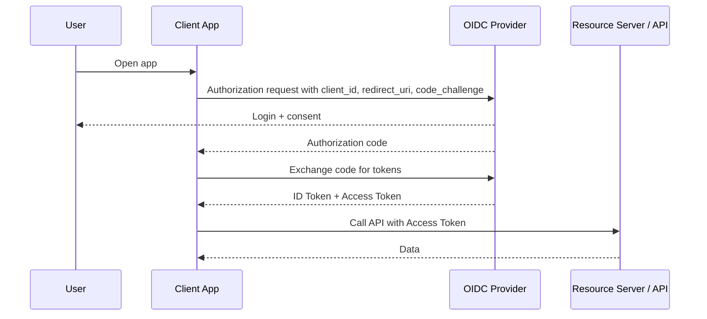

# OIDC

> **Learning Path:** Security Architecture
> **Section:** 5.1.6 — Application security

**1. The problem**

You have many applications that need to know *who* a user is. You don't want each app to store passwords, you don't want users to log in separately to each app, and you don't want App A to trust App B's internal user database.

OAuth 2.0 solved delegation: "Let App A access data on behalf of the user without seeing the password". It does **not** standardize *authentication* — proving who the user is.

That gap creates duplication, custom integrations, and fragile trust.

**2. Mental model**

OIDC = OpenID Connect. It adds an identity layer on top of OAuth 2.0.

Think of OAuth 2.0 as the entry permit to a building. OIDC adds a passport check at the entrance and puts the passport number in the permit.

The client gets an access token for authorization, and an ID Token for authentication. The ID Token is a signed JWT with claims like `sub`, `iss`, `aud`, `exp`. It is a cryptographically verifiable statement from the Identity Provider: "I authenticated this user, and this is who they are."

**3. How it works**

Essential flow for a web app with PKCE:

The client never sees the user's password. The IdP authenticates the user once and issues tokens. The client validates the ID Token signature using the IdP's JWKS, checks `iss`, `aud`, `exp`, `nonce`. Optionally it calls the UserInfo endpoint for fresh claims.

That's it. Authorization Code + PKCE is the default for public clients. ID Token is the proof of authentication.

**4. Architectural reasoning**

When it helps:
* Multiple frontends and APIs need single sign-on
* Third-party apps need to authenticate users without sharing secrets
* Mobile / SPA clients where you cannot store client secrets safely
* Federation across organizations, e.g., corporate IdP to SaaS

What it solves: standardized identity assertion, no password replication, centralized session and MFA.

Alternatives:
* **SAML**: XML-based SSO, strong in enterprise browsers, heavy, poor mobile support
* **Session cookies + custom auth**: Simple for one app, breaks down at scale and multi-tenant
* **OAuth 2.0 only**: You can infer identity from access token introspection, but no standard claims and no client-side proof

Choose OIDC when you need portable, verifiable identity across distributed apps and you can accept an external IdP dependency.

**5. Trade-offs and failure modes**

* **Trust boundary moves to IdP.** IdP outage = login outage. You need discovery resilience, JWKS caching, and token validation offline.
* **Token validation is your responsibility.** Not checking signature, `aud`, `iss`, `exp`, or `nonce` = token substitution and replay attacks. Clock skew causes subtle failures.
* **ID Token != Access Token.** Using ID Token to call APIs is a common mistake. Access Token is for authorization, ID Token is for authentication to the client.
* **Scope creep.** OIDC gives identity, not authorization. You still need proper scopes/roles in the access token and enforcement in the API.
* **Phishing and redirect_uri validation.** If redirect URIs are misconfigured, authorization codes leak. PKCE mitigates code interception.

**6. Example**

Enterprise SaaS with web dashboard, mobile app, and public API.

One IdP issues OIDC tokens. Dashboard uses Authorization Code + PKCE, validates ID Token, creates a local session. Mobile app uses same flow, stores tokens securely. API only validates Access Token signature and scopes.

New internal microservice joins: it just trusts the same JWKS and `iss`. No password sync, no new login page. Users get SSO across all products.

**7. Reasoning challenge**

You are designing internal service-to-service auth in a private VPC. Services need to know the calling service identity, not the end user. Do you use OIDC with client credentials, or mTLS with SPIFFE identities?

Think about: audience, revocation speed, blast radius of IdP failure, and whether you need human user claims at all.

**8. Key takeaway**

* OIDC solves *who is the user* by adding verifiable identity claims to OAuth 2.0 authorization.
* ID Token is a signed statement from the IdP; Access Token is for API access. Don't mix them.
* Architectural value is centralizing authentication and enabling SSO across distributed apps.
* Security hinges on correct token validation: signature, `aud`, `iss`, `exp`, `nonce`, and PKCE for public clients.
* IdP becomes a critical dependency; design for availability, key rotation, and failure modes.
