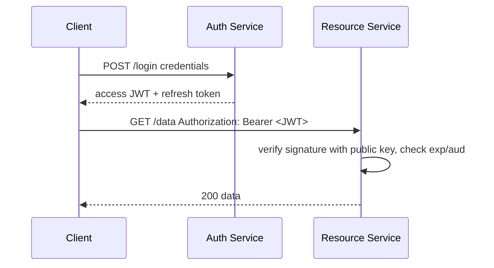

# JWT

> **Learning Path:** Security Architecture
> **Section:** 5.1.7 — Application security

### The problem

You have a distributed system with multiple services, APIs, and possibly mobile clients. After login you need to prove identity on every request without hitting a central session store on each call.

Constraints that create the problem:
* **Stateless scale.** A database-backed session lookup per request adds latency and a single point of failure. You want services to verify a request locally.
* **Decoupling.** Auth service and resource services should not need to share session state. Services should be independently deployable.
* **Cross-boundary trust.** Mobile apps, SPAs, and third-party clients need a portable credential that works across origins.

Session cookies + server-side store solves correctness, but not scale and coupling. JWT solves the trade-off.

### Mental model

A JWT is a tamper-evident postcard.

The issuer writes claims about the user — who they are, what they can do, when it expires — on the postcard, signs it, and hands it to the client. Any service that holds the public verification key can read the postcard and check the signature without calling back to the issuer.

It is **self-contained**, not encrypted by default. It proves authenticity, not secrecy.

### How it works

`header.payload.signature`

* **Header** declares algorithm and token type, e.g. `{"alg":"RS256","typ":"JWT"}`
* **Payload** is claims: `iss`, `sub`, `aud`, `exp`, `iat`, `scope`. Business claims can be added but should be minimal.
* **Signature** is computed over `base64url(header).base64url(payload)` with issuer's private key. Verification uses the public key.

Verification is local: check signature, check `exp`/`nbf`, check `aud`/`iss`. No DB lookup required.

If confidentiality is needed you use JWE, but most APIs use signed JWS only.

### Architectural reasoning

When it helps:
* **Stateless API gateways and microservices.** Each service verifies the JWT independently. No shared session store.
* **Cross-service auth.** The token travels with the request; downstream services trust the same signature.
* **Mobile / SPA.** Tokens are stored client-side and sent via `Authorization: Bearer`.

Alternatives:
* **Opaque session token + server store / Redis.** Strong revocation, small token size, but central dependency and network hop per request.
* **Mutual TLS.** Strong machine identity, poor user identity and UX.

Choose JWT when you optimize for **scale and decoupling** over instant revocation. Choose session store when you optimize for **control and immediate invalidation**.

### Trade-offs and failure modes

* **Revocation is hard.** Stateless means you cannot instantly kill a token. You need short `exp` + refresh tokens, token denylist with TTL, or versioned `iss` checks.
* **Size and leakage.** JWTs are larger than opaque IDs and are often logged in proxies. Never put PII or secrets in payload.
* **Algorithm confusion.** Accepting `alg:none` or allowing HS256 with a public key enables forgery. Always enforce expected alg and key type.
* **Key management.** RS256 lets you rotate public keys safely. HS256 shares a symmetric secret with every verifier — a secret leak compromises all.
* **Clock skew.** `exp` relies on synchronized clocks. Short lifetimes amplify skew problems.

### Example

Enterprise SaaS with Auth Service, API Gateway, and 12 microservices.

User logs in → Auth Service validates credentials, issues access token with 5 min `exp` and refresh token with 7 days `exp`. Client stores access token in memory, refresh token in httpOnly cookie.

Request flow:

Resource services never call Auth Service on the hot path. Token refresh is handled asynchronously.

### Reasoning challenge

A user reports their laptop stolen. You need to revoke all their active sessions immediately. Your current design uses 15-minute JWT access tokens with no denylist.

What is the minimal change that gives you effective revocation without abandoning stateless verification? What trade-off does it introduce?

### Key takeaway

* JWT is a signed, self-contained claim set that enables stateless verification across distributed services.
* It trades instant revocation and central control for scale, decoupling, and reduced latency.
* Keep tokens short-lived, minimal, signed with asymmetric keys, and never trust the client to store secrets.
* Design revocation explicitly — short expiry + refresh rotation, or a bounded denylist — don't assume stateless means immutable.
