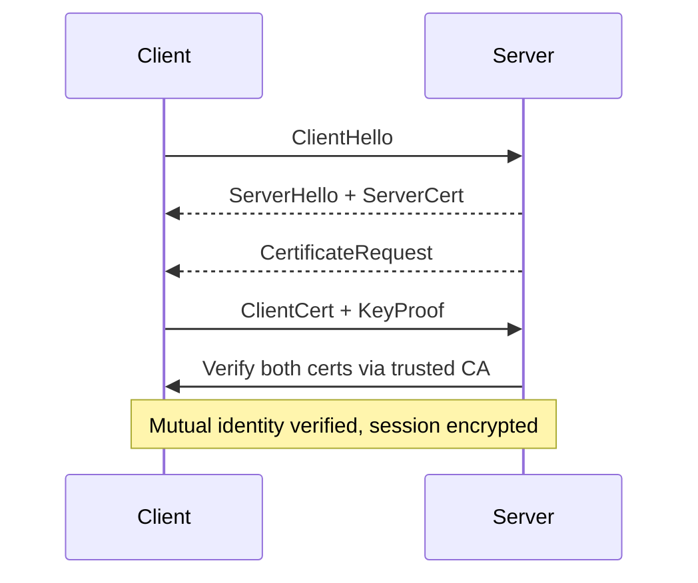

# mTLS

> **Learning Path:** Security Architecture
> **Section:** 5.1.8 — Application security

**The problem**

TLS as most apps use it authenticates the server to the client. The client proves who it is with a password, API key, or a bearer token. That works for human users, but for service-to-service calls it creates problems:

* Secrets leak. API keys in env vars rotate poorly and get logged.
* Identity is weak. IP allowlists break with autoscaling and multi-cloud.
* Authorization is decoupled from transport. You have to trust the network first, then check a token.

In a zero trust architecture you cannot trust the network. Every connection must prove both sides.

**Mental model**

Normal TLS = client shows ID to server, server shows ID to client.

mTLS = both sides show ID to each other and verify it with the same trusted authority.

Think of a secure facility with two doors. With TLS you check the visitor's badge at entry. With mTLS you also check the guard's badge before you hand over anything. Neither side trusts the room they are in.

**How it works**

mTLS is TLS with a client certificate.

1. Client initiates handshake with `ClientHello`.
2. Server presents its certificate, signed by a CA the client trusts.
3. Server requests client certificate.
4. Client presents its certificate, signed by a CA the server trusts, and proves possession via private key.
5. Both sides verify chain, expiry, revocation, and hostname/SAN.
6. If both valid, symmetric keys are negotiated and traffic is encrypted.

The CA is the trust anchor. Not the certificate itself. You control issuance policy, not just a static secret.

**Architectural reasoning**

When it helps:
* Service mesh / internal east-west traffic. Services need strong machine identity, not secrets.
* Zero trust perimeters where network location is meaningless.
* Regulatory environments requiring cryptographic non-repudiation for internal APIs.

Alternatives:
* API keys + TLS. Simpler, but secret management and rotation are painful at scale.
* JWT / OAuth2 client authentication. Good for identity + scopes, but token issuance and validation adds latency and a central dependency.
* IP allowlists. Fragile, doesn't prove identity.

Choose mTLS when the identity of the caller matters as much as the identity of the service, and you can operate a PKI.

**Trade-offs and failure modes**

Cert management is the cost. You are trading secret sprawl for PKI sprawl.

* Issuance and rotation. Short-lived certs ~24-72h reduce blast radius but need automation. Manual certs expire at 2am.
* Revocation. CRL/OCSP adds latency and availability dependency. Many systems rely on short lifetime instead.
* CA compromise = total compromise. Root and intermediate key protection is now critical infrastructure.
* Debugging is harder. "connection reset" can mean cert expiry, SAN mismatch, or wrong trust bundle.
* Performance. Handshake is heavier, though session resumption and TLS 1.3 mitigate.

Failure modes architects see in production: certs not renewed by automation, wildcard certs used for service identity, different trust bundles between client/server, and revocation not tested until incident.

**Example**

Enterprise payments platform: `api-gateway` public, `fraud-service`, `ledger-service`, `reconciliation-worker` internal.

Public traffic terminates at gateway with normal TLS + OAuth. Inside the VPC, Istio enforces mTLS automatically. Each pod gets a SPIFFE certificate with identity `spiffe://payments/fraud-service`. The ledger service only accepts connections where client identity is in `spiffe://payments/*` and the request is signed by the platform CA.

No API keys in service config. Rotation is handled by the mesh control plane. If a pod is compromised, its cert expires in 24h and cannot be reused.

**Reasoning challenge**

You are designing a SaaS with a public REST API for customers and 40 internal microservices. Do you enforce mTLS everywhere, only east-west, or also on the public edge? What changes if you add third-party partners who call your internal APIs?

**Key takeaway**

* mTLS solves machine identity, not encryption. TLS already encrypts; mTLS authenticates both sides cryptographically.
* It moves trust from network location and shared secrets to a PKI you control.
* The architectural decision is about operability: can you automate issuance, rotation, and revocation at scale?
* Use it for internal service-to-service trust boundaries. Keep human-facing auth separate.
