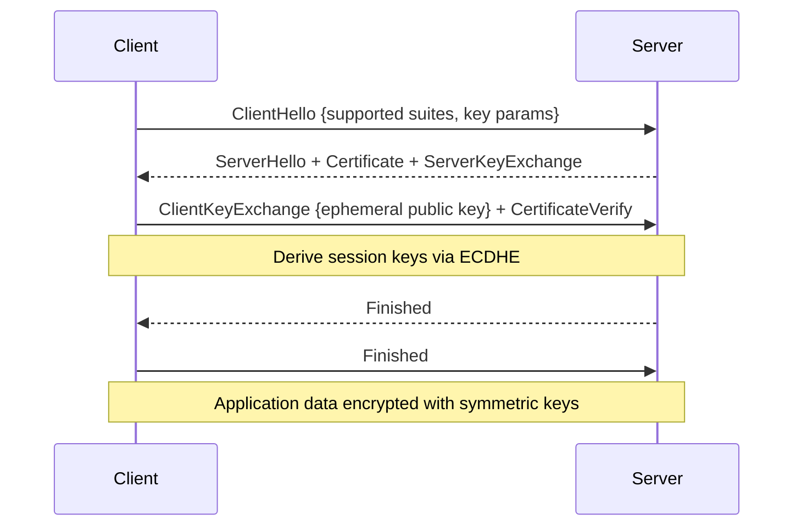

# TLS

> **Learning Path:** Security Architecture
> **Section:** 5.1.9 — Application security

**The problem**

You need to send data across the public internet. The network is untrusted. Anyone on the path can read it, modify it, replay it, or pretend to be the other side.

Constraints:
* Confidentiality: payload must not be readable by observers
* Integrity: receiver must detect tampering
* Authenticity: both sides must know who they are talking to
* No shared secrets you can pre-distribute to every client

Application-layer encryption solves this without requiring network-layer trust.

### Mental model

TLS is a negotiated secure tunnel between two endpoints.

Think of it as: a lockbox with a seal, delivered by a courier who checks ID badges.

The lockbox is symmetric encryption for speed. The seal is a MAC for integrity. The ID badge is a certificate signed by a trusted authority for authenticity. The handshake is the ritual to agree on the lock type and exchange a one-time key without sending it in clear.

### How it works

TLS is layered over TCP. It does not replace TCP, it secures it.

1. **Handshake.** Client proposes cipher suites. Server picks one and presents a certificate.
   Client validates the certificate chain to a trusted root, checks hostname, checks revocation if configured.
   Both sides perform an ephemeral key exchange, typically ECDHE, to derive a shared secret.
   Result: both have the same session keys, no long-term secret was transmitted.

2. **Record layer.** After handshake, all application data is encrypted with symmetric keys, authenticated with HMAC/AEAD, and fragmented.

The handshake is asymmetric and expensive. The data phase is symmetric and cheap.

### Architectural reasoning

When to use TLS:

* Any traffic crossing a trust boundary, especially public internet.
* Between services in a multi-tenant cloud where network is shared.
* For regulatory compliance requiring encryption in transit.

Alternatives and why TLS wins:

* **IPsec** secures network layer. Good for host-to-host, painful with NAT, middleboxes, and per-service policy. TLS is per-connection, app-controlled.
* **VPN** creates a network overlay. Heavyweight for service-to-service.
* **Application-level crypto** like NaCl boxes. Works but you reinvent key exchange, forward secrecy, and cert management.

TLS lets you reuse one stack for browsers, APIs, gRPC, MQTT, etc. The decision is: enforce authentication at the connection level, not per request.

mTLS is TLS with client certificates. It gives mutual authentication. Useful for service meshes and internal APIs where you need to know *which* service is calling, not just that the connection is encrypted.

### Trade-offs and failure modes

* **Performance.** Handshake adds RTTs and CPU. Mitigated with session resumption, TLS 1.3 0-RTT, and connection pooling. Still a cost on cold starts.
* **Certificate lifecycle.** Expiry, rotation, revocation, and hostname validation are operational burdens. Automation with ACME/LetsEncrypt and internal PKI is mandatory at scale.
* **Misconfiguration kills security.** TLS 1.0/1.1, weak ciphers, no forward secrecy, or trusting self-signed certs without pinning. An architect must enforce a policy: TLS 1.2+ only, ECDHE+AEAD, strict validation.
* **False sense of security.** TLS protects in transit, not at rest. It does not protect from compromised endpoints, logging, or malicious insiders.
* **Termination point.** TLS termination at load balancer means plaintext inside the data center. That's an architectural choice. If you need end-to-end, you need mTLS or re-encryption.

Common failure: disabling certificate verification to fix a hostname mismatch. This removes authenticity entirely.

### Example

An AI platform exposes a public inference API and talks internally to a vector store and model service.

Public API: TLS with server certificate from public CA. Clients validate hostname. Rate limiting and auth happen after TLS.

Internal calls: mTLS via service mesh. Each pod gets a short-lived SPIFFE certificate. The mesh enforces that only `ingest-service` can call `model-service`. Encryption is end-to-end; the mesh can terminate for observability but identity is propagated.

The public API uses TLS for confidentiality and authenticity. The mesh uses mTLS for zero-trust identity.

### Reasoning challenge

You are designing a SaaS control plane that will be consumed by thousands of enterprise customers via browser and mobile app, and by your own backend services.

Do you terminate TLS at the edge load balancer and send plaintext over a private VPC, or do you require TLS all the way to each service?

Consider latency, observability, blast radius of a compromised host, and operational complexity.

### Key takeaway

* TLS exists to provide confidentiality, integrity, and authenticity over an untrusted network without pre-shared secrets.
* Handshake is expensive asymmetric negotiation for a cheap symmetric session. Forward secrecy is the key property to preserve.
* Use TLS for any external boundary; use mTLS for internal service identity in zero-trust architectures.
* Security is operational: cipher policy, certificate lifecycle, and strict validation matter more than the protocol version alone.
* Termination choice defines your trust boundary. Choose deliberately, not by default.
