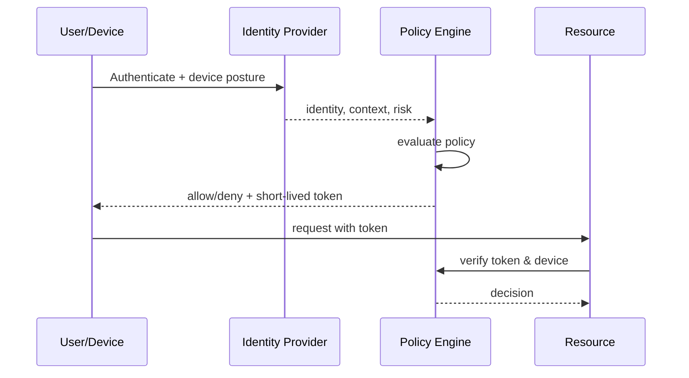

# Zero Trust

> **Learning Path:** Security Architecture
> **Section:** 5.2.1 — Enterprise security

**Zero Trust**

### 1. The problem

Perimeter security assumed: outside = bad, inside = good. Firewall protects the castle, once you're in you're trusted.

That model broke. Work is remote. Apps are SaaS and cloud-native. Employees use personal devices. Microservices talk to each other constantly. Supply chain compromise means an attacker is already inside.

With traditional trust, one compromised credential or one vulnerable service = lateral movement to everything. The network location is no longer a proxy for trust.

The constraint is: you cannot rely on network location to prove intent. You must prove identity, health, and context for every access.

### 2. Mental model

Never trust, always verify. Trust is not a permanent state granted at login or by being on VPN. It's a per-request decision.

Think of it like a bank vault with motion sensors on every door, not a fence around the building. Every access needs a fresh check of *who*, *what device*, *where*, *what is being requested*, and *why now*.

### 3. How it works

Zero Trust is enforced via three controls working together:

**Identity is the new perimeter.** Strong authentication, ideally phishing-resistant MFA, with continuous binding to a user and device.

**Verify every request.** Each access goes through a Policy Decision Point. The PDP evaluates identity, device posture, location/risk signals, and least-privilege policy before granting a short-lived token.

**Assume breach.** Microsegmentation limits blast radius. Services authenticate each other with mTLS. Logging is centralized for anomaly detection.

The flow repeats for every sensitive action, not just once per session.

### 4. Architectural reasoning

Zero Trust helps when:
* You have distributed users and workloads across cloud, on-prem, and SaaS
* Lateral movement is a bigger risk than initial compromise
* You need fine-grained data access, not role-based network access

Alternatives:
* **Perimeter + VPN:** Cheaper to operate, simple mental model. Fails when perimeter is porous and internal trust is too broad.
* **Network segmentation only:** Reduces blast radius but doesn't verify identity. Attackers who get in still move freely inside segments.

Choose Zero Trust when the cost of a breach outweighs the cost of adding verification latency and complexity. It's an architectural decision to trade implicit trust for explicit, auditable verification.

### 5. Trade-offs and failure modes

* **Complexity and identity sprawl.** Every service needs identity. Poorly governed IdP, certificates, and secrets create outages and security holes.
* **Latency and user friction.** Continuous checks add milliseconds and MFA prompts. Overly strict policies cause productivity loss and workarounds.
* **False sense of security.** Zero Trust is not a product. Buying a ZTNA gateway without policy discipline, device management, and logging gives you a more expensive perimeter.
* **Operational burden.** You need strong observability. If you can't see denied requests and anomalous patterns, you can't tune policy.

Failure mode: When policy engine is down, you must decide fail-open vs fail-closed. Fail-closed is secure but can halt business. Most architectures need graceful degradation with break-glass access.

### 6. Example

Enterprise SaaS with 3,000 employees, hybrid cloud.

Old model: VPN into VPC, then access internal apps. An engineer laptop compromised via phishing gives attacker full internal access.

Zero Trust model: No VPN. Employee authenticates to IdP with phishing-resistant MFA + device compliance check. Access to HR app requires managed device + corporate network or approved risk score. Access to production DB requires user in `on-call` group + device with EDR healthy + just-in-time approval, token valid 15 minutes. Service-to-service calls use mTLS with SPIFFE IDs, each namespace isolated.

Result: Compromised credential alone cannot reach production. Lateral movement is blocked by policy, not network.

### 7. Reasoning challenge

You are architecting a fintech internal tool used by 50 engineers, accessed only from corporate office via private network. MFA is already enforced at VPN. Budget is tight.

Do you implement full Zero Trust with device posture checks and per-request verification for this tool, or keep network-based trust?

### 8. Key takeaway

* Zero Trust exists because network location no longer equals trust. Verify identity and context on every request.
* Architecture is identity-centric: strong auth, device posture, least privilege, short-lived access.
* It reduces blast radius and enables remote/cloud work, at the cost of complexity, latency, and operational discipline.
* It's a continuous process of policy, not a product you buy.
