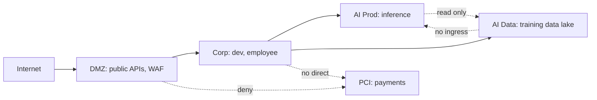

# Network segmentation

> **Learning Path:** Security Architecture
> **Section:** 5.2.2 — Enterprise security

**Network segmentation**

### The problem

A flat network is one trust boundary. Once an attacker — or a compromised workload — gets in, lateral movement is trivial. Credentials, malware, and ransomware spread unchecked because every host can theoretically reach every other host.

For an AI Solution Architect this is lethal: your training data lake, model registry, inference API, and employee laptops all live on the same logical fabric. A breach in the DMZ should not be able to reach the PII store. A compromised inference pod should not be able to SSH to the training cluster.

The need is not to block the internet. It is to *contain* damage inside the perimeter.

### Mental model

Segmentation is compartmentalization for networks. Think of watertight bulkheads on a ship. You want to isolate blast radius, not just build a stronger hull.

Macrosegmentation = large zones: DMZ, Corporate, PCI, AI/ML. Microsegmentation = fine-grained controls per workload, per identity.

The core idea: default deny between zones, explicit allow only for required flows.

### How it works

Segmentation is enforced at layers, not just one device.

* **Layer 2/3:** VLANs, VXLAN, subnets isolate broadcast domains.
* **Layer 4-7:** Firewalls, next-gen firewalls, and software-defined perimeter enforce zone-to-zone policies. East-west traffic is filtered, not just north-south.
* **Identity:** Modern segmentation adds workload identity and least-privilege: allow only `inference-service-prod` -> `model-registry:443` with mTLS, not `any -> any`.
* **Zero Trust:** Segmentation moves from “inside = trusted” to “never trust, always verify per connection”.

Each arrow is a policy decision, not a default route.

### Architectural reasoning

When it helps:
* Regulatory boundaries: PCI, HIPAA, GDPR data must be isolated.
* Blast radius reduction: contain ransomware and compromised AI workloads.
* Different security postures per zone: public-facing vs internal.
* Principle of least privilege for data access: training data does not need to be reachable from internet.

Alternatives:
* Flat network + strong endpoint protection. Cheaper, fails open.
* Full Zero Trust per identity with no network zones. Powerful but operationally expensive.
* Air-gapping. Maximum isolation, zero agility.

You choose segmentation when you need enforceable, auditable boundaries with reasonable operational cost.

### Trade-offs and failure modes

* **Complexity vs safety.** More segments = more policies. Policy sprawl causes outages and “allow any” exceptions that defeat the purpose.
* **False sense of security.** Segmentation slows lateral movement, it does not stop initial compromise. If credentials are reused across zones, attacker pivots anyway.
* **Performance and observability.** East-west inspection adds latency. You need visibility into cross-zone flows to avoid blind spots.
* **Segmentation sprawl.** Teams create a new VLAN for every project. Result: unmaintainable firewall rules, shadow connectivity.

Common failure: segmenting at the network only, without identity. An attacker who steals a valid service account can still move because the network allows it.

### Example

Enterprise AI platform:
* **DMZ:** Public inference API behind WAF and API gateway.
* **AI Prod:** Inference pods in isolated subnet. Only allowed ingress from DMZ on 443, egress only to model registry and feature store.
* **AI Data:** Training data lake with PII. No internet egress, no ingress from AI Prod except read-only via private endpoint with audit logging.
* **PCI:** Payment processing. No connectivity to AI zones at all.

A compromised inference pod can be exploited, but cannot reach training data or payments. Incident response is bounded.

### Reasoning challenge

You are designing network for a multi-tenant SaaS with an AI co-pilot feature. Tenant A and Tenant B data must be isolated. Your team proposes one shared VPC with Kubernetes NetworkPolicies per namespace, no separate subnets.

What do you question? What blast radius remains, and what segmentation decision would you make?

### Key takeaway

* Segmentation exists to contain breach impact, not to keep attackers out.
* Default deny between zones, allow only necessary, auditable flows.
* Macrosegmentation defines trust boundaries; microsegmentation enforces least privilege per workload.
* Network segmentation without identity and observability creates complexity without real safety.
* Choose segmentation when blast radius, compliance, and data sensitivity outweigh operational overhead.
