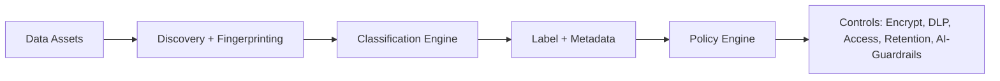

# Data classification

> **Learning Path:** Security Architecture
> **Section:** 5.2.5 — Enterprise security

**Data classification**

### 1. The problem

You have petabytes of data spread across SaaS, data lakes, object storage, and employee laptops. The same data is copied, exported, and ingested into AI tools.

When a breach happens, you can't answer fast: *What was exposed? Who can access it? Can it be used to train models?* Without a consistent answer, you over-protect everything, which kills productivity, or under-protect and violate compliance.

The problem isn't "name the data". It's that security controls, retention, and usage policies need to be applied *per data item*, but you have no systematic way to know what an item is.

### 2. Mental model

Classification is a traffic sign system for data.

It tells systems and people: *this data's sensitivity and business impact, and therefore what you must do with it*.

A label is not metadata for curiosity. It's a contract that drives automation: encryption, access, DLP, retention, and AI-use policies.

### 3. How it works

A workable classification scheme has three parts:

**Taxonomy.** A small, enforceable set of levels, e.g.:
* Public, Internal, Confidential, Restricted
Each level maps to handling requirements: encryption at rest/in transit, access control, retention, sharing, logging, and whether it can be used for training.

**Discovery and labeling.** 
Manual labeling fails at scale. Effective systems combine:
* Policy-based discovery: regex, data fingerprints, ML classifiers for PII, secrets, IP
* Context signals: source system, owner, data lineage
* Human confirmation for high-risk items

**Policy enforcement.** Labels must be enforced where data moves. At rest via storage classification tags, in transit via DLP proxies, in use via access control and data security posture management.

### 4. Architectural reasoning

Classification enables *risk-based architecture* instead of one-size-fits-all.

When it helps:
* You have regulatory scope: GDPR, HIPAA, PCI. You need to prove what data is subject to which rule.
* You need automated DLP and least-privilege access. A label lets you write one policy: "Restricted data requires MFA + just-in-time access".
* You are building AI systems. Classification decides what can be ingested for RAG or fine-tuning. Restricted data must be excluded from training pipelines.

Alternatives:
* No classification, manual reviews. Works for tiny orgs, fails with scale and speed.
* Classification by system only. "All data in HR system is Confidential". Too coarse, leads to over-protection and shadow IT.

Choose classification when data volume and sensitivity variety make per-item decisions necessary, and when you need automated enforcement, not just documentation.

### 5. Trade-offs and failure modes

* **Over-classification kills adoption.** If everything is Confidential, people ignore labels. Taxonomy must be small, 3-4 levels max, with clear examples.
* **Misclassification is a security incident.** Automated tools have false negatives. You need continuous re-discovery and human owners for high-risk data.
* **Label drift.** Data moves, gets copied, gets transformed. Labels must propagate with lineage, or you lose trust.
* **Complexity vs. automation.** Rich schemes with 12 levels look comprehensive but are unmaintainable. Simplicity beats completeness.

Operational cost is real: discovery pipelines, policy engines, and training. The ROI is incident response speed and avoided over-protection.

### 6. Example

Enterprise SaaS with customer PII, internal financial models, and public marketing content.

Classification:
* Public: marketing site content. No encryption requirement beyond baseline.
* Internal: org charts, non-sensitive docs. Standard access.
* Confidential: customer PII, contracts. Encryption + role-based access + DLP blocks download to personal cloud.
* Restricted: unreleased financials, model weights. MFA, just-in-time access, audit logging, blocked from all AI copilots and external sharing.

When a sales engineer copies a spreadsheet to a personal drive, DLP sees the Restricted label and blocks it. When building a support RAG bot, the ingestion pipeline filters out Confidential+ data automatically.

### 7. Reasoning challenge

Your company wants to allow employees to use an internal LLM for code assistance. You discover the model logs prompts for 30 days.

Where does data classification change the architecture? What controls would you require for code containing API keys vs. public code samples?

### 8. Key takeaway

* Classification exists to make risk decisions automatable and auditable at scale.
* A good taxonomy is small, business-meaningful, and maps directly to technical controls.
* Labels only work if they are discovered automatically, kept in sync with data movement, and enforced at boundaries.
* The architect's job is not perfect labeling, it's preventing misclassification from becoming a breach and avoiding over-classification from killing productivity.
