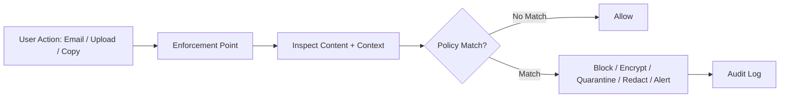

# Data loss prevention

> **Learning Path:** Security Architecture
> **Section:** 5.2.6 — Enterprise security

**Data Loss Prevention**

### 1. The problem

Your perimeter is gone. Data no longer lives in one data center behind a firewall. It lives in laptops, SaaS apps, cloud storage, Slack threads, email, code repos, and AI tools.

The problem is not theft from outside. The problem is authorized users moving sensitive data to unauthorized places.

An engineer copies customer PII to a personal Google Drive to work from home. A sales rep pastes health records into Slack. A developer logs an API key in an LLM chat. An ex-employee downloads the entire CRM before leaving.

Traditional controls — VPN, firewall, IAM — say *who* can access data. They do not say *what* can leave, *where* it can go, or *how* it can be used.

Compliance makes it mandatory. GDPR, HIPAA, PCI DSS, and contracts require demonstrable control over sensitive data movement. Business makes it critical. A single leak costs trust, fines, and incident response.

### 2. Mental model

DLP is a guardrail on data movement, not a lock on data storage.

Think of it as classification + policy enforced at the points where data *crosses a trust boundary*.

Data is classified by sensitivity. Policy defines allowed destinations and actions for each class. Inspection points enforce the policy.

It does not prevent legitimate access. It prevents inappropriate exfiltration, accidental sharing, and over-sharing.

### 3. How it works

The essential mechanism is three layers:

**Classify.** Identify what is sensitive. This can be content-based — regex for credit cards, SSNs, API keys; dictionary matches for internal project names; or context-based — labels applied by data owners.

**Policy.** Define what is allowed. Examples: PII can be sent to internal email only, not personal email. Source code cannot be uploaded to unsanctioned AI services. PHI must be encrypted at rest and never posted to public channels.

**Enforce.** Inspect data in motion at enforcement points and act.

Enforcement points are where architects make the decision:
* Endpoint: laptop / mobile DLP agent inspects file copy, clipboard, screenshot
* Network / CASB: cloud access security broker inspects SaaS-to-SaaS transfers, Drive, Slack, SharePoint
* API / Service mesh: inspection in the app layer before data leaves your system, e.g., before writing to LLM provider logs

### 4. Architectural reasoning

When it helps:
* Regulated data exists and must not leave the trust boundary
* Users use many SaaS apps you don't control
* Remote work and BYOD are normal
* AI tools and third-party integrations ingest data automatically

What it solves vs alternatives:
* Perimeter controls solve *who* gets in. DLP solves *what* leaves.
* Encryption solves confidentiality at rest/in transit. DLP solves *misuse* by authorized users.
* Monitoring / SIEM tells you after a breach. DLP tries to stop it at the boundary.

Choose it when data-centric security is required, not just network-centric.

### 5. Trade-offs and failure modes

**False positives vs false negatives.** Aggressive regex blocks legitimate work. Lax rules miss exfiltration. Tuning is an operational cost.

**Visibility vs privacy.** Deep content inspection is invasive. Engineers push back on clipboard and screen capture monitoring.

**Friction vs security.** Block and you slow users. Allow and you risk leakage. Most mature designs use graduated response: warn → redact → block → quarantine.

**Evasion.** DLP is bypassable. Screenshots, OCR, retyping, encoding, splitting data across messages, using personal devices. Defense requires layered controls: CASB + endpoint + app-level policy + user training.

**Context blindness.** A credit card number in a test dataset vs production matters. Pure pattern matching creates noise. Good architectures combine classification with metadata: data owner, source system, user role, destination risk.

### 6. Example

Fintech with customer PII in Google Workspace and Slack.

Architecture:
* Classifier tags documents containing SSN / account numbers via DLP API on Drive.
* CASB policy: PII files can be shared internally only, cannot be downloaded to unmanaged devices, cannot be posted to Slack channels with external participants.
* Endpoint agent blocks copy-paste of PII from internal CRM to personal clipboard.
* API gateway for the customer support app redacts PII before sending context to a third-party LLM for summarization, logging only tokenized IDs.

Result: Legitimate support still works, but accidental posting to a public Slack channel is blocked and logged.

### 7. Reasoning challenge

You are architecting security for a company using Slack, Google Drive, GitHub, and an AI coding assistant.

Where would you place DLP enforcement to prevent source code from being sent to an unsanctioned LLM, and what signal would you use to distinguish internal code from public open-source snippets?

### 8. Key takeaway

* DLP is about controlling data movement across trust boundaries, not preventing access.
* Effectiveness depends on classification quality and placement of enforcement points — endpoint, network/CASB, and application layer.
* It trades user friction and operational tuning cost for reduced exfiltration risk and compliance evidence.
* No single point stops evasion; DLP works as part of a data-centric security layer with least privilege, monitoring, and user awareness.
