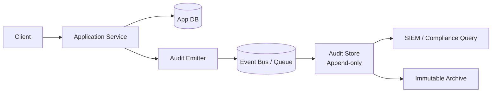

# Audit logging

> **Learning Path:** Security Architecture
> **Section:** 5.2.7 — Enterprise security

**Audit logging**

### The problem

You ship a system that processes sensitive data and makes irreversible actions: money moves, access is granted, records are deleted, a model approves a loan. Later someone asks: *Who did that? When? From where? With what authorization?*

Application logs answer *how the system ran*. Audit logs answer *who did what, to what resource, under what authority, and can we prove it didn't change*.

Without a reliable record you have no non-repudiation, no forensic reconstruction, and no compliance. Regulators and customers demand proof, not hope.

### Mental model

An audit log is an append-only, tamper-evident ledger of security-relevant events, written outside the normal application path.

Think of it as a court stenographer, not a debugger. It doesn't care about stack traces. It cares about identity, action, target, time, result, and context, in an order you can replay.

### How it works

Capture → Normalize → Ship → Store immutably → Retain

* Capture at trust boundary. Emit events for authentication, authorization decisions, data access/modification, privilege changes, admin actions, and critical business state changes.
* Normalize to a schema: `who, what, when, where, how, result`. Who = principal + identity proof. What = action + resource + before/after hash. When = trusted timestamp. Where = source IP, service, request id. How = auth method, policy used.
* Ship asynchronously when possible, synchronously when required. Decouple via an audit emitter so the app doesn't block on the audit store.
* Store in a separate security domain. Append-only, write-once storage with cryptographic integrity, e.g. object storage with versioning + Merkle tree, or a dedicated audit cluster. Never allow updates or deletes by application users.
* Retain per policy, with tiered storage and export controls. Query via read replicas, not the write path.

### Architectural reasoning

When it helps: regulated data, financial transactions, healthcare, admin actions, AI decisioning that must be explainable.

It solves: accountability, forensics, compliance evidence, and detection of insider threat.

Alternatives:
* Application logs: cheap, high volume, mutable, not trustworthy for compliance.
* Database audit triggers: complete for DB changes, blind to business logic and API calls.
* Synchronous DB write per action: strong consistency, kills latency and availability.

Choose separate, asynchronous audit pipeline when availability of the main service outweighs immediate audit durability. Choose synchronous write when the action must be provably recorded before it is considered committed, e.g. funds transfer or privilege elevation.

### Trade-offs and failure modes

**Consistency vs availability.** Synchronous audit blocks the request and couples fate. Asynchronous is resilient but risks loss on crash before flush. Mitigate with local durable buffer and at-least-once delivery.

**Central vs distributed.** Central store simplifies correlation and retention policy. Distributed per-service reduces blast radius but complicates cross-service reconstruction. Hybrid: emit locally, aggregate centrally.

**Performance vs completeness.** High cardinality events cause write amplification. Sample or filter at emitter, but never filter security events. Use batching and compression.

**Tamper resistance vs queryability.** Immutable object storage is tamper resistant but slow to query. Keep hot recent logs in a searchable store, cold archive immutable.

Failure modes to design for: clock skew breaking ordering → use hybrid logical clocks or centralized timestamp authority; log injection via untrusted fields → strict schema validation and allowlisting; missing logs on crash → emitter must persist to local WAL before ack; admin backdoor deleting logs → separate access control, WORM storage, and signed chain.

### Example

Enterprise SaaS with SOC2 and GDPR.

Auth service emits `login_success` with user id, MFA method, IP, user agent. Payment service emits `payment_reversed` with actor, approver, amount, policy id, request id. Admin console emits `role_granted` with grantor, grantee, role, justification.

Events go to a queue, then to an append-only audit store in a separate account with KMS encryption and 7-year retention. SIEM reads a replica for alerting. Compliance exports are signed and stored in WORM.

An investigation can reconstruct: who approved the reversal, from which IP, under which policy, and whether the audit record is intact.

### Reasoning challenge

You are designing an AI underwriting system. Model inference can be async and high volume. Regulators require proof that every adverse decision can be traced to a specific model version, input features, and human override, for 5 years.

Do you make the inference service synchronously write an audit record before returning a decision, or emit asynchronously? What do you lose with each choice, and what guardrails would you add?

### Key takeaway

* Audit logs prove *who did what* with integrity, not *why the system crashed*.
* Separate the audit path from the application path and make it append-only and tamper-evident.
* Synchronous = stronger guarantees, lower availability. Asynchronous = higher throughput, needs durability buffers and replay.
* Design for forensics first: identity, action, resource, time, result, context — consistently normalized and immutable.
