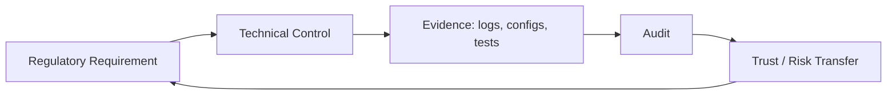

# Compliance

> **Learning Path:** Security Architecture
> **Section:** 5.2.8 — Enterprise security

**Compliance is not security. Compliance is provable security.**

### 1. The problem

You can build a secure system and still fail an audit. Regulators, customers, and insurers don't buy your architecture diagrams. They buy evidence that you consistently meet a set of rules.

The problem is trust at scale:
* A customer asks: "How do you know my data isn't leaving the EU?"
* A regulator asks: "Prove you can delete a user's data on request."
* An insurer asks: "Show your access controls are enforced, not just documented."

Security is about reducing risk. Compliance is about *demonstrating* risk reduction under a defined framework, with artifacts that survive an auditor.

Without a system for evidence, you get last-minute scramble, manual screenshots, and controls that exist in a Confluence page but not in production.

### 2. Mental model

Think of compliance as a chain: **Requirement -> Control -> Evidence -> Audit**

A requirement like GDPR Article 32 "security of processing" is abstract. It becomes a concrete control: encryption at rest, access logging, key rotation. That control must produce continuous evidence: logs, config snapshots, test results. The audit is just someone checking the chain is intact.

Compliance is therefore an architectural property: can you generate proof on demand, not just in theory.

### 3. How it works

Frameworks map requirements to controls. SOC 2, ISO 27001, HIPAA, PCI DSS, GDPR are different rule sets but the pattern is the same.

Architecturally, compliance is enforced by three primitives:
* **Policy as code**: IAM policies, network policies, data classification labels enforced by pipelines, not by training.
* **Observability for control**: audit logs, change logs, data lineage. If a control isn't logged, it doesn't exist to an auditor.
* **Boundaries**: data residency, tenant isolation, separation of duties. Compliance forces hard boundaries in the architecture.

### 4. Architectural reasoning

Compliance helps when you need external assurance or operate in regulated domains. It hurts velocity if treated as a checklist at the end.

When to design for it:
* You process personal health, financial, or EU citizen data.
* Enterprise customers require SOC 2 / ISO 27001 before procurement.
* You need liability reduction or insurance.

Alternatives are risk acceptance or market limitation. You can skip formal compliance and accept higher churn, lower deal size, or manual reviews per customer. That's a valid business decision, but it's an architectural trade-off.

Design choice: embed controls in the platform, not per service. A centralized logging plane, centralized secrets management, and a policy engine are cheaper than 50 teams implementing their own.

### 5. Trade-offs and failure modes

**Speed vs. provability.** Automating evidence collection costs upfront engineering. Manual evidence collection costs every audit.

**Standardization vs. flexibility.** Compliance favors standard patterns: one KMS, one logging format, one identity provider. Product teams want bespoke. The architect's job is to make the standard pattern capable enough.

**Centralized vs. distributed evidence.** Centralized is auditable but a bottleneck. Distributed is resilient but hard to prove completeness.

Common failures:
* Checkbox compliance: controls documented but not enforced in CI/CD. Drift appears after first production change.
* Audit-driven spikes: evidence is collected for 2 weeks before audit, then stops.
* Shadow IT: teams bypass the approved stack to ship faster, creating unmonitored data flows.

### 6. Example

A SaaS with EU customers needs GDPR. The architectural decision is not "add encryption". It's:

* Data residency boundary: EU customer data only written to EU region, enforced by tenant routing layer.
* Right to erasure: data classification + lineage so you can find all copies of PII across DB, S3, backups, and vector stores.
* Access logging: every read of PII emits an immutable audit event to a tamper-evident store.

The product works the same, but the architecture now *proves* GDPR compliance continuously.

### 7. Reasoning challenge

Your AI support agent needs to summarize customer tickets. The team wants to send ticket text to a third-party LLM. You have SOC 2 and a DPA in place.

What do you need to decide before enabling this, from a compliance architecture perspective? Think about data classification, data residency, sub-processor evidence, and logging.

### 8. Key takeaway

* Compliance = provable adherence, not just good security.
* Design controls as architecture, not documentation: policy as code, boundaries, and continuous evidence.
* Treat compliance as an ongoing evidence pipeline, not an audit project.
* The most expensive compliance is retrofitting controls after the system ships.
