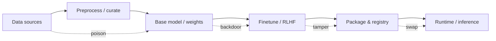

# Model supply-chain risks

> **Learning Path:** Security Architecture
> **Section:** 5.3.10 — AI security

**Model supply-chain risks**

### The problem

You are building on top of models you did not train. A fine-tuned model is not a single artifact, it is a chain of artifacts: raw data, curated datasets, preprocessing code, base weights, training framework, fine-tuning scripts, packaging, and the runtime that loads it. 

Each link is produced by a different team, vendor, or open-source project and each link can be compromised without changing the API you call. Unlike a library bug, a compromised model can behave correctly 99% of the time and only misbehave on specific inputs. That makes detection hard and blast radius large.

The constraint is composability plus opacity. Models are large, non-deterministic, and their behavior is not fully captured by tests. You cannot audit weights by reading them.

### Mental model

Think software supply-chain, but the artifact is behavioral.

In software supply-chain you worry about a malicious npm package. In model supply-chain you worry about:
* **Poisoned data** that teaches a backdoor
* **Trojaned weights** that embed hidden triggers
* **Compromised tooling** that silently changes training
* **Unverified provenance** where you cannot prove what data and code created a model

The chain is:

Every arrow is a trust boundary. A compromise anywhere propagates downstream and is inherited by every system that consumes the model.

### How it works

Risks cluster at four stages:

**Data → Training.** Poisoning or bias injection in training or fine-tuning data. An attacker with data-contributor access can insert rare trigger phrases that cause unsafe outputs, data exfiltration, or privilege escalation.

**Base model → Fine-tune.** Base weights from a model hub are large and rarely verified. A compromised base model can contain weight-level backdoors that survive fine-tuning.

**Build → Package.** Training pipelines, compilers, and packaging tools are software. A compromised optimizer or serialization library can alter weights at build time. No reproducible build = no integrity check.

**Registry → Runtime.** Model registries, container images, and serving endpoints are mutable. A model can be swapped, downgraded, or served from an untrusted replica without the consumer noticing.

The core mechanism is *provenance loss*. You lose the ability to answer: what data, code, and environment produced this artifact, and has it changed since?

### Architectural reasoning

When it helps to treat models like supply-chain artifacts:
* You use third-party base models, open weights, or vendor-hosted models
* Models are updated frequently and consumed by multiple services
* A single model failure has high business or safety impact

What you can do architecturally:
* **Provenance and SBOM for models.** Record dataset IDs, code versions, training seeds, and hashes in a Model Bill of Materials. Sign the artifact at package time and verify at load time.
* **Immutable model registry with signing.** Only signed models from an approved registry can be deployed. Runtime verifies signature and hash before loading.
* **Isolation and least privilege at inference.** Run models in sandboxed runtimes with no direct access to secrets, network, or internal tools unless explicitly granted.
* **Input validation and output monitoring.** Treat model output as untrusted. Guardrails, canary inputs, and behavioral drift detection catch backdoors that signature checks miss.

Alternatives: fully train in-house vs use managed models. In-house gives control but is expensive and slow. Managed models give speed but increase supply-chain depth.

### Trade-offs and failure modes

* **Verification overhead vs agility.** Signing, reproducibility, and reproducible builds slow iteration. Teams often skip them until an incident.
* **Provenance completeness vs cost.** Full data lineage is expensive. Partial lineage gives a false sense of safety.
* **Runtime attestation vs latency.** Cryptographic verification at load time is cheap; continuous runtime attestation is harder.
* **Detection lag.** Poisoning is often only visible under adversarial inputs. Standard unit tests will pass.

Common failure mode: you verify the model file hash but not the data it was trained on. A clean package can still carry a poisoned behavior.

### Example

Enterprise RAG with a third-party embedding model and fine-tuned reranker.

The team pulls `embedder-v3` from a public hub, fine-tunes a reranker on internal customer tickets, and deploys via a managed inference service.

Supply-chain risk: the hub account is compromised and a new `embedder-v3.1` with a backdoor is published under the same name. The CI pipeline auto-updates on patch version. The backdoor maps a specific rare phrase to a high similarity vector that forces the RAG to retrieve a malicious document and exfiltrate prompt data.

Mitigation: pin model by content hash, require signed releases from the vendor, verify signature in deployment, and run a canary query set that checks embedding stability for known inputs before promotion.

### Reasoning challenge

You need a fast-to-market chatbot. Option A: use a managed foundation model with automatic updates and no signing. Option B: use the same model but pin to a signed artifact, run a reproducible build pipeline, and add 2-day release delay for verification.

Your threat model includes insider risk at the model vendor and regulatory requirement for auditability. What do you choose and what is the minimum control you will not drop?

### Key takeaway

* Model supply-chain risk is about provenance and integrity across data, code, weights, and runtime, not just the API contract.
* If you cannot prove what created a model and that it has not changed, you cannot trust its behavior.
* Sign and pin models, isolate inference, and monitor behavior, not just availability.
* Speed and supply-chain safety trade off directly; design the verification boundary you can sustain.
