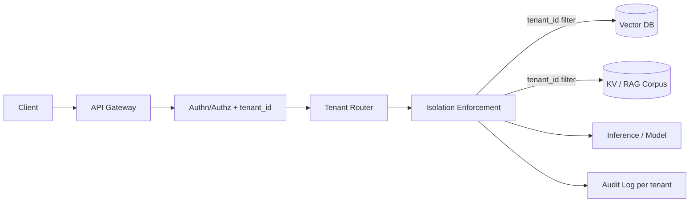

# Tenant isolation

> **Learning Path:** Security Architecture
> **Section:** 5.3.13 — AI security

**Tenant isolation** is not a feature. It is the answer to a specific failure mode in multi-tenant AI systems.

### 1. The problem

You are building a SaaS AI product. One model serving layer, one vector database, one embedding index. Many customers.

The problem appears when data from Tenant A becomes visible, influenceable, or inferable by Tenant B.

In traditional SaaS this is about row-level filters. In AI it is about:
* RAG retrieval returning another tenant's documents
* Embeddings leaking semantic information across tenants
* Prompt injection or tool output from one tenant poisoning a shared context window or cache
* Fine-tuning or RLHF data from one tenant being memorized and reproduced for another
* Logs, metrics, and traces mixing PII across tenants

The constraint is economic: you cannot provision a full physical stack per tenant. The constraint is security/compliance: you must guarantee no cross-tenant data access, and prove it.

### 2. Mental model

Think of tenants as separate security domains that share infrastructure.

Isolation = guaranteeing that a request with `tenant_id = A` can only ever read/write/process data and model state belonging to A, even if the underlying hardware, model weights, and storage are shared.

It is not just database multi-tenancy. It is isolation across data, compute, model state, and metadata.

### 3. How it works

Isolation is enforced at four layers, not just one:

Essential mechanisms:
* **Identity binding.** Every request is bound to a tenant_id at the edge and propagated as a non-removable context. No tenant_id = reject.
* **Data partitioning.** Logical: tenant_id column + mandatory row-level security on every query. Physical: per-tenant namespaces/collections. Hybrid: per-tenant collections on shared cluster.
* **Compute partitioning.** Shared model weights are fine, shared *state* is not. No shared prompt cache, no shared session state, no cross-tenant tool results.
* **RAG guardrails.** Vector search must be scoped. Index names, collection filters, and embedding isolation must be enforced before similarity search runs.
* **Audit and observability per tenant.** Logs must be separable for compliance and forensics.

### 4. Architectural reasoning

When it helps: any multi-tenant AI service with shared infrastructure.

Alternatives:
* **No isolation.** Cheapest, fastest. Unacceptable for production.
* **Logical isolation.** One DB, tenant_id filters, shared model. Good for scale and cost. Requires strict enforcement.
* **Physical isolation.** Per-tenant DBs, per-tenant model replicas. Strongest security, highest cost. Used for regulated tenants.

Decision rule: start with logical isolation with mandatory enforcement points, escalate to physical for high-risk tenants.

In AI specifically, you must decide isolation per asset:
* Embeddings / vector store: per-tenant collection is almost mandatory. Similarity search without a tenant filter is data leakage.
* Fine-tuning: never mix datasets. Per-tenant model version or at minimum per-tenant training data provenance.
* Prompt / tool context: no shared conversation memory across tenants. Cache keys must include tenant_id.

### 5. Trade-offs and failure modes

Key trade-offs:
* **Cost vs assurance.** Physical isolation is provable; logical isolation is cheaper but requires code correctness.
* **Latency vs safety.** Enforcing tenant filters on every vector query adds overhead. Skipping it kills security.
* **Flexibility vs blast radius.** Shared embeddings index is efficient, but one misconfigured filter exposes all tenants.

Common failure modes architects miss:
* Missing tenant filter in one code path. Especially in async jobs, batch indexing, or admin tools.
* Shared embedding model leaking tenant-specific semantics through nearest-neighbor retrieval.
* Prompt cache or system prompt injection where Tenant A can influence the context seen by Tenant B.
* Logging PII from all tenants into a single stream, breaking compliance.
* Fine-tuning data memorization leading to cross-tenant data exfiltration via adversarial prompts.

### 6. Example

Enterprise RAG assistant SaaS.

Architecture: API Gateway -> Auth -> Tenant Router -> Per-tenant Pinecone collection + per-tenant Postgres with RLS.

All vector queries are built as: `search(collection=tenant_{id}, filter={tenant_id})`. The embedding model is shared, but the index is not. Inference runs on shared GPU pool, but the system prompt is built per tenant and no cross-tenant cache keys are allowed.

Result: you get multi-tenant economics with provable data separation. If a financial services tenant requires SOC2, you can move them to a dedicated vector cluster and dedicated model replica without changing the API.

### 7. Reasoning challenge

You are designing a multi-tenant code assistant with RAG over company repos. You have 10,000 tenants, average 50k documents each. Options:
A) One giant vector index with tenant_id metadata filter.
B) One index per tenant.

Pick one and justify the failure mode you are most worried about and how you would mitigate it. What changes if one tenant is a regulated bank?

### 8. Key takeaway

* Tenant isolation in AI is about data, model state, and context, not just rows in a database.
* Enforce tenant_id at the edge and make it mandatory for every data access, retrieval, and logging path.
* Shared compute is fine; shared mutable state across tenants is not.
* Design for provable isolation first, then optimize cost with logical partitioning and selective physical isolation for high-risk tenants.
