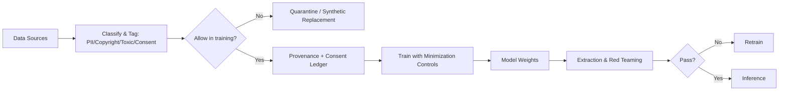

# Training-data concerns

> **Learning Path:** Security Architecture
> **Section:** 5.3.9 — AI security

## The problem

You are building a system that learns from data. The moment you train a model, the data is not just processed — it is *absorbed*. Weights encode statistical patterns from the training set, and with enough capacity models memorize verbatim examples, PII, credentials, and proprietary text.

This creates a security problem that traditional data handling does not have: you cannot reliably delete data from a trained model, you cannot audit what the model learned, and a poisoned or non-consented example can create a persistent backdoor.

The constraint is not storage security. It is **embedding liability**. Once data is in training, it can be extracted via prompt injection, membership inference, or simple regurgitation. It can also be weaponized by an adversary who sneaks a poisoned sample into the corpus.

## Mental model

Think of training data as code that runs forever, not as a database record you can delete.

In a normal system: data in → process → discard. 
In a learning system: data in → weights update → data persists implicitly.

Training-data concerns are therefore governance concerns: *what data is allowed to influence the model, can we prove it, and can we limit harm if it leaks?*

## How it works

Training data security is enforced before training starts, not after.

Key mechanisms:
* **Classification and minimization.** Tag data at ingestion for sensitivity, copyright, and consent. Strip or generalize PII before training. Use data minimization: train only on what is needed for the task.
* **Provenance and consent ledger.** Record source, owner, license, retention policy, and revocation rights. This is the audit trail you need for compliance and for future removal requests.
* **Training controls.** Differential privacy noise, gradient clipping, and canary watermarking reduce memorization. Federated learning keeps raw data at the edge.
* **Validation.** Red team for regurgitation, membership inference, and poisoning. If the model can output a training sample verbatim, the data should not have been allowed.

## Architectural reasoning

Training data governance is chosen when the model will be deployed to customers, regulated domains, or untrusted data sources.

It solves: leakage of secrets/PII, copyright infringement, model poisoning/backdoors, bias from unrepresentative data, and regulatory non-compliance.

Alternatives:
* **No controls, train on everything.** Fastest, highest utility. Acceptable only for fully synthetic, public, and licensed data.
* **Post-hoc filtering.** Trying to remove data after training is unreliable. Unlearning is expensive and incomplete.
* **Synthetic data only.** Eliminates source liability but can reduce fidelity and introduce distribution shift.

Choose strict governance when data is customer-owned, regulated, or high-risk. Choose lighter controls for public research corpora with clear licenses.

## Trade-offs and failure modes

* **Utility vs privacy.** More data and less filtering improves performance, but increases memorization risk. Differential privacy and aggressive redaction improve safety at cost of accuracy.
* **Centralization vs federated.** Centralized training simplifies quality control but concentrates sensitive data. Federated keeps data local but makes poisoning detection and provenance harder.
* **Cost of governance vs risk.** Classification, lineage, and red teaming add pipeline latency and engineering overhead. The failure mode is skipping it to ship faster, then suffering a PII leak or poisoned model in production.
* **Revocation is hard.** If a data owner withdraws consent, you cannot surgically remove their contribution from a large model without retraining. Design for this by scoping training windows and maintaining a revocation map.

Common failures: training on logs containing API keys, fine-tuning on customer support tickets with PII, and accepting third-party datasets without license review.

## Example

A fintech wants to fine-tune a LLM on internal support tickets to improve agent responses.

Architectural decision: Do not train on raw tickets.

Instead:
* Classify tickets, strip PII with DLP, and retain only de-identified intents.
* Keep a consent ledger for tickets from EU customers under GDPR.
* Train on a synthetic replica generated from the de-identified distribution for high-sensitivity classes.
* Run extraction tests: prompt the model for verbatim ticket text. If it succeeds, block the source.

Result: utility for intent classification preserved, PII and copyright risk removed, and revocation can be handled by dropping the synthetic seed.

## Reasoning challenge

Your team can fine-tune a model on 2M public GitHub repos for code completion. One engineer notes many repos contain hardcoded secrets and proprietary code. Do you proceed, filter, or use a synthetic alternative? What controls would you require before training, and what would you accept as proof the model is safe to release?

## Key takeaway

* Training data is a persistent security liability embedded in weights, not a transient input.
* Govern data before training with classification, minimization, provenance, and consent — you cannot reliably fix it afterwards.
* Accept the utility-privacy trade-off explicitly; the safest data you never train on is better than data you cannot audit.
* Design for revocation and poisoning from day one; otherwise you will be forced to retrain under incident pressure.
